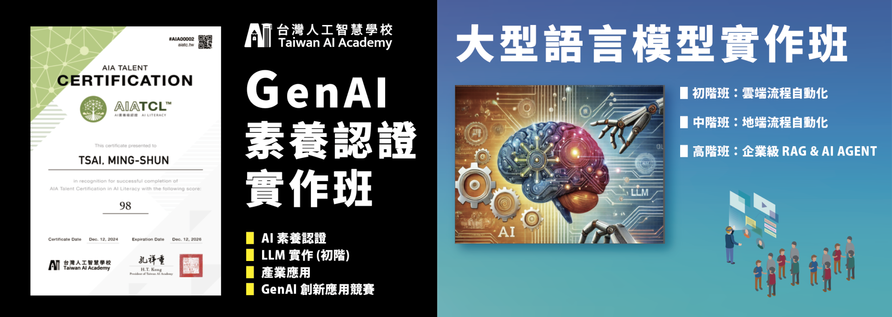

# 中小微企業 AI 應用工具包

> 大型語言模型、Prompt、RAG、流程自動化、模板

**貢獻者：** 孫曉恩、蔡政霖、劉又綺、李福裕、郭柏甫  
**更新日期：** 2025/10/07  
**來源：** 財團法人台灣人工智慧學校基金會  
**聯絡信箱：** hi@aiacademy.tw

---

## 📚 課程架構

| 分類 | 內容 | 檔案 |
|------|------|------|
| **Part I 初階班** | Prompt Engineering & Make 自動化 | [part1-beginner.md](./part1-beginner.md) |
| **Part II 中階班** | n8n 流程自動化 | [part2-intermediate.md](./part2-intermediate.md) |
| **Part III 高階班** | LangChain, RAG, Fine-tuning | [part3-advanced.md](./part3-advanced.md) |
| **補充資源** | DeepSeek、CAG、開源模型等 | [supplementary.md](./supplementary.md) |
| **工具與設定** | API Key 取得、軟體安裝 | [setup.md](./setup.md) |

---

## 📖 授權

為推動知識共享與資源應用，本文件內容採開源方式公開，提供大眾自由參考、複製與修改使用。  
若您有需要，可依實際情況進行調整與引用。  
請於使用或轉載時註明來源：

> 財團法人台灣人工智慧學校基金會
