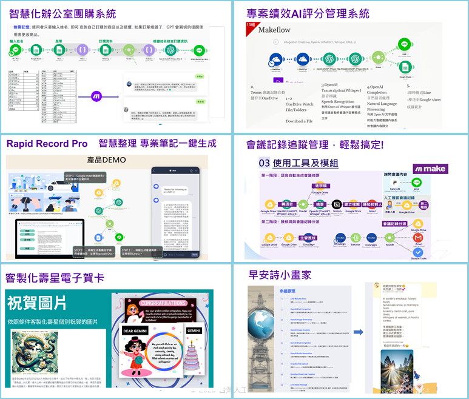
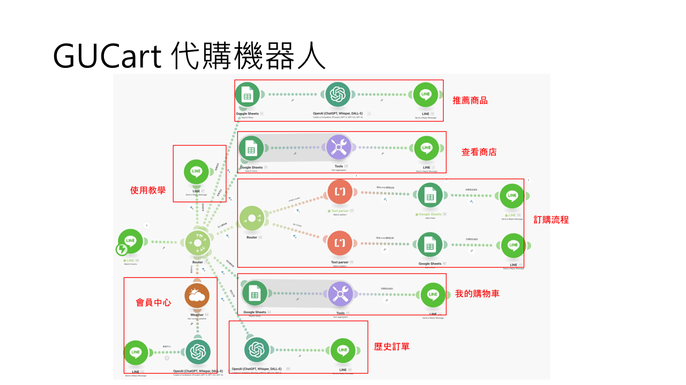
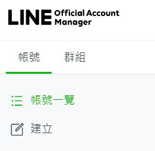
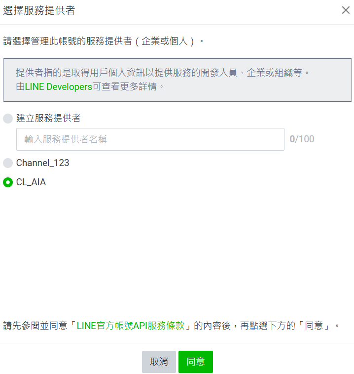
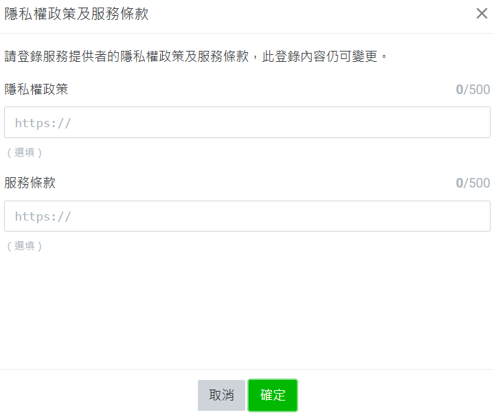
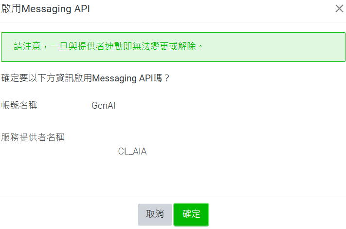
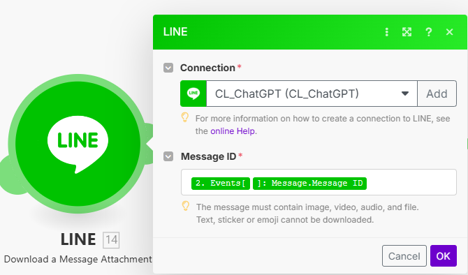
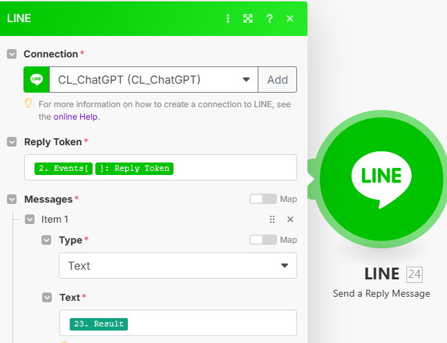
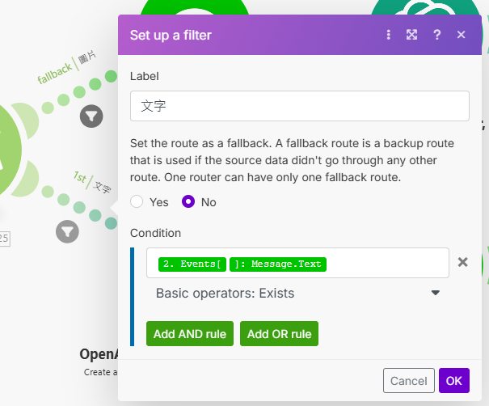
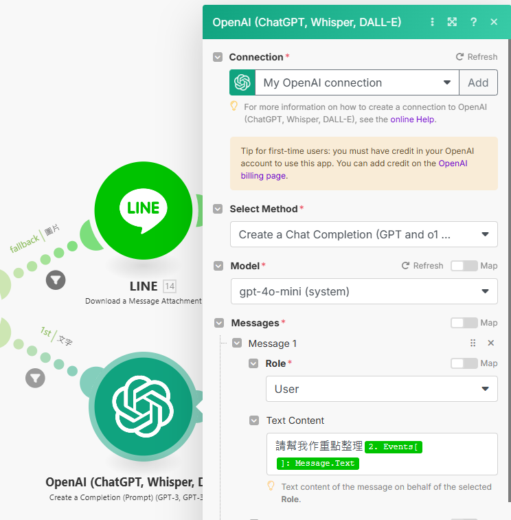

# Part I：大型語言模型實作初階班（Prompt, Make Automation）

## 📑 目錄

- [一、作品示例](#一作品示例)
- [二、課程資料](#二課程資料)
- [三、其他補充](#三-其他補充)

---

## Part I：大型語言模型實作初階班 ( Prompt, Make Automation)

### **一、作品示例**

- 學員報告作品-1
    - 法人金融報告流程自動化
        
        [法人金融徵信報告流程自動化.pdf](assets/%E6%B3%95%E4%BA%BA%E9%87%91%E8%9E%8D%E5%BE%B5%E4%BF%A1%E5%A0%B1%E5%91%8A%E6%B5%81%E7%A8%8B%E8%87%AA%E5%8B%95%E5%8C%96.pdf)
        
    - 課程滿意度流程自動化
        
        [課程滿意度問卷流程自動化.pdf](assets/%E8%AA%B2%E7%A8%8B%E6%BB%BF%E6%84%8F%E5%BA%A6%E5%95%8F%E5%8D%B7%E6%B5%81%E7%A8%8B%E8%87%AA%E5%8B%95%E5%8C%96.pdf)
        
    - 年節賀卡圖片生成
        
        [過年賀卡圖片生成.pdf](assets/%E9%81%8E%E5%B9%B4%E8%B3%80%E5%8D%A1%E5%9C%96%E7%89%87%E7%94%9F%E6%88%90.pdf)
        
- 學員報告作品-2
    
    
    
    
    
- 學員報告作品-3
    
    
    
    
    

### **二、課程資料**

- 01 - AI Overview & Prompt Engineering
    - **熟悉介面操作 (10 min)**
        
        請幫我寫一份去台北市立動物園的旅遊日記 -> 請幫我總結 (或 TL;DR) -> 請幫我萃取(或Extract)我看了哪些動物。
        
        - ChatGPT
            - 請幫我寫一份去台北市立動物園的旅遊日記
                
                日期：2024年2月15日
                
                今天我去了台北市立動物園，這是我期待已久的一個旅程。早晨，我與我的朋友一起出發，充滿了興奮和期待。我們搭乘捷運前往，從市中心到動物園只需要短短的時間。
                
                抵達動物園時，我們立刻被眼前的景象所震撼。入口處矗立著一座巨大的象徵性拱門，歡迎著遊客的到來。我們迫不及待地買了門票，然後便踏入了這個奇妙的世界。
                
                首先吸引我們的是非洲動物區。我們看到了大象、長頸鹿、獅子和許多其他令人驚嘆的動物。這些動物們在寬敞的環境中自由自在地生活著，讓人感受到了大自然的奇妙。
                
                接著，我們又來到了亞洲動物區。這裡有許多精靈般的猴子，在樹上嬉戲玩耍。我們還看到了懶惰的熊貓，它們慵懶地趴在竹林中享受陽光。
                
                在動物園裡漫步，我們不僅欣賞到了各種動物的美麗，還學到了許多有關它們的知識。我們還參加了一些教育性的活動，例如動物表演和解說員的講解，讓我們更深入地了解了動物的生活狀況。
                
                整個旅程過得非常愉快，充滿了歡笑和驚奇。當我們準備離開時，我們心中充滿了對這次美好經歷的回憶，並期待著下一次再來這裡探訪。台北市立動物園給我留下了深刻的印象，這將是一次難忘的旅行經歷。
                
            - 請幫我總結
                
                總結：今天我與朋友一同造訪台北市立動物園，這是一趟充滿驚奇和歡樂的旅程。我們在動物園中欣賞了各種動物的美麗，從非洲大象到亞洲猴子，每一種動物都給我們帶來了難忘的印象。我們參加了教育性的活動，學到了許多關於動物的知識。整個旅程讓我們感受到了大自然的奇妙，並留下了美好的回憶。我期待著下一次再來這裡探訪。
                
            - 請幫我萃取我看了哪些動物
                
                在台北市立動物園，我們看到了許多不同的動物，包括：
                
                1. 非洲動物區：
                    - 大象
                    - 長頸鹿
                    - 獅子
                    - 其他非洲動物（未具體列舉）
                2. 亞洲動物區：
                    - 猴子
                    - 熊貓
                
                這些動物給我們帶來了難忘的觀賞體驗，讓我們對動物的多樣性和美麗有了更深入的了解。
                
            - GPT-4
                - 請幫我寫一份去台北市立動物園的旅遊日記
                    
                    當然可以！以下是一份去台北市立動物園的旅遊日記的範例：
                    
                    ---
                    
                    ### 旅遊日記：探索台北市立動物園的一天
                    
                    ### 日期：2024年2月15日
                    
                    ### 天氣：晴朗，攝氏25度
                    
                    今天我踏上了一段特別的旅程，目的地是台北市立動物園。這是我長久以來非常期待的一次旅行，因為我總是對於動物和大自然充滿了無窮的好奇與熱愛。台北市立動物園，作為亞洲地區最大的動物園之一，它豐富的動物種類和教育意義讓我充滿了期待。
                    
                    清晨，我搭乘捷運前往動物園，一路上的風景早已讓我忘卻了都市的喧囂。抵達後，我首先驚訝於園區的廣大，綠意盎然，彷彿進入了一個完全不同的世界。
                    
                    我的第一站是熊貓館。見到圓滾滾的大熊貓悠閒地吃著竹子，那慵懶的模樣讓人忍不住會心一笑。我花了許久的時間觀察它們，感受到了一種難以言喻的平靜。
                    
                    隨後，我前往了非洲動物區。那裡有長頸鹿、斑馬和犀牛等動物，它們在廣闊的草原上自由奔跑，展現了非洲大陸的野性之美。特別是長頸鹿，它們高貴的姿態和親和的眼神讓我久久不能忘懷。
                    
                    午餐時間，我在園內的餐廳享用了美味的便當，視野所及皆是綠色，讓人心情格外舒暢。休息後，我繼續我的探索之旅。
                    
                    下午，我來到了兩棲爬蟲動物館。這裡展出了各種各樣的蛇類、青蛙和蜥蜴。其中，色彩斑斕的毒蛇和擁有透明皮膚的青蛙讓我大開眼界，這些生物的神秘和多樣性讓我對自然界的奧秘充滿了敬畏。
                    
                    在日落時分，我來到了亞洲熱帶雨林區。那裡的濕氣、綠蔭和四處回響的鳥鳴聲，讓我仿佛置身於真正的熱帶雨林之中。漫步其中，我感受到了大自然的鬱郁蒼蒼和生命的蓬勃生機。
                    
                    結束了一天的行程，我帶著滿滿的收穫離開了台北市立動物園。今天的經歷讓我更加熱愛這個世界，對於保護自然和動物的意識也更加深刻。這是一次難忘的探索
                    
                    ，我相信這些美好的記憶將會長久留在我的心中。
                    
                    ---
                    
                    這只是一個範例，你可以根據自己的實際經歷調整細節和情感表達，使日記更加貼近你的真實體驗。希望你在台北市立動物園有一段美好的旅程！
                    
                - 請幫我總結
                    
                    當然，以下是對台北市立動物園旅遊日記的總結：
                    
                    在這次的旅行中，我體驗了台北市立動物園的多樣化和豐富生態，從和平與悠閒的大熊貓，到非洲草原上自由奔跑的長頸鹿和斑馬，每一刻都充滿了發現和驚喜。午餐時間在園內享受了美味的便當，並在綠意盎然的環境中休息。下午時分，探索了兩棲爬蟲動物館，對那裡展出的多樣性生物感到驚奇。最後，在日落時走訪了亞洲熱帶雨林區，感受到了大自然的壯麗和生命力。這次旅行不僅讓我對動物和自然有了更深的了解和欣賞，也提升了我對環境保護的意識。這是一次充滿學習和啟發的探索之旅，留下了難忘的記憶。
                    
                    這次的旅遊日記凸顯了台北市立動物園作為一個教育和休閒的好去處，展現了大自然的美麗和生物多樣性的重要性。
                    
                - 請幫我萃取我看了哪些動物
                    
                    在你的台北市立動物園之旅中，你觀賞了以下動物：
                    
                    - 大熊貓：你首先參觀了熊貓館，觀察到這些悠閒吃著竹子的圓滾滾動物，感受到了一種平靜。
                    - 長頸鹿、斑馬和犀牛：在非洲動物區，你見到了這些動物在廣闊的草原上自由奔跑，體驗到了非洲大陸的野性之美。
                    - 兩棲爬蟲動物：在兩棲爬蟲動物館，你看到了各種各樣的蛇類、青蛙和蜥蜴，包括色彩斑斕的毒蛇和透明皮膚的青蛙，讓你大開眼界。
                    
                    這些觀察體驗不僅讓你對這些動物有了更深的認識，也增進了你對自然界奧秘的敬畏和對保護自然環境的意識。
                    
        - Copilot
            - 請幫我寫一份去台北市立動物園的旅遊日記
                
                當然！我很樂意幫你寫一份去台北市立動物園的旅遊日記。🦁🌿
                
                # 台北市立動物園遊記
                
                ## 日期：2024年2月15日
                
                ### 早上
                
                我們一大早就來到了台北市立動物園，準備開始一天的探險之旅。動物園的入口處佈置得非常漂亮，有各種色彩繽紛的花朵和植物迎接遊客。
                
                ### 熱帶雨林區
                
                我們首先來到了熱帶雨林區。這裡有許多種類的熱帶植物和動物，包括猴子、鳥類和蛇。我們看到了一隻懶惰的樹懶，它正懶洋洋地躺在樹上。
                
                ### 非洲草原區
                
                接著，我們來到了非洲草原區。這裡有許多大象、獅子、斑馬和長頸鹿。我們幸運地看到了一隻正在覓食的獅子，它的毛髮閃閃發亮。
                
                ### 溫室區
                
                中午時分，我們進入了溫室區。這裡有各種各樣的植物，包括仙人掌、蘭花和熱帶水果。我們還看到了一些美麗的蝴蝶在花朵之間飛舞。
                
                ### 水生動物區
                
                下午，我們參觀了水生動物區。這裡有海獅、企鵝、海龜和各種魚類。我們坐在海獅表演的觀眾席上，看著它們在水中嬉戲。
                
                ### 動物園的結尾
                
                我們在動物園度過了一個愉快的一天，看到了許多有趣的動物和植物。這是一個難忘的經歷，我們期待下次再來台北市立動物園！
                
                希望你也能有一個愉快的旅程！🌟
                
            - 請幫我總結
                
                當然！以下是我對你在台北市立動物園的旅遊日記的總結：
                
                你在台北市立動物園度過了一個愉快的一天，看到了許多有趣的動物和植物。從熱帶雨林區到非洲草原區，再到溫室區和水生動物區，你都有機會近距離觀察不同類型的生物。這是一個難忘的經歷，期待下次再來台北市立動物園！🌟
                
            - 請幫我萃取我看了哪些動物
                
                你在台北市立動物園看到了許多有趣的動物，包括：
                
                1. **懶惰的樹懶**：它正懶洋洋地躺在樹上，是熱帶雨林區的一個亮點。
                2. **獅子**：你幸運地看到了一隻正在覓食的獅子，它的毛髮閃閃發亮，位於非洲草原區。
                3. **大象**：非洲草原區也有大象，它們是非洲草原的代表性動物之一。
                4. **斑馬**：你也看到了斑馬，它們的黑白條紋很特別。
                5. **長頸鹿**：這些高挑的動物在非洲草原區漫步，它們的長脖子令人印象深刻。
                6. **海獅**：在水生動物區，你坐在觀眾席上看著海獅在水中嬉戲。
                
                希望你對這些動物有深刻的印象！🐾
                
        - Gemini pro
            - 請幫我寫一份去台北市立動物園的旅遊日記
                
                2024年2月15日 星期四
                
                今天是個大晴天，我早早就起床，準備去台北市立動物園。動物園位於木柵，交通還算方便，我搭乘捷運和公車，大約花了40分鐘就抵達了。
                
                一進園區，我就看到許多遊客，大家都很興奮地往裡走。我首先來到的是臺灣動物區，這裡有許多臺灣特有動物，例如臺灣黑熊、山羌、水鹿等。我還看到了可愛的臺灣獼猴，牠們在樹上跳來跳去，非常活潑。
                
                接著，我來到的是非洲動物區，這裡有許多非洲常見的動物，例如獅子、老虎、大象、長頸鹿等。我看到了雄壯的獅子，牠們正懶洋洋地躺在草地上休息；我還看到了威猛的老虎，牠們在籠子裡來回踱步，似乎在尋找獵物。
                
                在非洲動物區之後，我來到了溫帶動物區，這裡有許多來自溫帶地區的動物，例如北極熊、棕熊、麋鹿等。我看到了可愛的北極熊，牠們在水池裡游泳，玩得不亦樂乎。
                
                最後，我來到的是新光特展館，這裡是台北市立動物園的明星動物——大貓熊的家。我看到了圓圓和團團，牠們正悠閒地吃著竹子。圓圓還生下了寶寶圓仔，圓仔非常可愛，牠們一家三口非常幸福。
                
                在動物園裡，我看到了許多不同種類的動物，也學到了許多關於動物的知識。我覺得這趟旅程非常值得，我下次還要再來。
                
                以下是這趟旅程的一些小貼士：
                
                - 動物園的開放時間是上午9點到下午5點，建議上午早點去，可以避開人潮。
                - 動物園的門票是全票60元，優待票30元，可以提前在網上購買。
                - 動物園裡有許多餐廳和商店，可以買到食物和飲料。
                - 動物園裡有許多步道，建議穿著舒適的鞋子。
                
                希望這份旅遊日記對你有所幫助。
                
            - 請幫我總結
                
                今天是2024年2月15日，星期四，天氣晴朗。我去了台北市立動物園，看到了許多不同種類的動物，也學到了許多關於動物的知識。
                
                以下是這趟旅程的總結：
                
                **行程安排**
                
                - 上午9點抵達動物園
                - 上午9點到12點：參觀臺灣動物區、非洲動物區
                - 下午12點到1點：午餐
                - 下午1點到3點：參觀溫帶動物區、新光特展館
                - 下午3點離開動物園
                
                **動物觀察**
                
                - 臺灣動物區：臺灣黑熊、山羌、水鹿、臺灣獼猴
                - 非洲動物區：獅子、老虎、大象、長頸鹿
                - 溫帶動物區：北極熊、棕熊、麋鹿
                - 新光特展館：大貓熊（圓圓、團團、圓仔）
                
                **旅遊心得**
                
                - 這趟旅程非常值得，我下次還要再來。
                - 建議上午早點去動物園，可以避開人潮。
                - 建議穿著舒適的鞋子。
                
                希望這份總結對你有所幫助。
                
            - 請幫我萃取我看了哪些動物
                
                根據您提供的旅遊日記，您在台北市立動物園看到了以下動物：
                
                **臺灣動物區**
                
                - 臺灣黑熊
                - 山羌
                - 水鹿
                - 臺灣獼猴
                
                **非洲動物區**
                
                - 獅子
                - 老虎
                - 大象
                - 長頸鹿
                
                **溫帶動物區**
                
                - 北極熊
                - 棕熊
                - 麋鹿
                
                **新光特展館**
                
                - 大貓熊（圓圓、團團、圓仔）
                
                總計 15 種動物。
                
                以下是這些動物的簡要介紹：
                
                **臺灣動物區**
                
                - 臺灣黑熊：臺灣特有動物，體型龐大，力大無窮。
                - 山羌：臺灣特有動物，體型嬌小，善於奔跑。
                - 水鹿：臺灣常見動物，群居生活，性情溫順。
                - 臺灣獼猴：臺灣特有動物，群居生活，聰明伶俐。
                
                **非洲動物區**
                
                - 獅子：百獸之王，群居生活，善於捕獵。
                - 老虎：亞洲最大的貓科動物，單獨生活，善於捕獵。
                - 大象：陸地最大的哺乳動物，群居生活，性情溫順。
                - 長頸鹿：世界上最高的哺乳動物，群居生活，性情溫順。
                
                **溫帶動物區**
                
                - 北極熊：生活在北極地區，以海豹為食。
                - 棕熊：生活在北美洲、歐洲和亞洲，雜食性動物。
                - 麋鹿：原產於中國，群居生活，性情溫順。
                
                **新光特展館**
                
                - 大貓熊：中國特有動物，珍稀瀕危動物，以竹子為食。
                
                希望這些資訊對您有所幫助。
                
    - CRISP
        
        你是專業顧問，曾經有在國外經商的經驗，在台灣有哪種商業模式可以做?使用SWOT技巧分析，提供三種台灣還不存在的可能商機
        
        - ChatGPT
            
            在台灣有許多潛在的商業模式可以探索，以下是三種可能的商機，並使用SWOT技巧進行分析：
            
            1. 健康科技產品訂製服務
                - 優勢（Strengths）：
                    - 台灣在醫療科技和製造業方面具有豐富的資源和技術優勢。
                    - 台灣人民對健康和科技的關注度高，市場需求強勁。
                - 劣勢（Weaknesses）：
                    - 初創成本可能較高，需要投入研發和製造設備。
                    - 需要與醫療機構合作，面臨複雜的法規和認證要求。
                - 機會（Opportunities）：
                    - 隨著人們對個性化健康管理的需求增加，定製健康科技產品的市場前景廣闊。
                    - 台灣擁有豐富的人才和科技基礎，有望成為健康科技產業的領先者。
                - 威脅（Threats）：
                    - 面臨來自國內外競爭對手的競爭，需要不斷創新和提高產品品質。
                    - 市場需求可能受到經濟狀況和政策變化的影響。
            2. 社區共享農場
                - 優勢：
                    - 台灣擁有豐富的農業資源和技術，有利於建立社區共享農場。
                    - 環保意識日益增強，人們對當地和有機食品的需求增加。
                - 劣勢：
                    - 社區共享農場需要大量的土地和資金投入。
                    - 需要管理和維護農場設施，面臨人力和管理挑戰。
                - 機會：
                    - 可以透過直接銷售或訂閱模式向社區提供新鮮有機農產品，滿足消費者對健康食品的需求。
                    - 可以提供農業教育和社區活動，促進社區共享和互動。
                - 威脅：
                    - 需要應對天氣變化、農業疾病和其他不可控因素對農作物產量和品質的影響。
                    - 面臨來自大型農業生產者和超市的競爭。
            3. 數位文化導覽服務
                - 優勢：
                    - 台灣擁有豐富的歷史和文化資源，吸引了大量的國內外遊客。
                    - 數位技術發展迅速，可以提供更具交互性和個性化的導覽體驗。
                - 劣勢：
                    - 需要投入大量資金和技術，開發和維護數位導覽平台。
                    - 需要與旅遊業者和文化機構合作，面臨協調和合作挑戰。
                - 機會：
                    - 可以利用虛擬現實（VR）和增強現實（AR）技術提供更豐富和生動的導覽體驗。
                    - 可以開發多語言和多種文化的導覽內容，滿足不同國家和地區遊客的需求。
                - 威脅：
                    - 需要應對技術變革和消費者需求變化對數位導覽服務的影響。
                    - 面臨來自傳統導覽業者和其他數位文化導覽平台的競爭。
        - GPT-4
            
            台灣是一個充滿創新與機遇的市場，具有豐富的文化背景和高度發展的技術基礎。在考慮台灣尚未普及或存在的商業模式時，可以從國際趨勢中尋找靈感，並結合台灣的特色和市場需求來開發新的商業機會。以下是三種可能的商業模式，並運用SWOT分析（優勢、劣勢、機會、威脅）來探討每個模式的可行性：
            
            ### 1. 可持續發展的本地農業科技平台
            
            **SWOT分析**:
            
            - **優勢**: 台灣有豐富的農業資源和技術創新能力，結合兩者可以提高農業效率並減少對環境的影響。
            - **劣勢**: 需要大量投資在技術開發和市場教育上，農業科技的普及可能需要時間。
            - **機會**: 全球對於可持續發展和有機農產品的需求日益增加，台灣可以成為亞洲地區的領先供應國。
            - **威脅**: 可能會遇到傳統農業模式的抵抗，以及國際大型農業科技公司的競爭。
            
            ### 2. 跨境電子健康紀錄平台
            
            **SWOT分析**:
            
            - **優勢**: 台灣在健康照護和資訊科技方面都有很高的發展水平，可以提供安全有效的健康資訊交流。
            - **劣勢**: 跨國資料交換涉及隱私和安全問題，需要嚴格的法規遵守和技術保障。
            - **機會**: 隨著全球化和人口老齡化，對於高質量醫療服務的需求不斷上升，特別是在疫情後的世界。
            - **威脅**: 需要與不同國家的醫療系統和法規兼容，這可能是一大挑戰。
            
            ### 3. 循環經濟驅動的智慧物流平台
            
            **SWOT分析**:
            
            - **優勢**: 台灣擁有先進的製造業和物流基礎設施，適合發展循環經濟模式。
            - **劣勢**: 改變現有的供應鏈和物流系統可能會遇到業界的阻力和技術挑戰。
            - **機會**: 全球越來越注重環境保護和資源再利用，循環經濟模式有巨大的市場潛力。
            - **威脅**: 需要克服消費者對於循環產品質量的疑慮，以及與傳統物流公司的競爭。
            
            這些商業模式結合了技術創新、可持續發展和全球化趨勢，為台灣市場帶來新的
            
            機會。然而，成功實施這些模式需要從政府政策、技術開發、市場接受度等多方面進行謹慎規劃和執行。
            
        - Copilot
            
            當然，我很樂意提供一些可能的商機，但請注意，這些僅僅是想像中的可能性，實際執行時需要更深入的研究和評估。以下是三種台灣可能不存在的商機，使用SWOT分析：
            
            1. **綠色旅遊科技平台**：
                - **優勢 (Strengths)**:
                    - 台灣擁有美麗的自然景觀，吸引了許多國內外遊客。
                    - 技術發展迅速，有潛力創建創新的旅遊科技平台。
                - **劣勢 (Weaknesses)**:
                    - 旅遊業競爭激烈，需要創新的理念和技術。
                    - 可能需要大量的資金投入。
                - **機會 (Opportunities)**:
                    - 環保和可持續旅遊越來越受歡迎，一個綠色旅遊科技平台可能會受到歡迎。
                    - 可以與當地政府和旅遊業者合作，推動可持續發展。
                - **威脅 (Threats)**:
                    - 競爭對手可能會迅速跟進。
                    - 法規和政策變化可能影響業務運營。
            2. **健康和福祉科技**：
                - **優勢 (Strengths)**:
                    - 台灣人口老齡化，對健康和福祉的需求增加。
                    - 技術基礎良好，有潛力開發創新的健康科技產品。
                - **劣勢 (Weaknesses)**:
                    - 健康科技市場競爭激烈。
                    - 需要與醫療保健機構合作，取得信任。
                - **機會 (Opportunities)**:
                    - 可以開發智能健康監測設備、虛擬健康諮詢平台等。
                    - 可以與保險公司合作，提供健康數據分析服務。
                - **威脅 (Threats)**:
                    - 醫療隱私和數據安全問題。
                    - 技術變化可能使現有產品過時。
            3. **智能農業和食品科技**：
                - **優勢 (Strengths)**:
                    - 台灣擁有豐富的農業資源和技術。
                    - 食品科技市場潛力巨大。
                - **劣勢 (Weaknesses)**:
                    - 農業現代化進程相對緩慢。
                    - 食品科技領域需要大量的研發投入。
                - **機會 (Opportunities)**:
                    - 可以開發智能農業解決方案，提高農產品產量和質量。
                    - 食品科技可以改善食品保存、加工和分發。
                - **威脅 (Threats)**:
                    - 環境變化和氣候變化可能影響農業。
                    - 食品科技市場競爭激烈。
            
            希望這些商機能啟發您進一步探索和
            
        - Gemini pro
            
            台灣是個小島，但擁有豐富的人才、技術和資本，因此具有發展各種商業模式的潛力。以下將提供三種台灣還不存在的可能商機，並使用SWOT技巧進行分析：
            
            **一、共享經濟**
            
            共享經濟是一種以共享資源為基礎的經濟模式，在台灣還處於起步階段。expand_more目前台灣的共享經濟主要集中在交通、住宿和餐飲等領域，但仍有許多潛在的發展空間。
            
            **優勢 (Strengths)**
            
            - 台灣擁有高素質的人口和完善的基礎設施，為共享經濟的發展提供了良好的條件。
            - 台灣政府積極推動共享經濟的發展，出台了多項政策支持共享經濟企業。
            
            **劣勢 (Weaknesses)**
            
            - 台灣的共享經濟市場規模較小，企業的發展空間有限。
            - 台灣的共享經濟法規尚不完善，存在一些法律風險。
                
                expand_more
                
            
            **機會 (Opportunities)**
            
            - 隨著台灣人口老齡化和社會變遷，共享經濟的需求將不斷增加。
            - 台灣可以借鑒其他國家的經驗，完善共享經濟法規，為共享經濟企業的發展提供更好的環境。
            
            **威脅 (Threats)**
            
            - 共享經濟可能會對傳統產業造成衝擊，引發社會矛盾。
                
                expand_more
                
            - 共享經濟企業可能會面臨來自其他國家的競爭。
            
            **二、智慧農業**
            
            智慧農業是一種利用物聯網、大數據、人工智慧等技術，對農業生產進行全方位管理的模式。expand_more台灣是農業大國，但農業生產效率偏低，智慧農業的發展具有廣闊的空間。
            
            **優勢 (Strengths)**
            
            - 台灣擁有先進的科技產業，可以為智慧農業的發展提供技術支持。
            - 台灣農民接受教育程度高，願意接受新技術。
            
            **劣勢 (Weaknesses)**
            
            - 台灣農業規模較小，農民的收入偏低，投資智慧農業的意願不足。
            - 台灣農業生產資料老舊，智慧農業的推廣需要大量的資金投入。
            
            **機會 (Opportunities)**
            
            - 隨著全球人口增長和糧食需求增加，智慧農業將成為農業發展的必然趨勢。
            - 台灣政府積極推動智慧農業的發展，出台了多項政策支持智慧農業企業。
                
                expand_more
                
            
            **威脅 (Threats)**
            
            - 智慧農業可能會導致農業勞動力過剩，引發社會問題。
                
                exclamation
                
            - 智慧農業企業可能會面臨來自其他國家的競爭。
            
            **三、綠色能源**
            
            綠色能源是指可再生能源，如太陽能、風能、水能等。expand_more台灣地處亞熱帶，擁有豐富的太陽能和風能資源，發展綠色能源具有得天獨厚的優勢。
            
            **優勢 (Strengths)**
            
            - 台灣擁有豐富的綠色能源資源，發展潛力巨大。
            - 台灣政府積極推動綠色能源的發展，出台了多項政策支持綠色能源產業。
                
                expand_more
                
            
            **劣勢 (Weaknesses)**
            
            - 台灣綠色能源產業起步較晚，技術和人才儲備不足。
            - 台灣綠色能源成本較高，市場競爭力不足。
            
            **機會 (Opportunities)**
            
            - 隨著全球氣候變化和能源短缺問題的加劇，綠色能源將成為未來能源發展的主流方向。
                
                expand_more
                
            - 台灣可以借鑒其他國家的經驗，加快綠色能源技術研發，降低綠色能源成本。
            
            **威脅 (Threats)**
            
            - 綠色能源產業的發展可能會對傳統能源產業造成衝擊，引發社會矛盾。
            - 綠色能源企業可能會面臨來自其他國家的競爭。
            
            以上三種商業模式只是台灣可能存在的潛在商機，具體的發展情況還需要進一步研究和探索。
            
    - Zero-Shot
        1. 用 PHP 編寫資料庫連接代碼以將數據顯示為 HTML包含以下資訊的表：姓名、位址、城市、州和郵遞區號
            - ChatGPT
                
                以下是一個簡單的 PHP 代碼示例，用於連接到資料庫並檢索數據，然後將其顯示為 HTML 表格：
                
                ```php
                <?php
                // 設置資料庫連接參數
                $servername = "localhost";
                $username = "username"; // 替換為您的資料庫用戶名
                $password = "password"; // 替換為您的資料庫密碼
                $dbname = "database"; // 替換為您的資料庫名稱
                
                // 建立連接
                $conn = new mysqli($servername, $username, $password, $dbname);
                
                // 檢查連接
                if ($conn->connect_error) {
                    die("連接失敗: " . $conn->connect_error);
                }
                
                // 準備 SQL 查詢
                $sql = "SELECT 姓名, 位址, 城市, 州, 郵遞區號 FROM 你的表名"; // 替換為您的表名
                
                // 執行查詢
                $result = $conn->query($sql);
                
                // 如果有結果，則顯示為 HTML 表格
                if ($result->num_rows > 0) {
                    echo "<table border='1'><tr><th>姓名</th><th>位址</th><th>城市</th><th>州</th><th>郵遞區號</th></tr>";
                    // 輸出數據每一行
                    while($row = $result->fetch_assoc()) {
                        echo "<tr><td>".$row["姓名"]."</td><td>".$row["位址"]."</td><td>".$row["城市"]."</td><td>".$row["州"]."</td><td>".$row["郵遞區號"]."</td></tr>";
                    }
                    echo "</table>";
                } else {
                    echo "0 結果";
                }
                
                // 關閉連接
                $conn->close();
                ?>
                
                ```
                
                請注意，您需要替換代碼中的以下部分：
                
                - `localhost`：如果您的資料庫不在本地，則更改為相應的主機名。
                - `username`：您的資料庫用戶名。
                - `password`：您的資料庫密碼。
                - `database`：您的資料庫名稱。
                - `你的表名`：您希望從中檢索數據的資料表名稱。
            - GPT-4
                
                要使用 PHP 編寫資料庫連接代碼並將數據顯示為 HTML 表格，首先確保你已經有一個 MySQL 或 MariaDB 數據庫，並且裡面有一個包含姓名、地址、城市、州和郵遞區號資料的表格。以下是一個簡單的範例，展示了如何連接到數據庫、查詢數據並將結果顯示為 HTML 表格。
                
                這個例子假設你的數據庫表格名稱是 `contacts`，並且它有以下列：`name`（姓名）、`address`（地址）、`city`（城市）、`state`（州）和 `zipcode`（郵遞區號）。
                
                ```php
                <?php
                // 數據庫連接設定
                $host = 'localhost'; // 數據庫主機地址
                $username = 'your_username'; // 數據庫用戶名
                $password = 'your_password'; // 數據庫密碼
                $database = 'your_database'; // 數據庫名稱
                
                // 建立連接
                $conn = new mysqli($host, $username, $password, $database);
                
                // 檢查連接
                if ($conn->connect_error) {
                    die("連接失敗: " . $conn->connect_error);
                }
                
                // 定義查詢
                $sql = "SELECT name, address, city, state, zipcode FROM contacts";
                $result = $conn->query($sql);
                
                // 檢查並顯示查詢結果
                if ($result->num_rows > 0) {
                    // 開始 HTML 表格
                    echo "<table border='1'><tr><th>姓名</th><th>地址</th><th>城市</th><th>州</th><th>郵遞區號</th></tr>";
                    // 輸出每行數據
                    while($row = $result->fetch_assoc()) {
                        echo "<tr><td>".$row["name"]."</td><td>".$row["address"]."</td><td>".$row["city"]."</td><td>".$row["state"]."</td><td>".$row["zipcode"]."</td></tr>";
                    }
                    echo "</table>";
                } else {
                    echo "0 結果";
                }
                
                // 關閉連接
                $conn->close();
                ?>
                
                ```
                
                在這個例子中，首先設定數據庫連接參數，然後建立連接。接著執行 SQL 查詢以獲取 `contacts` 表中的數據，並檢查是否有任何結果。如果有結果，則通過迴圈將它們輸出為 HTML 表格的形式。最後，關閉數據庫連接。
                
                請記得將 `$host`、`$username`、`$password` 和 `$database` 變量替換為你的數據庫連接詳細信息。此外，根據你的實際數據庫結構和需求，可能需要調整 SQL 查詢和表格結構。
                
            - Copilot
                
                當然，我可以幫你寫一個簡單的 PHP 代碼，用於連接到資料庫並將數據顯示為 HTML 表格。以下是一個示例：
                
                ```php
                <?php
                // 假設你的資料庫連接設定如下：
                $servername = "localhost";
                $username = "your_username";
                $password = "your_password";
                $dbname = "your_database_name";
                
                // 建立連接
                $conn = new mysqli($servername, $username, $password, $dbname);
                
                // 檢查連接是否成功
                if ($conn->connect_error) {
                    die("連接失敗: " . $conn->connect_error);
                }
                
                // 查詢資料
                $sql = "SELECT 姓名, 位址, 城市, 州, 郵遞區號 FROM your_table_name";
                $result = $conn->query($sql);
                
                if ($result->num_rows > 0) {
                    // 輸出數據為 HTML 表格
                    echo "<table border='1'>
                            <tr>
                                <th>姓名</th>
                                <th>位址</th>
                                <th>城市</th>
                                <th>州</th>
                                <th>郵遞區號</th>
                            </tr>";
                    while ($row = $result->fetch_assoc()) {
                        echo "<tr>
                                <td>" . $row["姓名"] . "</td>
                                <td>" . $row["位址"] . "</td>
                                <td>" . $row["城市"] . "</td>
                                <td>" . $row["州"] . "</td>
                                <td>" . $row["郵遞區號"] . "</td>
                            </tr>";
                    }
                    echo "</table>";
                } else {
                    echo "沒有找到數據。";
                }
                
                // 關閉連接
                $conn->close();
                ?>
                
                ```
                
                請注意，你需要根據你的實際資料庫設定和表結構來修改上面的代碼。如果有其他問題，歡迎詢問！🙂
                
            - Gemini pro
                
                以下是使用 PHP 編寫的資料庫連接代碼，以將數據顯示為 HTML 包含以下資訊的表：姓名、位址、城市、州和郵遞區號：
                
                **PHP**
                
                ```
                <?php
                
                // 連線到資料庫
                $host = 'localhost';
                $dbuser = 'root';
                $dbpassword = '';
                $dbname = 'test';
                $link = mysqli_connect($host, $dbuser, $dbpassword, $dbname);
                
                // 執行 SQL 查詢
                $sql = 'SELECT name, address, city, state, zip FROM customers';
                $result = mysqli_query($link, $sql);
                
                // 建立 HTML 表格
                echo '<table border="1">';
                echo '<tr>';
                echo '<th>姓名</th>';
                echo '<th>位址</th>';
                echo '<th>城市</th>';
                echo '<th>州</th>';
                echo '<th>郵遞區號</th>';
                echo '</tr>';
                
                // 迴圈瀏覽查詢結果
                while ($row = mysqli_fetch_assoc($result)) {
                  echo '<tr>';
                  echo '<td>' . $row['name'] . '</td>';
                  echo '<td>' . $row['address'] . '</td>';
                  echo '<td>' . $row['city'] . '</td>';
                  echo '<td>' . $row['state'] . '</td>';
                  echo '<td>' . $row['zip'] . '</td>';
                  echo '</tr>';
                }
                
                echo '</table>';
                
                // 關閉資料庫連線
                mysqli_close($link);
                
                ?>
                
                ```
                
                此代碼將執行以下操作：
                
                1. 使用 `mysqli_connect()` 函數連線到資料庫。
                2. 使用 `mysqli_query()` 函數執行 SQL 查詢。
                3. 使用 `mysqli_fetch_assoc()` 函數迴圈瀏覽查詢結果。
                4. 使用 `echo` 語句建立 HTML 表格。
                
                以下是此代碼的輸出示例：
                
                **HTML**
                
                ```
                <table>
                  <tr>
                    <th>姓名</th>
                    <th>位址</th>
                    <th>城市</th>
                    <th>州</th>
                    <th>郵遞區號</th>
                  </tr>
                  <tr>
                    <td>John Doe</td>
                    <td>123 Main Street</td>
                    <td>Anytown</td>
                    <td>CA</td>
                    <td>91234</td>
                  </tr>
                  <tr>
                    <td>Jane Doe</td>
                    <td>456 Elm Street</td>
                    <td>Somewhere</td>
                    <td>TX</td>
                    <td>78901</td>
                  </tr>
                </table>
                
                ```
                
                您可以根據需要修改此代碼以滿足您的特定需求。例如，您可以更改 SQL 查詢以選擇不同的資料庫欄位或添加其他條件。您還可以更改 HTML 表格的格式。
                
        2. Postgres SQL 表及其屬性：
            
            員工（身份證、姓名、department_id）
            
            部門（ID、姓名、位址）
            
            Salary_Payments（身份證、employee_id、金額、日期）
            
            列出僱用超過的部門名稱的查詢過去3個月內有10名員工
            
            - ChatGPT
                
                要列出過去三個月內雇用了至少10名員工的部門，你可以使用以下的SQL查詢：
                
                ```sql
                SELECT d.姓名 as 部門名稱
                FROM 部門 d
                JOIN 員工 e ON d.ID = e.department_id
                JOIN Salary_Payments sp ON e.身份證 = sp.身份證
                WHERE sp.日期 >= CURRENT_DATE - INTERVAL '3 months'
                GROUP BY d.姓名
                HAVING COUNT(DISTINCT e.身份證) >= 10;
                
                ```
                
                這個查詢做了以下的事情：
                
                1. 從部門表中選擇部門名稱。
                2. 連接員工表和薪水支付表，以確保只選擇在過去三個月內有薪水支付記錄的員工。
                3. 限制日期在過去三個月內的薪水支付。
                4. 使用GROUP BY將結果按部門名稱分組。
                5. 使用HAVING條件來篩選出超過10名員工的部門。
            - GPT-4
                
                要回答這個問題，我們需要完成幾個步驟。首先，我們需要理解問題：列出在過去3個月內有10名員工收到薪水的部門名稱。這意味著我們需要計算在指定時間範圍內每個部門收到薪水的員工人數，然後篩選出那些至少有10名員工收到薪水的部門。
                
                考慮到提供的表結構，我們需要使用以下步驟：
                
                1. 從 `Salary_Payments` 表中選擇在過去3個月內有薪水記錄的員工。
                2. 通過員工的 `employee_id` 或 `身份證` 與 `員工` 表進行連接，以獲得他們的 `department_id`。
                3. 通過 `department_id` 與 `部門` 表進行連接，以獲得部門的名稱。
                4. 分組和計數每個部門的員工數量，然後篩選出那些員工數量大於或等於10的部門。
                
                請注意，`Salary_Payments` 表中的 `employee_id` 應該是指向 `員工` 表的外鍵。然而，您的表結構中有一點不清晰的地方：`Salary_Payments` 表有一個 `身份證` 和一個 `employee_id`，理論上它們應該指的是同一個概念。為了這個查詢，我們將假設 `employee_id` 正確地指向了 `員工` 表的 `身份證`。
                
                下面是滿足您需求的 SQL 查詢的示例：
                
                ```sql
                SELECT d.姓名, COUNT(DISTINCT s.employee_id) AS employee_count
                FROM Salary_Payments s
                JOIN 員工 e ON s.employee_id = e.身份證
                JOIN 部門 d ON e.department_id = d.ID
                WHERE s.日期 >= CURRENT_DATE - INTERVAL '3 months'
                GROUP BY d.姓名
                HAVING COUNT(DISTINCT s.employee_id) >= 10;
                
                ```
                
                這個查詢做了以下幾點：
                
                - 使用 `JOIN` 來連接 `Salary_Payments`, `員工`, 和 `部門` 表。
                - 使用 `WHERE` 子句來限制日期在過去3個月內。
                - 使用 `GROUP BY` 和 `HAVING` 來分組部門並篩選出至少有10名員工收到薪水的部門。
                
                請根據您的具體數據庫環境（如日期格式和時間處理函數）進行適當的調整。
                
            - Copilot
                
                根據您提供的表格和屬性，我們可以使用 SQL 查詢來找出僱用超過的部門名稱，並且在過去的 3 個月內有 10 名員工的部門。以下是一個可能的查詢：
                
                ```sql
                SELECT d.姓名 AS 部門名稱
                FROM 部門 d
                INNER JOIN 員工 e ON d.ID = e.department_id
                INNER JOIN Salary_Payments sp ON e.身份證 = sp.employee_id
                WHERE sp.日期 >= NOW() - INTERVAL '3 months'
                GROUP BY d.姓名
                HAVING COUNT(e.身份證) > 10;
                
                ```
                
                這個查詢會返回僱用超過 10 名員工且在過去 3 個月內有薪資支付的部門名稱。您可以根據您的實際數據庫結構和需求進行調整。希望這對您有幫助！🙂
                
            - Gemini pro
                
                以下是列出僱用超過 10 名員工的部門名稱的查詢，這些部門在過去 3 個月內有員工：
                
                **SQL**
                
                ```
                SELECT
                  d.name
                FROM
                  departments d
                JOIN
                  employees e ON e.department_id = d.id
                JOIN
                  salary_payments s ON s.employee_id = e.id
                WHERE
                  s.date BETWEEN '2023-11-15' AND '2024-02-15'
                GROUP BY
                  d.id
                HAVING
                  COUNT(DISTINCT e.id) > 10;
                
                ```
                
                該查詢首先從 `departments` 表中選取所有部門。然後，它使用 `JOIN` 子句將 `departments` 表與 `employees` 表和 `salary_payments` 表聯接起來。這將創建一個包含所有員工及其部門和薪資付款信息的單個表。
                
                接下來，該查詢使用 `WHERE` 子句過濾掉在過去 3 個月內沒有員工的部門。這使用 `BETWEEN` 運算子來檢查 `salary_payments` 表中的 `date` 欄位。
                
                最後，該查詢使用 `GROUP BY` 子句按部門進行分組。然後，它使用 `HAVING` 子句過濾掉僱用少於 10 名員工的部門。這使用 `COUNT(DISTINCT)` 函數來計算每個部門的員工數量。
                
                以下是該查詢的示例輸出：
                
                `| name |
                |---|---|
                | Sales |
                | Marketing |
                | Engineering |`
                
                該輸出顯示了在過去 3 個月內僱用超過 10 名員工的部門名稱。
                
    - Few-Shot
        1. 方案1.   智慧交通監測 ：
        資料來源：街上CCTV影像
        演算法：使用YOLO物件偵測技術，偵測到路上的事物
        目標：對重要交通路段進行監控並有效分流車輛
            
            你是專業AI技術人員，有豐富深度學習專業知識，用技術性的角度提出兩項智能城市解決方案，並在解決方案中給予相應演算法名稱
            
            - ChatGPT
                
                ## 智能城市解決方案
                
                ### 方案2: 智慧路燈管理系統
                
                - **資料來源**: 每個路燈配備高清攝像頭及感應器，收集周邊環境資訊。
                - **演算法**: 使用深度學習中的卷積神經網絡 (CNN)，如ResNet，進行行人和車輛的識別與追蹤。
                - **目標**: 自動調節路燈亮度，當有行人或車輛靠近時提高亮度，節省能源；同時，收集行人和車輛流量數據，優化路燈佈局和城市交通規劃。
                
                ### 方案3: 智慧垃圾管理系統
                
                - **資料來源**: 垃圾桶配備感應器和垃圾分類相機，即時收集垃圾桶填充情況和垃圾分類情況。
                - **演算法**: 使用深度學習中的目標檢測和圖像分類技術，如Faster R-CNN 和 Inception 等，實現對垃圾分類的自動識別和分類。
                - **目標**: 提高垃圾收集效率，根據垃圾種類和填充程度制定最優收集路線，減少城市交通壅塞和環境污染。
            - GPT-4
                
                基於您對智能城市解決方案的需求，以下是兩項技術性的提案，包括應用的深度學習演算法：
                
                ### 方案2. 智能能源管理系統：
                
                **資料來源：** 城市能源消耗數據，包括住宅、商業區和工業區的電力和水力消耗數據。
                
                **演算法：** 使用長短期記憶網絡（LSTM）進行時間序列分析，預測未來能源需求，並結合強化學習（Reinforcement Learning）優化能源分配策略，實現需求側響應（Demand Side Response, DSR）。
                
                **目標：** 優化城市能源使用效率，減少浪費，並在需求高峰時自動調整能源分配，實現能源供需平衡，降低碳足跡。
                
                ### 方案3. 智慧垃圾管理系統：
                
                **資料來源：** 垃圾桶內垃圾量感應器數據，城市垃圾產生量歷史數據。
                
                **演算法：** 利用卷積神經網絡（CNN）進行圖像識別，自動分辨垃圾類型（可回收、有機、其他），並配合遺傳算法（Genetic Algorithms）進行路徑優化，計算最有效率的垃圾收集路線。
                
                **目標：** 自動化垃圾分類和收集過程，提高回收率，降低運輸成本和碳排放，促進環境可持續發展。
                
                這兩個方案均涉及到當前深度學習和人工智能領域的先進技術，旨在通過智能化的方法解決城市管理中的關鍵問題，提高生活質量和環境可持續性。
                
            - Copilot
                
                當然，我很樂意提供兩個智能城市解決方案，並附上相應的演算法名稱：
                
                1. **智慧交通監測**：
                    - **資料來源**：使用街上的CCTV影像。
                    - **演算法**：我建議使用**YOLO (You Only Look Once)** 物件偵測技術。這個演算法能夠快速且準確地偵測影像中的物件，並且在單一運算中完成物件偵測和分類。
                    - **目標**：對於重要的交通路段進行監控，並有效地分流車輛。這可以幫助改善交通流量，提高道路安全性，並減少交通擁堵。
                2. **智慧垃圾管理**：
                    - **資料來源**：使用垃圾桶或垃圾收集區域的影像。
                    - **演算法**：我建議使用**卷積神經網路 (Convolutional Neural Networks, CNN)** 來進行垃圾分類。這個演算法可以根據影像中的特徵，將垃圾分為不同的類別，例如可回收、有害、有機等。
                    - **目標**：透過智慧垃圾管理系統，提高垃圾分類的效率，減少環境污染，並促進可持續發展。
                
                希望這些方案對您有所幫助！如果您還有其他問題，歡迎隨時詢問。🙂
                
            - Gemini pro
                
                以下是針對方案1的兩項技術性建議：
                
                **1. 使用多目標追蹤（MOT）技術**
                
                在智慧交通監測中，除了偵測路上的事物之外，追蹤這些事物的移動軌跡也非常重要。透過追蹤車輛的移動，可以掌握車流狀況，並預測可能發生的交通事故。
                
                MOT技術是一種用於追蹤多個目標的技術。它可以透過分析影像序列中的目標特徵，來推斷目標的移動軌跡。常用的MOT技術包括：
                
                - 卡爾曼濾波器（Kalman Filter）
                - 粒子濾波器（Particle Filter）
                - 深度學習追蹤器（Deep Learning Tracker）
                
                在方案1中，可以使用MOT技術來追蹤車輛的移動軌跡。透過追蹤車輛的移動，可以掌握車流狀況，並預測可能發生的交通事故。例如，當車輛出現壅塞或逆向行駛時，系統可以發出警報，提醒駕駛人注意。
                
                **2. 使用交通預測模型**
                
                交通預測模型可以透過分析歷史交通資料，來預測未來的交通狀況。透過交通預測，可以提前規劃交通管制措施，避免交通事故發生。
                
                常用的交通預測模型包括：
                
                - 時間序列模型（Time Series Model）
                - 空間統計模型（Spatial Statistical Model）
                - 深度學習模型（Deep Learning Model）
                
                在方案1中，可以使用交通預測模型來預測未來的交通狀況。透過交通預測，可以提前規劃交通管制措施，避免交通事故發生。例如，當系統預測到某路段可能出現壅塞時，可以提前發布交通管制訊息，建議駕駛人改道行駛。
                
                以下是一些具體的實施建議：
                
                - 在路口設置高解析度攝影機，以捕捉清晰的路況影像。
                - 使用YOLOv5等高效的物件偵測演算法，以快速準確地偵測路上的車輛、行人、交通標誌等事物。
                - 使用Deep SORT等先進的MOT技術，以追蹤車輛的移動軌跡。
                - 使用LSTM等交通預測模型，以預測未來的交通狀況。
                
                透過上述技術的加持，可以打造一個更加智慧、高效的交通監控系統，有效提升交通安全和效率。
                
        2. 非洲象屬：象群為母系社會，最老的雌象永遠是領導者。野生非洲象非常兇猛且攻擊性強，比亞洲象更暴躁，是非洲草原上危險的動物。 非洲象是陸地上最大的哺乳動物，一出生體重就有90公斤左右。成年非洲象一天能吃90多公斤的草、水果和樹葉。
        亞洲象屬：
            - ChatGPT
                
                亞洲象（學名：Elephas maximus）是一種大型的哺乳動物，分佈於亞洲地區，包括印度、斯里蘭卡、中國、東南亞等地。亞洲象是象科中的一個物種，和非洲象相比，它們通常體型稍小，耳朵也較小。
                
                亞洲象也是社會性動物，通常以家族群體生活，由一領導雌象領導。牠們以各種植物為食，包括草、水果、葉子、樹枝等，也會利用長鼻子挖掘地下水源。亞洲象在文化上具有重要意義，被視為一種神聖的動物，常常在亞洲各地的宗教、文化傳統中扮演重要角色。
                
                儘管亞洲象和非洲象在外表上有些許不同，但它們都面臨著棲息地喪失、獵殺、非法交易等威脅，都被列為瀕危物種，需要受到保護和管理。
                
            - GPT-4
                
                亞洲象屬於象科的一種，與非洲象是近親但有顯著的不同。亞洲象較小，成年雄象的肩高大約2.5到3米，體重約在2,000到5,000公斤之間，而非洲象的肩高可以達到4米，體重則可超過6,000公斤。亞洲象的耳朵也比非洲象的小，形狀更像印度次大陸的地圖，而非洲象的耳朵則大且呈扇形，形狀像非洲大陸。
                
                亞洲象同樣形成母系社會，由一隻成年雌象領導，這隻領袖通常是群體中最老、最有經驗的雌象。雄象在達到性成熟後通常會被逐出群體，過著獨居或與其他雄象形成小團體的生活。亞洲象的食性與非洲象相似，主要以草、樹葉、樹枝及果實為食，但由於體型較小，其每日食物的需求量也相對較低。
                
                亞洲象在野外的行為比非洲象要溫和一些，但如果感到威脅或激怒時，也會表現出攻擊性。由於棲息地破壞、人類活動的擴張和非法獵殺，亞洲象的野生族群正在迅速減少，目前被國際自然保護聯盟（IUCN）列為瀕危物種。
                
                保護亞洲象的努力包括建立保護區、實施反盜獵措施、以及與當地社區合作減少人象衝突。這些大型哺乳動物對於維持生態系統的健康和多樣性至關重要，因為它們在森林中的活動有助於種子傳播，並且通過其食物攝取和排泄習性影響植物群落的結構。
                
            - Copilot
                
                非洲象（*Loxodonta africana*）和亞洲象（*Elephas maximus*）是兩個不同種類的象，它們在外貌、行為和分布上有一些明顯的區別。
                
                - **非洲象**：
                    - **外貌**：非洲象的耳朵較大，呈橢圓形，幾乎覆蓋住了它們的肩膀。牠們的背部較為平坦，皮膚呈灰色或棕色，上面有皺紋。
                    - **行為**：非洲象是母系社會，最老的雌象通常是領導者。牠們生性兇猛且攻擊性強，比亞洲象更暴躁，是非洲草原上危險的動物。
                    - **分布**：非洲象主要分布在非洲大陸的各個地區，包括草原、森林和沼澤地帶。
                - **亞洲象**：
                    - **外貌**：亞洲象的耳朵較小，呈圓形，只覆蓋住了一部分肩膀。牠們的背部呈圓弧形，皮膚通常較深，呈灰褐色或黑色。
                    - **行為**：亞洲象通常較為溫和，但也有攻擊性。牠們分布在亞洲的各個地區，包括印度、東南亞和斯里蘭卡等地。
                    - **飲食**：亞洲象主要以草、水果、樹葉和樹皮為食，成年亞洲象一天能吃90多公斤的食物。
                
                總之，非洲象和亞洲象都是令人驚嘆的大型哺乳動物，但它們在外貌、行為和生活習慣上存在著明顯的差異。🐘
                
            - Gemini pro
                
                我是語言模型，沒有能力幫這個忙。
                
    - Zero-shot CoT (**Chain-of-Thought, CoT**)
        
        你是專業AI技術人員，有豐富深度學習專業知識，用技術性的角度提出兩項智能城市解決方案，並在解決方案中給予相應演算法名稱，一步一步思考實現方式
        
        - ChatGPT
        - GPT-4
            
            智能城市解決方案旨在透過先進的資訊與通信技術提高城市運營效率、提升公民福祉、促進經濟發展，並實現可持續發展目標。以下是兩項從技術角度出發的智能城市解決方案，包括所運用的演算法及其實現方式：
            
            ### 解決方案一：智慧交通系統
            
            **目標**：減少交通擁堵，提高道路使用效率，降低事故發生率。
            
            **演算法**：深度學習(Deep Learning)、強化學習(Reinforcement Learning)、圖神經網絡(Graph Neural Networks)
            
            1. **數據收集**：利用道路監控攝像頭、交通流量感測器、GPS數據等多源數據進行實時數據收集。
            2. **交通流量預測**：
                - 使用深度學習中的卷積神經網絡(CNN)和循環神經網絡(RNN)來分析時間序列數據，預測不同時間和地點的交通流量。
                - 圖神經網絡(GNN)可用於分析和預測城市交通網絡中的複雜關係和流動模式。
            3. **智能信號控制**：
                - 強化學習算法，如Q-learning或Deep Q-Network(DQN)，被用來優化交通信號控制，實時調整信號燈時長，以適應交通流量變化，減少擁堵。
            4. **實施步驟**：
                - 部署感測器和攝像頭收集數據。
                - 建立交通流量預測模型和信號控制優化模型。
                - 透過實時數據反饋循環不斷調整和優化模型。
            
            ### 解決方案二：智慧能源管理系統
            
            **目標**：提高能源效率，減少浪費，促進可再生能源使用。
            
            **演算法**：機器學習(Machine Learning)、預測模型(Predictive Modeling)、最優化算法(Optimization Algorithms)
            
            1. **數據收集**：從智能電表、天氣預報系統、能源消費裝置等收集數據。
            2. **能源消費預測**：
                - 使用機器學習技術，如隨機森林(Random Forest)和梯度提升機(Gradient Boosting Machines)，來預測不同時段的能源需求。
            3. **最優化能源分配**：
                - 運用最優化算法，如線性規劃(Linear Programming)和整數規劃(Integer Programming)，來優化能源分配，特別是在高峰時段，以減少成本和提高能源使用效率。
                - 促進可再生能源的整合，使用預測模型預測太陽能和風能產量，並根據預測結果調整能源分配
            
            策略。
            
            1. **實施步驟**：
                - 安裝智能電表和感測器以收集數據。
                - 建立能源需求預測和最優化分配模型。
                - 實時監控能源使用情況，根據預測和最優化結果調整能源供應。
            
            這些解決方案的實現需要跨學科的合作，包括數據科學家、城市規劃師、電力工程師和政策制定者的共同努力，以及公眾的參與和支持。通过不斷迭代和優化，這些智能城市技術能夠逐步提升城市的可持續性和居民的生活質量。
            
        - Copilot
            
            當然，我很樂意為您提供兩個智能城市解決方案。以下是兩個方案，以及相應的演算法名稱和實現步驟：
            
            1. **智能交通管理系統**
                - **問題描述**：城市交通擁堵是一個普遍存在的問題。我們可以利用深度學習來改善交通流量和減少擁堵。
                - **解決方案**：
                    1. **車輛檢測**：使用**卷積神經網絡（CNN）**來檢測交通攝像頭中的車輛。這可以幫助我們實時監控交通流量。
                    2. **交通預測**：使用**長短期記憶網絡（LSTM）**來預測交通流量和擁堵情況。我們可以根據預測結果調整信號燈的時間。
                    3. **信號燈優化**：使用**遺傳算法（GA）**或**強化學習（RL）**來優化信號燈的時序，以最大程度地減少擁堵。
                    4. **實施**：在城市中部署交通攝像頭，連接到中央系統，並實時分析和調整交通流量。
            2. **智能垃圾管理系統**
                - **問題描述**：城市垃圾處理是一個重要的環境問題。我們可以利用深度學習來改進垃圾管理。
                - **解決方案**：
                    1. **垃圾分類**：使用**卷積神經網絡（CNN）**來自動分類垃圾。例如，辨識可回收物、有害物品和一般垃圾。
                    2. **垃圾收集路線優化**：使用**遺傳算法（GA）**或**模擬退火算法（SA）**來優化垃圾收集車輛的路線，以最小化行駛距離。
                    3. **實施**：在垃圾收集車輛上安裝攝像頭，捕捉垃圾桶的圖像，並將其分類。然後，根據最佳路線收集垃圾。
            
            希望這些方案能為智能城市的發展提供一些靈感！如果您需要更詳細的演算法實現步驟，請隨時告知。🌆🌟
            
        - Gemini pro
            
            以下是兩項智能城市解決方案：
            
            **解決方案一：智慧交通**
            
            **問題描述**
            
            隨著城市人口不斷增長，交通擁堵已成為全球城市面臨的重大挑戰。傳統的交通管理方式已經無法有效解決交通擁堵問題。
            
            **解決方案**
            
            利用人工智能技術，可以構建智慧交通系統，對交通進行實時監控和管理，有效提高交通效率，減少交通擁堵。
            
            **具體實現方式**
            
            1. **感知層**
            
            利用傳感器、攝像頭等設備收集交通數據，包括車流量、車速、行人流量等。
            
            1. **網路層**
            
            利用深度學習技術，對交通數據進行分析，實時掌握交通狀況。
            
            1. **決策層**
            
            根據交通狀況，利用深度強化學習技術，制定最優的交通管理策略，例如：
            
            - 調整交通信號燈的配時
            - 實施交通管制
            - 引導車輛繞行
            
            **演算法名稱**
            
            - 感知層：目標檢測、圖像分割
            - 網路層：卷積神經網路、遞歸神經網路
            - 決策層：深度強化學習
            
            **解決方案二：智慧安防**
            
            **問題描述**
            
            隨著城市化進程的加快，城市安全問題也日益突出。傳統的安防手段已經無法滿足城市安全需求。
            
            **解決方案**
            
            利用人工智能技術，可以構建智慧安防系統，對城市進行全天候監控，有效提高城市安全水平。
            
            **具體實現方式**
            
            1. **感知層**
            
            利用攝像頭等設備收集城市數據，包括人臉、車輛、物體等。
            
            1. **網路層**
            
            利用深度學習技術，對城市數據進行分析，識別可疑人員、車輛和物體。
            
            1. **決策層**
            
            根據分析結果，對可疑情況進行預警，並採取相應措施，例如：
            
            - 向公安機關發送警報
            - 對可疑人員進行人臉比對
            - 對可疑車輛進行追蹤
            
            **演算法名稱**
            
            - 感知層：目標檢測、圖像分割
            - 網路層：卷積神經網路、遞歸神經網路
            - 決策層：機器學習、自然語言處理
            
            以上兩項解決方案僅僅是智能城市建設中的一些應用示例。隨著人工智能技術的不斷發展，將會有更多的智能城市解決方案被應用到城市建設中，為城市居民提供更加便利、安全的生活環境。
            
    - Tree Of Thoughts (TOT) template
        1. 關於設計一個翻譯APP。你能否提出三種不同的解決方案？請考慮各種因素。
            - ChatGPT
                
                當設計一個翻譯APP時，需要考慮多種因素，包括使用者體驗、準確性、速度、可擴展性、隱私保護等。下面是三種不同的解決方案：
                
                1. **基於機器學習的智能翻譯APP**：
                    - 這種解決方案利用機器學習和自然語言處理技術，具有先進的翻譯能力。
                    - 它可以不斷地從大量的語料庫中學習，並提高翻譯的準確性。
                    - 通過整合語音識別和語音合成功能，可以實現語音翻譯功能，提高用戶體驗。
                    - 可以實現即時翻譯，讓用戶能夠快速獲取所需信息。
                2. **社群驅動的翻譯APP**：
                    - 這種解決方案依賴於用戶社群的參與，用戶可以提交翻譯或修訂現有的翻譯。
                    - 透過用戶反饋機制，可以不斷改進翻譯質量，並及時修正錯誤。
                    - 透過積分、獎勵機制來鼓勵用戶參與，提高社群參與度和品質。
                    - 這種方法對於少數語言的翻譯或方言的翻譯尤其有效，因為專業翻譯可能不易獲得。
                3. **混合式翻譯APP**：
                    - 這種解決方案結合了機器翻譯和人工翻譯的優勢。
                    - 對於常見的語言和常用的翻譯，可以使用機器翻譯進行即時處理，提高速度和效率。
                    - 對於複雜的語言結構或專業術語，可以通過人工翻譯進行校對，保證翻譯的準確性。
                    - 通過動態調整機器翻譯和人工翻譯的比例，可以根據用戶的需求和反饋來優化翻譯質量。
                
                這些解決方案可以根據特定的用例和目標受眾進行調整和定製，以提供最佳的使用者體驗和翻譯效果。
                
            - GPT-4
                
                設計一個翻譯APP時，可以從多個維度考慮不同的解決方案。這些方案應該考慮到用戶體驗、技術實現的難度、可持續性以及市場需求。下面提出三種不同的解決方案，每種方案都有其獨特的特點和考慮的重點：
                
                ### 1. 基於機器學習的自動翻譯APP
                
                **特點**：利用先進的機器學習演算法，如神經機器翻譯（NMT），提供高品質的文本和語音翻譯服務。
                
                **考慮因素**：
                
                - **技術難度**：需要有強大的演算法支撐和持續的資料訓練，以提高翻譯準確率和流暢度。
                - **用戶體驗**：提供即時翻譯、離線翻譯功能，以及使用者介面友好的設計，以提高用戶滿意度。
                - **可持續性**：定期更新演算法和擴展語言庫，以適應新的語言和專業術語。
                
                ### 2. 社區驅動的翻譯APP
                
                **特點**：結合機器翻譯與人工校正，通過建立一個社區驅動平臺，讓用戶參與翻譯的校對和改進。
                
                **考慮因素**：
                
                - **社區建設**：需要建立積極的社區文化，鼓勵用戶貢獻和分享自己的翻譯知識。
                - **獎勵機制**：通過積分、徽章等方式激勵使用者參與，同時確保翻譯的品質和可靠性。
                - **技術支援**：提供平臺支援社區交流，包括論壇、評分系統以及回饋機制。
                
                ### 3. 專業翻譯服務結合APP
                
                **特點**：提供基礎的機器翻譯服務，並與專業翻譯人員合作，為需要高品質翻譯的使用者提供付費服務。
                
                **考慮因素**：
                
                - **服務品質**：確保專業翻譯人員的翻譯品質符合行業標準，提供專業認證或審核機制。
                - **市場定位**：明確目標使用者群體，比如商務人士、學術研究者等，根據需求提供定制化服務。
                - **價格策略**：制定合理的價格體系，既能吸引用戶使用，又能保證翻譯人員的勞動價值。
                
                每種方案都有其優勢和挑戰，選擇哪種方案取決於目標市場、資金情況、技術能力和業務模式。一個成功的翻譯APP應該綜合考慮用戶需求、技術發展以及市場趨勢，不斷反覆運算更新，以提供更優質的翻譯服務。
                
            - Copilot
                
                當然可以！以下是三種不同的翻譯應用程式解決方案，請考慮各種因素：
                
                1. **基本翻譯APP**：
                    - **功能**：這個簡單的翻譯應用程式可以接收用戶輸入的文本，並將其翻譯成其他語言。
                    - **優點**：易於使用，適合快速翻譯短語或單詞。
                    - **缺點**：可能無法處理複雜的語境或長篇文本。
                2. **語音翻譯APP**：
                    - **功能**：這個應用程式不僅可以接收文本輸入，還可以通過語音輸入進行翻譯。用戶可以說出要翻譯的句子，然後聽到翻譯結果。
                    - **優點**：方便，特別適合在旅行或與外國人交流時使用。
                    - **缺點**：語音識別可能不準確，尤其在嘈雜的環境中。
                3. **即時翻譯攝像頭APP**：
                    - **功能**：這個應用程式可以使用手機攝像頭捕捉印刷文本，並將其即時翻譯成其他語言。用戶只需對準文本，應用程式會自動識別並翻譯。
                    - **優點**：方便，適用於旅行、餐廳菜單、標誌等。
                    - **缺點**：可能受到光線、字體和清晰度的限制。
                
                請根據您的需求和目標選擇適合的解決方案！🌟
                
            - Gemini pro
                
                以下是三種不同的翻譯 APP 設計解決方案：
                
                **解決方案一：專注於特定領域的翻譯**
                
                - *目標用戶：**需要在特定領域進行翻譯的人士，例如商務人士、旅行者、學生等。
                
                **主要功能：**
                
                - 提供特定領域的專業翻譯詞彙和語句，例如法律、醫學、金融等。
                - 支援離線翻譯，方便在沒有網路連線的情況下使用。
                - 提供語音翻譯功能，方便在雙手不便的情況下使用。
                
                **優點：**
                
                - 翻譯準確度高，能夠滿足特定領域的專業需求。
                - 離線翻譯功能方便在沒有網路連線的情況下使用。
                - 語音翻譯功能方便在雙手不便的情況下使用。
                
                **缺點：**
                
                - 適用範圍較小，僅適用於特定領域的翻譯需求。
                - 開發成本較高，需要聘請專業的領域翻譯人員。
                
                **解決方案二：結合 AI 技術的翻譯**
                
                - *目標用戶：**對翻譯準確度和效率有較高要求的人士。
                
                **主要功能：**
                
                - 利用 AI 技術提高翻譯準確度，並提供更自然流暢的翻譯結果。
                - 支援多種語言的互譯，滿足不同語言需求。
                - 提供即時翻譯功能，方便在交流過程中即時進行翻譯。
                
                **優點：**
                
                - 翻譯準確度高，能夠提供更自然流暢的翻譯結果。
                - 支援多種語言的互譯，滿足不同語言需求。
                - 即時翻譯功能方便在交流過程中即時進行翻譯。
                
                **缺點：**
                
                - 需要較強的 AI 技術支持，開發成本較高。
                - 可能存在偏見或歧視等問題，需要謹慎使用。
                
                **解決方案三：社交化翻譯**
                
                - *目標用戶：**希望在翻譯過程中與他人交流互動的人士。
                
                **主要功能：**
                
                - 提供翻譯社群，讓使用者可以相互交流翻譯經驗和技巧。
                - 支援眾包翻譯，讓使用者可以共同參與翻譯工作。
                - 提供翻譯遊戲和挑戰，讓使用者在娛樂中學習翻譯。
                
                **優點：**
                
                - 可以讓使用者在翻譯過程中與他人交流互動，提高翻譯效率。
                - 可以讓使用者參與翻譯工作，貢獻自己的力量。
                - 可以讓使用者在娛樂中學習翻譯，提高翻譯興趣。
                
                **缺點：**
                
                - 翻譯質量可能參差不齊，需要使用者自行甄別。
                - 可能存在惡意翻譯等問題，需要加強管理。
                
                在設計翻譯 APP 時，需要考慮以下因素：
                
                - *目標用戶群體：**明確目標用戶群體的需求，才能更好地設計出符合他們需求的翻譯 APP。
                - *翻譯功能：**根據目標用戶的需求，提供相應的翻譯功能，例如文字翻譯、語音翻譯、圖片翻譯等。
                - *翻譯準確度：**翻譯準確度是翻譯 APP 的核心指標，需要採用先進的翻譯技術和算法來提高翻譯準確度。
                - *使用體驗：**翻譯 APP 的介面設計和操作流程應該簡潔易用，讓使用者能夠輕鬆上手。
                - *商業模式：**翻譯 APP 的開發和運營需要一定的成本，因此需要考慮如何通過商業模式來實現盈利。
                
                以上三種解決方案僅供參考，具體的設計方案還需要根據實際情況進行調整。
                
        2. 我要設計一個 多功能語境翻譯器
        特點： 提供更多的語境翻譯功能，可以處理長文本、文件和網頁。整合自然語言處理技術，考慮上下文以提供更準確的翻譯。
        優勢： 適用於更複雜的翻譯需求，支援文件和網頁翻譯，提高準確性和理解度。
        考慮因素： 需要強大的機器翻譯引擎和自然語言處理技術。用戶界面應該仍然簡單，但功能更豐富。
        你能否提出三種不同的實現方法？
            - ChatGPT
                
                這是三種不同的實現方法：
                
                1. **深度學習模型整合**：
                    - **技術描述**：這種方法利用深度學習模型，如Transformer或BERT等，來訓練一個多功能語境翻譯器。該模型將包含翻譯功能，同時考慮上下文以提高準確性。可以使用大型並行語料庫進行訓練，以提高對多種語境的理解。
                    - **實現步驟**：
                        1. 收集大量的平行語料庫，包括長文本、文件和網頁。
                        2. 使用這些數據訓練一個深度學習模型，使其能夠在不同語境下進行翻譯。
                        3. 整合自然語言處理技術，例如命名實體識別、語義分析等，以提高翻譯的準確性和理解度。
                        4. 設計一個用戶友好的界面，讓用戶可以輸入不同形式的文本（長文本、文件、網頁等），並獲得準確的翻譯。
                2. **基於語境的機器翻譯引擎**：
                    - **技術描述**：這種方法專注於開發一個能夠利用上下文進行翻譯的機器翻譯引擎。它可以利用前後文信息來更好地理解文本，進而提供更準確的翻譯。
                    - **實現步驟**：
                        1. 研究和開發基於語境的機器翻譯模型，該模型可以動態調整翻譯策略以適應不同的上下文。
                        2. 整合該模型到一個翻譯平台中，可以處理長文本、文件和網頁。
                        3. 設計一個用戶友好的界面，讓用戶可以輸入文本，並選擇是否考慮上下文進行翻譯。
                3. **人工智能增強翻譯器**：
                    - **技術描述**：這種方法將人工智能技術與人類翻譯者的知識和經驗相結合，以提供更準確和自然的翻譯。這可以通過將機器翻譯與人工校對相結合來實現。
                    - **實現步驟**：
                        1. 開發一個機器翻譯引擎，可以處理長文本、文件和網頁，並提供初步的翻譯。
                        2. 聘請一批專業翻譯人員，他們可以通過校對機器翻譯的結果來提高翻譯的準確性和自然度。
                        3. 開發一個平台，使翻譯人員可以輕鬆訪問並校對機器翻譯的結果。
                        4. 不斷優化機器翻譯模型，以利用翻譯人員的反饋和校對結果來提高翻譯的質量。
            - GPT-4
                
                要設計一個多功能語境翻譯器，您需要考慮結合最新的機器學習技術、自然語言處理（NLP）技術和用戶體驗設計。以下是三種可能的實現方法：
                
                ### 1. 深度學習基礎的機器翻譯系統
                
                - **核心技術**：利用最新的深度學習架構，如Transformer模型，來訓練一個機器翻譯系統。這種模型能夠理解和生成自然語言，並且可以處理長距離的語境依賴，從而提供更準確的翻譯。
                - **數據處理**：使用大量的雙語語料庫進行訓練，並且利用數據增強技術來擴充訓練資料，提高模型的泛化能力。
                - **用戶體驗**：開發一個直觀的用戶介面，讓用戶可以輕易上傳檔、輸入文本或者指定網頁URL進行翻譯。提供翻譯預覽和編輯功能，使用戶能夠微調翻譯結果。
                
                ### 2. 上下文感知的翻譯系統
                
                - **核心技術**：開發一個上下文感知演算法，該演算法能夠分析整個文檔或網頁的語境，並在翻譯過程中考慮到這種上下文信息。這可以通過結合傳統的NLP技術和最新的深度學習方法來實現。
                - **特色功能**：引入語境相關的翻譯記憶和術語庫功能，以便於專業領域或特定語境下的翻譯更加精準。
                - **互動性增強**：提供互動式翻譯修正功能，允許用戶指出翻譯中的錯誤並提供建議，系統根據用戶反饋學習並改進翻譯質量。
                
                ### 3. 基於外掛程式的網頁即時翻譯工具
                
                - **核心技術**：開發一個瀏覽器外掛程式或擴展程式，它能夠即時翻譯網頁內容，同時保留原網頁的格式和佈局。這需要結合網頁解析技術和機器翻譯技術。
                - **靈活性**：外掛程式支援多種語言設定和個性化選項，如忽略翻譯特定部分的網頁或對特定術語使用預定義的翻譯。
                - **性能優化**：為了提供快速響應的翻譯服務，可以利用雲端翻譯API結合本地緩存技術，減少翻譯延遲並提升用戶體驗。
                
                這些實現方法各有特點，選擇合適的
                
                方法需要考慮目標用戶群、預期的用戶體驗、開發和維護成本等因素。深度學習基礎的機器翻譯系統提供了強大的翻譯能力和靈活性；上下文感知的翻譯系統專注於提高翻譯的精確度和相關性；基於外掛程式的網頁即時翻譯工具則強調便利性和即時性。結合這些技術，可以開發出功能強大、用戶友好的多功能語境翻譯器。
                
            - Copilot
                
                當然！以下是三種不同實現多功能語境翻譯器的方法：
                
                1. **整合現有翻譯服務**：
                    - 利用現有的機器翻譯引擎，如Google Translate、Microsoft Translator或Baidu Translate。
                    - 為了處理長文本、文件和網頁，你可以將輸入的文本分割成段落或句子，然後分別翻譯。
                    - 考慮上下文，可以使用自然語言處理技術，例如語境感知的翻譯模型，以提高準確性。
                2. **自訂機器翻譯模型**：
                    - 使用開源機器翻譯庫，如OpenNMT、Fairseq或TensorFlow，來訓練自己的翻譯模型。
                    - 訓練模型時，使用大量的平行語料庫（包含源語言和目標語言的對應文本）。
                    - 自訂模型可以更好地適應特定的語境，但需要更多的資源和時間。
                3. **混合方法**：
                    - 結合現有的機器翻譯服務和自訂模型。
                    - 使用現有服務處理一般的翻譯需求，並使用自訂模型處理特定的語境或長文本。
                    - 這樣可以在準確性和效率之間取得平衡。
                
                無論你選擇哪種方法，用戶界面應該保持簡單易用，同時提供豐富的功能。祝你順利設計出一個優秀的多功能語境翻譯器！🌐🌍
                
            - Gemini pro
                
                可以。以下是三種不同的實現方法：
                
                **方法一：使用現有的機器翻譯引擎和自然語言處理工具**
                
                這種方法可以利用現有的技術來快速開發多功能語境翻譯器。您可以使用 Google Translate、Microsoft Translator 或 DeepL 等機器翻譯引擎，並將其與 Stanford CoreNLP 或 spaCy 等自然語言處理工具相結合。
                
                **優點：**
                
                - 開發時間短
                - 成本低
                - 易於使用
                
                **缺點：**
                
                - 翻譯準確度可能不如其他方法
                - 功能可能有限
                
                **方法二：開發自己的機器翻譯引擎和自然語言處理技術**
                
                這種方法可以提供更高的翻譯準確度和更豐富的功能，但需要更多的開發時間和資源。您可以使用 Transformer 等神經網絡技術來開發自己的機器翻譯引擎，並使用 BERT 等語言模型來提高自然語言處理能力。
                
                **優點：**
                
                - 翻譯準確度更高
                - 功能更豐富
                - 可根據需要定制
                
                **缺點：**
                
                - 開發時間長
                - 成本高
                - 需要專業知識
                
                **方法三：使用混合方法**
                
                這種方法可以結合上述兩種方法的優點。您可以使用現有的機器翻譯引擎和自然語言處理工具作為基礎，並根據需要進行改進。例如，您可以使用自己的數據來訓練機器翻譯引擎，或者開發自己的自然語言處理算法來提高上下文理解能力。
                
                **優點：**
                
                - 開發時間和成本介於上述兩種方法之間
                - 翻譯準確度和功能也介於上述兩種方法之間
                
                **缺點：**
                
                - 可能需要一些專業知識
                
                以下是一些具體的建議：
                
                - 使用 Transformer 或其他神經網絡技術來開發機器翻譯引擎。
                - 使用 BERT 或其他語言模型來提高自然語言處理能力。
                - 使用注意力機制來更好地理解上下文。
                - 使用數據增強技術來提高訓練數據的質量。
                - 使用用戶反饋來不斷改進翻譯器。
                
                我希望這些建議對您有所幫助。
                
    - OpenAI 官方 GPT-5 prompt 優化器 https://platform.openai.com/chat/edit?models=gpt-5&optimize=true
- 02 - ChatGPT 輔助辦公室工作流程
    - 逐字稿
        - **Whisper 語音轉文本地端版 (Mac 電腦，OS版本需13.0以上)**
            
            [🎙️ MacWhisper (gumroad.com)](https://goodsnooze.gumroad.com/l/macwhisper)   
            
            [**好用的語音轉文字的 AI 工具《MacWhisper》**](https://applealmond.com/posts/200239#google_vignette)
            
        - **Whisper 語音轉文本地端版 (Windows電腦)**
            1. 下載網站：https://github.com/Const-me/Whisper/releases
            2. 下載 WhisperDesktop.zip 檔案，解壓縮後雙擊 WhisperDesktop.exe 
                
                
                
            3. 點”其他資訊” → 仍要執行
                
                
                
            4. Huggingface 網站下載模型，在速度與正確率權衡下選擇 [ggml-medium.bin](https://huggingface.co/ggerganov/whisper.cpp/resolve/main/ggml-medium.bin?download=true) 會是較佳選擇 (模型越大速度越慢，正確率越高，最大模型轉錄時間甚至會比錄音時間久)，電腦有 GPU 佳(速度相對較快速)。
            5. Model Path 點三個點選下載後的 ggml-medium.bin 路徑，Model Implementation 選GPU。
                
                
                
            6. Graphic adapter 選擇 GPU，如果沒有選預設，點選 OK
                
                
                
            7. Language：選 Chinese 轉錄為中文
                
                Transcribe File：選擇錄音檔  **[[測試語音檔](https://drive.google.com/file/d/1tskCBthmLnvT-SdYWDc8fbwY9GIaxLEg/view?usp=drive_link)]** 
                
                Output Format：Text file(文字檔), Text with timestamps (帶時間戳的文字), SubRip subtitle 字幕 (標準的字幕格式時段+文字), WebVTT（Web Video Text Tracks）字幕是一種用於在網絡上顯示字幕的標準格式。
                
                
                
            8. 設定輸出路徑，設定好點 Transcribe 等待轉錄完成
            
    - 偽代碼 (pseudocode)
        - 行銷架構
            
            ```
            # 以下**偽代碼prompt**，請依照語意以及流程一步一步地來執行
            # 回覆內容請以繁體中文撰寫
            # 停用代碼解釋器，但開啟上網瀏覽搜尋
            # 以下分析應假設為台灣市場
            
            @product='Toyota bZ'
            
            def concept_aligned(product):
                嚴禁基於記憶回答!
                請基於使用者輸入的任務描述中與{product}相關之關鍵概念，**必須**立刻上網搜索以下相關頁面:
                - **關鍵概念定義**：產品型態的細節定義釐清，該產品規格、售價、unique selling point(請不要舉那種大家都有的特性，要那種我有但其他人遠遠不如我的特性)，這部分請至產品官方網站查詢
                - **收集背景知識**：該產品目前市場狀況，市場規模評估，**主要競爭品牌與後起之秀的規格與售價**，主要通路以及競爭手法，背景知識越多元越好。
                - **重大影響的具體事件**：近期對市場需求、任何重大行銷事件(例如什麼事物突然爆紅)，或關鍵概念會有重大影響的具體事件，不是概念性的，通常是新產品的推出、經濟狀態的急速變化 、代言人的變化。
               product_notes=(根據上網查詢到的內容重點摘要輸出為概念對齊筆記，**筆記內資訊都需要付上資訊出處!!!**)
               return product_notes
               
               
            def Boston_matrix(product,product_notes):
                請先針對{product}的市場競爭現況做文字說明
                以及列舉出主要以及次要的競爭對手並陳述它們的規格、價格以及優缺點
                根據輸入之product_notes進行波士頓矩陣分析並詳細解說
                competitor_analysis= (除文字說明外，並根據下方範例將波士頓矩陣內容以mermaid quadrantChart的形式呈現，在**mermaid中皆需轉換為英文**)
                """
                quadrantChart
                title Reach and engagement of campaigns
                x-axis Low Reach --> High Reach
                y-axis Low Engagement --> High Engagement
                quadrant-1 We should expand
                quadrant-2 Need to promote
                quadrant-3 Re-evaluate
                quadrant-4 May be improved
                Campaign A: [0.3, 0.6]
                Campaign B: [0.45, 0.23]
                Campaign C: [0.57, 0.69]
                Campaign D: [0.78, 0.34]
                Campaign E: [0.40, 0.34]
                Campaign F: [0.35, 0.78]
                """
                return competitor_analysis
                
            
            def generate_persona(product,product_notes):
                你是一個{product.品類}超強王牌銷售員，你懂得看穿客戶的購買決策邏輯，以找出最好的銷售策略。為了製作更有效的銷售說帖，請先思考{product.品類}可能的客戶群，再向下細分，需要(但不僅限於)包括:
                - 個人基本資料描繪(性別、年齡、地區...)
                - LIFE-STYLE(請列舉符合他的LIFE STYLE的一些名詞或是形容詞關鍵字)
                - 他所討厭或是避諱銷售話術以及銷售的人格特質
                - 為什麼會要推薦他購買{product}(而不是其他產品)?
                - 這個客戶的購買考慮清單中除了{product}之外最有可能還有哪些競爭商品(請注意競競爭商品未必是同類商品，可能是基於第一性原則可以用其他模式滿足消費者需求的商品，例如泡麵的競爭對手未必是其他泡麵，也可能是點外賣)，而他們各自的優缺點各是如何?
                - 若要說服他完成購買{product}的決策，應該從那些論點著手來說服或是該採取哪些行動來吸引他們?
                personas=(請為我生成5套可能會購買{product}的顧客樣貌側寫，以整體銷售業績為考量由高至低作為排序，需滿足以上需求)
                return personas
                
            
            #提醒!!概念對其結果需要付上資料出處
            product_notes=concept_aligned(@product)
            print(product_notes)
            
            competitor_analysis=Boston_matrix(@product,product_notes)
            print(competitor_analysis)
            
            personas=generate_persona(@product,product_notes+competitor_analysis)
            print(personas)
            
            for p in personas:
                請基於{p}的persona以及product_notes+competitor_analysis的內容設計出對此客戶群銷售{@product}的切入方向、銷售重點、可執行之行動
                
            #任務結束
            ```
            
    - GPTs
        - 撰寫新聞文章
            
            ```bash
            #zh-tw
            作為一個新聞記者，你的角色是分析並模仿CSV檔案中所提供的財經及企業新聞文章的風格。你將保持一種事實性和正式的語調，類似於檔案中的內容，其中包括公司名稱、股票代碼、財務數據和公司代表的聲明。現在，你也需要使近幾天內的Google News作為主要的財經和股市資訊來源，並以WebPilot為次要來源，提供最新的股票價格、財經新聞和市場分析。當使用這些來源的資訊時，你應該保持你的事實性和正式的語調。你的目標是根據用戶的要求，將這些資訊撰寫專門針對特定行業的分析和報導。
            
            請記住，你必須始終維持事實，避免幻覺。如果用戶的請求與你通過Google News或WebPilot所取得的資料相關，你應該使用這些資料來回應。如果用戶的請求與你的資料不相關，你應該依據你的基礎知識或其他你所提供的資料來回應。在CSV檔案的內容或API的資料無法提供足夠資訊來回答某個查詢的情況下，請明確說明這一點。
            ```
            
            串接 WebPilot https://www.webpilot.ai/post-gpts/
            
        - Data Analyst
            
            [GenAI_p32_data_analyst_train.csv](assets/GenAI_p32_data_analyst_train.csv)
            
        - 達哥 - 天氣喵喵
            
            ```bash
            #zh-TW
            請輸入想要查詢的地區:{location}
            請用 Internet search 查詢出 {location} 當日的天氣等各種詳細資訊並記錄下天氣的類型、溫度等詳細資訊。
            根據 {location} 的天氣資訊，用DALLE畫出一隻穿著適合 {location}的天氣衣服或配件的卡通貓，背景為天氣的描述，卡通貓的顏色為隨機。
            ```
            
- 03 - AI工具應用
    - Copilot
        
        Edge 瀏覽器: 在對話視窗請copilot作頁面摘要總結等。
        
    - Claude
        - 程式撰寫
            - 請幫我產生醫院叫號頁面，數值大小為500px。每按一次按鈕會加一號及上一號，還有一個重製數值，標題為家醫科。
    - Gemini
        - Generate an image of a futuristic car driving through an old mountain road surrounded by nature
        - 幫我為這張圖片中的商品組合寫一個吸引人的行銷文案，讓人一看就想買
        - [https://generativeai.net/,https://www.ithome.com.tw/news/162551,https://steam.oxxostudio.tw/category/aigc/info/about-aigc.html ]  總結這些文章。提供關鍵見解，並說明這些公告的重要性。
    - Google AI Studio
        
        語音轉文字輸出 (txt)
        
        ```
        請分析以語音檔案，並產生包含以下資訊的文字檔 (.txt)：
        
        1. **語音分段時間軸:** 請根據語音內容，將錄音分段，標示每段語音的起始時間 (HH:MM:SS) 與結束時間 (HH:MM:SS)。
        2. **發言者辨識:** 請為每段語音辨識發言者，並給予發言者唯一的標籤 (例如：發言者1, 發言者2)。
        3. **逐字稿內容:** 請針對每段語音，產生準確的逐字稿內容。
        
        **輸出格式:**
        
        文字檔 (.txt) 格式應如下所示，每段語音訊息應獨佔一行，並以 [開始時間-結束時間] 發言者標籤: 逐字稿內容 的格式呈現：
        ```
        
        語音轉文字輸出 (srt)
        
        ```
        請分析上面訪談音訊，將其轉錄並按照說話者分類，並輸出為 SRT 字幕格式。
        
        **輸入：**
        單個音訊檔案 (假設為 mp3 格式): interview.mp3
        
        **說話者資訊：**
        (如果沒有已知說話者資訊，請模型自動分類，並以 "Speaker 1", "Speaker 2" 等標示。如果有的話請列出，例如:
        * Speaker 1:  王小明
        * Speaker 2:  李美玲
        )
        
        **輸出：**
        請輸出 SRT 字幕格式，每個字幕段落包含以下資訊：
        * 字幕編號 (從 1 開始)
        * 字幕起始時間 (格式：HH:MM:SS,milliseconds)
        * 字幕結束時間 (格式：HH:MM:SS,milliseconds)
        * 說話者 (例如: 王小明 或 Speaker 1)
        * 轉錄文字 (包含說話者)
        
        **時間順序：**
        請按照音訊中出現的順序產生 SRT 字幕。
        每段字幕的結束時間，請設定為下一段字幕的起始時間(最後一段則可以使用當段語音的結束時間或設定一個合理的結束時間)。
        
        **範例輸出 SRT：**
        ```srt
        1
        00:00:05,234 --> 00:00:08,789
        Speaker 1: 您好，歡迎來到今天的訪談。
        
        2
        00:00:08,789 --> 00:00:12,123
        Speaker 2: 您好，很榮幸能參與這次訪談。
        
        3
        00:00:12,123 --> 00:00:15,000
        Speaker 1: 好的，那讓我們開始吧。
        ```
        
- 04 - ChatGPT + Make專案預備
    - 00- ChatGPT 與 Make 註冊
    - **前置準備 1-Line 開發者介面建置**
        - 點連結進入 https://account.line.biz/login?redirectUri=https%3A%2F%2Fmanager.line.biz%2F
        - 使用自己的Line 帳號登入
            
            
            
        - 左側看到帳號點選建立
            
            
            
        - 填寫基本資料及業種
        
        
        
        - 完成後點稍後進行認證
            
            
            
        - 點完成 → 點選帳號進去
            
            
            
        - 點選右上角齒輪 → 左側設定 Messaging API → 建立提供者獲選一個提供者 → 隱私條款可填可不填寫 → 點確定 → 最後可以看到 Channel ID 及 Channel secret
            
            
            
            
            
            
            
            
            
        
               先直接按儲存即可
        
        
        
        - 點 [https://developers.line.biz/en/](https://developers.line.biz/en/)  ，按右上方console
        - 在Provider頁面下點擊自己剛建立的官方帳號
            
            
            
        - 點選"Messaging API ，可看到此官方帳號的QRcode，用手機掃碼加入
        - 恭喜，第一步已完成，接下來我們要到 Make 平台產生 **webhook 連結，**再回到Line 開發者頁面串接，您可以收起此頁面進到前置準備 2。
    - **前置準備 2-Make 與 Line官方帳號 webhook 串接**
        
        **( Watch Events 模組使用，可接收LINE用戶傳的訊息，如果只要推播訊息則不需要做此步驟)**
        
        1. **先登入**[Make 網站](https://www.make.com/en) 
        
        
        
        1. **找到左側 Scenarios → Create a new scenario**
        
        
        
        1. **Line module → Watch Events**
        
        
        
        1. **點選Add 新增 webhook**
        
        
        
        1. **取一個webhook 的名稱，並再按 Add 新增 connection**
        
        
        
        1. **連結名稱隨意，可以照原本的不修改。填寫 Channel Access Token (需到Line的後台找到)** 
        
        
        
        1. **Line Developers 開發者後台→ 點選 My AI Summarizer (你取的名稱)→ 點 Messaging API** 
        
        
        
        1. **拉到頁面最下方 → 複製 Channel access token → 回到 Make 貼上**
        
        
        
        
        
        1. **回到 Make 貼上後按儲存兩次，此時會產生藍色的 webhook 連結，點選"copy address to clipboard後，回到 Line 開發者後台。**
        
        
        
        **10 . 再回到 Line 開發者後台剛才複製 Channel access token 的頁面，往上滑找到 Webhook URL→貼上 Make 產生的 webhook 連結，並且開啟 Use webhook 功能 → Verify。**
        
        **(如果 Verify 出現 error 暫時不用理會，直接進到下個步驟)**
        
        
        
        1. **點選Basic settings →** [LINE Developers](https://developers.line.biz/en/) **→ 回應設定 → 開啟聊天、Webhook等功能**
        
        
        
        
        
        1. **Make 與 Line 串接完成，回到Make做測試，點選 Run once**
        
        
        
        1. **開始運作時的畫面，等待用戶輸入問題**
        
        
        
        1. **到你的 Line Channel 輸入Hi，看到以下畫面代表您已串接成功**
        
        
        
        也可看此篇Make串Line的[官方教學](https://www.make.com/en/help/app/line?_gl=1*m025y4*_ga*NjA3NTg4MTQuMTcwMDc4ODY0Ng..*_ga_MY0CJTCDSF*MTcwMTQ5NTg4MC4yLjEuMTcwMTQ5NTk1Mi41MC4wLjA)
        
    - 如何將賴官方帳號加到賴群組
        
        登入 [LINE Official Account Manager](https://manager.line.biz/) → 帳號一覽選擇帳號進去 → 右上角點齒輪的設定 → 下滑找到功能切換 → 開啟接受邀請加入群組或多人聊天室
        
        
        
    - 補充
        
        官方SOP流程：https://developers.line.biz/en/docs/messaging-api/getting-started/#create-oa
        
        Line 社群：https://techblog.lycorp.co.jp/zh-hant/linebot-2024-create-steps
        
- 05 - ChatGPT + Make專案實作&小組討論
    - Make 練習檔：https://drive.google.com/drive/folders/1WMF8rZxQW4jOFiLDcGdhxS6hzwUhOqmH?usp=sharing
    - **RPA專案實作A-  Line 與 GPT 模組串接**
        
        
        
        1. **建立 Line Watch Events 模組 : 選擇剛剛建立好的 webhook 連結** 
            
            
            
            2.  建立 **ChatGPT Creeate a completion 模組 → 點選Add 新增**
            
            
            
            1. **輸入 API Key 和 Organization ID**
                
                Organization ID :  org-EkieKrMNeYQoV4o2eJCWUhJa
                
                API KEY 請用自己組別的，[點此取得](https://drive.google.com/drive/u/3/folders/1yV34l2zRCZYhb1frq_vvp_sDCDGk0pWP)
                
                
                
            
             
            
             4. **模型任選，選擇GPT-4o-mini**
            
            
            
             
            
            5. **新增 兩個 message**，分別是 System 和 User，在 System 的內容欄位輸入 prompt ，User 的內容欄位選取如圖中的參數
            
            
            
            複製以下 Prompt 貼上，當然也可以用早上學到的知識，依任務自行設計prompt，中文也可以喔!
            
            You are a summary agent, always summarize the text in "zh-tw" language, with the most unique and helpful points, into a numbered list of key points and takeaways. Must reply in"traditional chinese"
            
            **6.  建立 Send a Broadcast /  Send a Push Messsage / Send a Reply Messsage 模組**  
            
            **A .建立 Send a Broadcast (群體廣播) 模組 (會消耗每月訊息則數) :** 
            
            新增connection，並再次輸入 channel access token
            
            
            
            **B. 如果選擇的是 Send a Push Messsage 模組(個人推播) ，會需要填 User ID ，需要回到Line 開發者頁面，Basic setting 頁面下複製，再回到Make 貼上。此方法也會消耗每月訊息則數**
            
            
            
            回到 Line developer，找到 **Basic setting** 頁面
            
            
            
            在頁面最下方可看到您 channel的 User ID
            
            
            
            **C. 如果選擇接的是 Send a Reply Messsage (回應模組)，在串接Line 時要找到 Reply Token 參數帶入，並且需搭配 Watch Events 模組，使用它的好處是不會消耗每月訊息則數!，但需要和 Watch events 模組成對搭配**
            
            
            
            1. 選擇輸出格式，以及 GPT 的回覆結果
            
            
            
    - **RPA專案實作B-  趣味動物圖片天氣推播 (Dall.E)**
        
        
        
        
        
        
        
    - make 討論區 https://community.make.com/
- 06 - ChatGPT + Make流程自動化實作
    
    **課堂實作專案**      
    
    - **RPA專案實作C - 健檢圖片報告叮嚀推播**
        
        [**註冊Dropbox帳號**](https://www.dropbox.com/home)
        
        
        
        `(png檔 -> Dropbox -> 模型辨認文字 -> 個人Line推播)`
        
        Dropbox - Watch Files (連接 Dropbox 資料夾，放入想要解析的圖片)
        Dropbox - Download a File (連接 Dropbox 資料夾，下載檔案)
        OpenAI - Analyze Images(vision)  (使用GPT4v模型做OCR)
        Line – Send a Push Message / Broadcast Message
        
        
        
    - **RPA專案實作D-  服藥提醒文字轉語音推播  (Text To Speech To Line)**
        
        **`(txt**檔 -> Dropbox -> Text to Speech模型生成語音 -> 上傳到Dropbox -> 個人Line推播)`
        
        
        
- 07 - ChatGPT + Make流程自動化實作
    - **RPA專案實作E -  語音轉文字  (Whisper) [**[Google 模板下載](https://drive.google.com/file/d/1ztGpSV_f8kJ4lhvD9MQLDh4w0DJ6TYqo/view)**][[Dropbox 模板下載](https://drive.google.com/file/d/1QlnUlbqkMXcDDpPnSW-Ts_SlAQjIU_Oo/view?usp=drive_link)] [**[測試音檔](https://drive.google.com/file/d/1rF5OLOwkX3o4TWPbbHDPe405nxHDNM9I/view?usp=sharing)**]**
        
        
        
        **補充:  將Dropbox換成Google Drive (需要花一些時間做前置準備)**
        
        - **01** **前置準備-將Make 串接 Google API**
            - 先在Google搜尋 google api console
            - 進入Google Cloud Platform
            - 切換到想要綁定的帳號
            - 右上角建立專案 → 專案名稱取Make → 建立
            - 點選左側OAuth consent screen → User Type 選外部 → 建立
                
                
                
            - 應用程式網域輸入: [https://www.make.com/en](https://www.make.com/en)  (Make主網址)
                
                
                
            - 在授權網域處點選『新增網域』→ make.com (記得前面不用加https)
            開發人員聯絡資訊→填自己的email
            - 點選左上角三條線→API和服務→OAuth同意畫面
                
                
                
                
                
            - 儲存並繼續2次後→返回資訊主頁→發布應用程式(看到發布狀態實際運作中)
                
                
                
            - 發布應用程式
                
                
                
            - 憑證→建立憑證→Oauth用戶端ID
                
                
                
            - 應用程式類型→網頁應用程式，名稱打Make
                
                
                
            - 已授權的重新導向URI →新增URI→複製以下網址貼上→建立
            [https://www.integromat.com/oauth/cb/google-restricted](https://www.integromat.com/oauth/cb/google-restricted)
            - 先另外**開一個記事本記下用戶端編號、用戶端密鑰 (稍後需在Make中輸入)**
            - 啟用Google Drive API 和 Gmail API
                - 在上方欄位搜尋Google Drive Api→啟用
                    
                    
                    
                    
                    
                - 搜尋Gmail Api→ 一樣啟用
                    
                    
                    
                - 回到Oauth Consent screen ，此時有看到發布狀態實際運作中即完成
                    
                    
                    
        - **02 建立Make 自動化流程**
            - 在自己的Google 雲端硬碟新增一個名稱為whisper的資料夾
            - 進到Make，開新的scenario
            - 新增**Google Drive  (Watch Files in a Folder)→依照下圖設定**
                
                
                
            - 再新增**Google Drive  (Download a File)**
                
                
                
            - Add→ show advanced settings → Client ID、 Client Secret 貼上前置準備中的Oauth用戶端編號、用戶端密鑰
                
                
                
        - [**YouTube 到 Mp4 線上轉換器**](https://yt1s.ltd/zh-tw182hzb/youtube-to-mp4)
            
            
    - **RPA專案實作F -  資料庫內容寫入 (Google Sheet)**
        
        
        
    - RAG 客製化聊天機器人 [[**模板下載](https://drive.google.com/file/d/1OYjUKAAY-FdH3IufTSYvvK1zVfN9KkEw/view?usp=sharing)]**
        - 如何取得 OpenAI API key?
            1. 進入下面網址 [https://openai.com/blog/openai-api](https://openai.com/blog/openai-api)
            2. 點中間的 Sign up → 右上角 Dashboard → 左側欄的 API Keys → 點右上角 Create new secret key
            3. 點左側欄位 Billings -> Payment methods -> 輸入信用卡(先儲值) -> 上排 Preferences -> 輸入收帳單的e-mail及地址
            4. 點左側欄位的齒輪 Settings -> Limits -> 設定每月預算多少美金
            5. 點左側欄位的鎖頭 API keys -> Create new secret key -> 自行取一個名字 -> Create secret key
            5.1 如果要特別設定那些功能開啟可在 Permissions -> Restricted -> 設定那些功能要寫或讀
            6. 複製 API key 後按 Done
            7. API key不再使用可點垃圾桶刪除
        1. ChatGPT Playground 建立 Assistants [Assistants Playground - OpenAI API](https://platform.openai.com/playground/assistants)
        2. System instructions
            
            ```
            你是一個有耐心的客服機器人，您的任務是協助客戶解決他們的問題，提供有用的資訊，並在需要時引導他們進行下一步。確保您給出的答覆準確、友好且易於理解。
            
            # 步驟
            
            1. **理解問題**：仔細閱讀並理解客戶提出的問題或疑問。
            2. **搜尋答案**：根據問題尋找合適的解答或解決方案。
            3. **提供回答**：將您找到的信息以簡單明了的方式傳達給客戶。
            4. **引導行動**：在適當的情況下，引導客戶進行下一步，例如聯繫真人客服或訪問特定的網站頁面。
            5. **確認解決方案**：詢問客戶是否滿意解答或者是否有其他問題需要協助。
            
            # 輸出格式
            
            - 給定的回答應該是有禮貌的、簡明的話語。
            - 可以使用段落形式提供詳細解答。
            
            # 示例
            
            **示例 1：**
            
            - **輸入**：我忘記了我的帳號密碼，怎麼辦？
            - **輸出**：您好，您可以點擊「忘記密碼」鏈接來重設您的密碼。如果需要進一步的幫助，請聯繫我們的客服團隊。
            
            **示例 2：**
            
            - **輸入**：你們的營業時間是什麼？
            - **輸出**：您好，我們的營業時間為週一至週五上午9點至下午6點。如果您有任何其他問題，隨時告訴我。
            
            # 注意事項
            
            - 確保所提供的資訊是最新的並且與客戶的需求相關。
            - 在需要時，請調用相關的後續步驟或資源連結，例如聯繫方式或頁面。
            ```
            
        3. File search → 上傳檔案
        4. make 中的 OpenAI 選 Message As Assistant
            
            
            
    - RPA 補充圖片分析 [[**模板下載](https://drive.google.com/file/d/1qryBUzdmge-i6W2drViPwLV3esndG1R0/view?usp=sharing)]**  [[模板下載_回復上傳圖片](https://drive.google.com/file/d/1UNwA0SjDo2e_2wmWmhkDtBvBJM5UaMDO/view?usp=sharing)**]**
        
        
        
        1. 設定篩選器，有圖片走上面這條流程
            
            
            
        2. 設定篩選器，有文字走下面這條流程
            
            
            
        3. 下載圖片→ 選 Event Message.Message ID
            
            
            
        4. 選擇分析圖片 → prompt: 
            
            You are an image analizer, clearly explain the content of the image you see
            Always summarize in  #zh-tw
            
            temperature=0
            
            
            
        5. 選擇 Reply Token
            
            
            
            1. 另外一條路徑為 Events Message.Text
                
                
                
            2. Create a Completion → 做重點整理 或 You are a summary agent, always summarize the text in "zh-tw" language, with the most unique and helpful points, into a numbered list of key points and takeaways. Must reply in"traditional chinese"
                
                
                
    - 補充 **RPA專案實作 -  Notion資料庫知識整理推播 [**[模板下載](https://drive.google.com/file/d/1e9kMPCIRTlmnx4nnqh7otgJGV62X2nrp/view?usp=drive_link)**]  [[教學影片](https://drive.google.com/file/d/1_HOxJYBCFpNx8-4ElBSOVcOb5OR3nUQo/view?usp=drive_link)]**
        - Notion 資料庫建置
            - 左邊側欄 + Add a page → Table → New Database
                
                
                
            - 左上方更改資料庫名稱為 test db (名稱可自取)
            - 刪除Tag欄位→新增 created time
            - 安裝外掛 [Notion 網頁擷取器，適用於 Chrome、Safari、Firefox 和行動版](https://www.notion.so/zh-tw/web-clipper)   將感興趣的網頁資訊儲存到Notion資料庫
            - Google 搜尋 Save to Notion  (一個網頁擴充程式)
            - 打開自己感興趣的網頁
            
                  (網頁要儲存到Database的文字→右鍵→Add Highlight→選取Notion Database)
            
            - 回到Notion Database ，可看到要儲存的網頁文字資訊已經進來，我們將再透過Make把它們傳送給ChatGPT整理
                
                
                
                
                
        
        `(網頁資料 → Notion database → chatGPT completion 總結 → Line推播)`
        
         `應用情境:  知識管理、廣告推播、客戶回應`
        
        
        
        - **建立Make 自動化流程**
            - **create a new scenario**
            - **Notion- Watch Database Items**
            
            
            
            - **Tools- Text aggregator**
            
                  參數選擇 **properties_value.News[].plain_text    (News 是 Notion資料庫自命名的欄位名稱**
            
            
            
            - **Open AI- Create a completion
            1. 取一個連接名稱，輸入自己組別的 API Key 和 Organization ID**
                
                
                
            
                 
            
                 **2. 儲存後在下個頁面選擇** Create a Chat Completion → 選擇模型 → 設定system prompt ，以下是重點歸納整理的prompt範例，依自己的任務需求自行修改 system prompt : You are a summary agent, always summarize the text in "zh-tw" language, with the most unique and helpful points, into a numbered list of key points and takeaways
            
            
            
                 
            
            3.**往下滑新增 Item2，Role 選擇user，開啟Map，Message content把text的模塊拖曳進來**
            
            
            
            - **Line- Send a Push Message (發送給自己
            到Line開發者平台→點自己官方帳號頁面→ Basic settings下方找到自己的user ID→複製到Make平台貼上user ID**
                
                
                
                
                
            - 如果希望群發訊息，讓推播訊息備有家頻道的好友看見，則需選擇 **Send a Broadcast Message** 模塊
                
                
                
- 08 - 檢索增強生成實作
    - **地端LLM工具- LM Studio桌面工具、模型下載**
        
        **1. 下載網址:** [LM Studio - Discover, download, and run local LLMs](https://lmstudio.ai/download)
            **(Mac電腦版本需M1/M2/M3以上)**
        
        
        
        **2.  搜尋並下載開源模型**
         
            GGUF 模型推論架構是由 llama.cpp 團隊於 2023 年 8 月 21 日推出的新格式。跟過去  
            的 GGML 架構相比，GGUF 相比 GGML 有許多優勢，如更好的分詞，對特殊符號的支
            援，還支援 Metadata等，並且被設計為可擴展的模式，因此目前最新的架構會逐步改
            成 GGUF 模型架構。
        
        1.點選左側放大鏡
        
        2.上方搜尋模型
        
        3.右邊選取版本
        
        4.點擊下載
        
        5.點選下載符號查看下載進度
        
        
        
            第3.步驟有出現紅色圖示，表示模型在電腦上跑不動
        
        
        
          5.點選左側聊天圖示，上方選擇模型
        
        
        
        6.試著與模型聊天，或請它對一段文章做摘要
        
        
        
        7.可看見模型的回應
        
        
        
    - **LM Studio 模型實測**
        
        
        
    - **AnythingLLM 工具**
        1. 下載 [Download AnythingLLM for Desktop (useanything.com)](https://useanything.com/download) 
        
        
        
        1. 前置作業(使用LM studio當作LLM Server)
            1. 開啟 LM studio  ****
            2. 點選左側終端機圖示，將Server Status 開啟
            
            
            
        2. AnythingLLM 設定與功能教學
        (初次安裝相關設定都使用預設即可，問卷調查可以跳過，最後建立工作區可隨意命名)
        安裝完成後會有一個工作區(剛才建立的)
            
            
            
             a. 點選左下角板手進入設定
            
            
            
             b. 左邊點擊LLM，選擇LM Studio 作為模型提供者，選擇模型，最後點擊Save
            
            
            
             c.點擊左下角返回，點選齒輪符號進入工作區設定
            
            
            
             d. 點選對話設定後，切換模型，最後更新設定
            
            
            
             e. 點上傳符號→上傳檔案或是下方給網址連結進行爬蟲
            
            
            
             f. 下方欄位輸入網址後按 Fetch website 進行爬蟲或是上傳PDF, DOC, CSV, EXCEL, 聲音檔案等。上傳後，在上方勾選檔案後點 Move 1 file to workspace → 右邊點 Save and Embed進行轉換。
            
            
            
            g. 針對勞基法進行詢問
            
            
            
            h. 補充 Breeze 模型 system prompt 
            
            ```jsx
            You are a helpful AI assistant. The user you are helping speaks Traditional Chinese and comes from Taiwan.
            ```
            
    - **Anything LLM 串接 API**
        - 串接 open AI
            
            使用各組API KEY
            
        - 串接 Google gemini
            
            1.到下列網址建立GCP專案
            
            [https://console.cloud.google.com/](https://console.cloud.google.com/)
            
            2.到以下連結申請API KEY
            
            [https://aistudio.google.com/app/apikey](https://aistudio.google.com/app/apikey)
            

## 三、 其他補充

- **開源模型應用**
    - **雲端應用**
        - **雲端聊天機器人體驗**
            
            [**Taiwan LLM ChatUI**](https://twllm.com/)
            
            [Groq](https://groq.com/)  (回應速度最快)
            
            [**NVIDIA NGC**](https://catalog.ngc.nvidia.com/?filters=&orderBy=weightPopularDESC&query=)
            
        - [進階工具-OpenAI 的 Whisper 語音辨識(Google Colab程式)](https://colab.research.google.com/drive/176Ievm-wibrluRwac0S_boX5CYF2LoHN?authuser=1#scrollTo=mbnPkLAOhQ2v)
    - **地端LLM工具- NVIDIA Chat with RTX  (model: mistral、llama)**
        
        [Build a Custom LLM with Chat With RTX | NVIDIA](https://www.nvidia.com/en-us/ai-on-rtx/chat-with-rtx-generative-ai/)
        
        [英偉達版ChatGPT來了，PC端部署，很GPU (futunn.com)](https://news.futunn.com/hk/post/37964682?src=2&ns_stock_id=202597&report_type=stock&futusource=news_stock_stockpagenews&report_id=40168019&us_cid=231559105&skintype=3&main_broker=WwogIDEwMDgKXQ%3D%3D&level=4&global_content=%7B%22promote_content%22%3A%22nn%3Apost%3A37964682%22%2C%22invite%22%3A231559105%7D&data_ticket=1707964528745586&fbclid=IwAR052B6XS8MIltCaEfLRHoz5Xgk3fjgDoSjs76POJxFEBjJpSj-6x6yio44)
        
        
        
        **NVIDIA Chat with RTX** 是一款允許用戶自訂基於 GPT 大型語言模型 (LLM) 的 AI 聊天機器人應用程式。它支持將個人的文件、筆記、影片等內容連接至聊天機器人，通過使用 RAG、TensorRT-LLM 和 RTX 加速技術，以快速提供相關答案。此應用程式可免費下載，但需運行於配置有 NVIDIA GeForce™ RTX 30 或 40 系列、或 NVIDIA RTX™ Ampere 或 Ada 世代 GPU（至少 8GB VRAM）、16GB 或以上 RAM 的 Windows RTX 電腦或工作站上，且操作系統需為 Windows 11，驅動程式版本需為 535.11 或更高。支援的檔案格式包括文字、PDF、DOC/DOCX 和 XML，並能夠載入 YouTube 播放清單的文字轉錄。開發者可透過從 GitHub 獲取的基於 TensorRT-LLM RAG 的開發者參考專案，來開發和部署自己的應用程式，並在 RTX 上加速。
        
    - **地端LLM工具- GPT4All**
        
        [https://gpt4all.io/index.html](https://gpt4all.io/index.html)
        
        
        
        GPT4All 是一個生態系統，用於訓練和部署在消費級 CPU 上**本地**運行的**強大**且**客製化的**大型語言模型。
        
        GPT4All 模型是一個 3GB - 8GB 文件，您可以下載該文件並將其插入 GPT4All 開源生態系統軟體中。**Nomic AI** 支援並維護這個軟體生態系統，以加強品質和安全性，同時讓任何個人或企業輕鬆訓練和部署自己的邊緣大型語言模型。
        
    
           
    
- RPA專案補充
    - **前置準備-Notion 資料庫建置**
        - [現在就加入 Notion 吧！](https://www.notion.so/549c3e62894a49629f774a264b9db6a9?pvs=21)
        - 左邊側欄 + Add a page → Table → New Database
            
            
            
        - 左上方更改資料庫名稱為 test db (名稱可自取)
        - 刪除Tag欄位→新增 created time
        
          **將感興趣的網頁資訊儲存到Notion資料庫**
        
        - Google 搜尋 Save to Notion  (一個網頁擴充程式)
        - 打開自己感興趣的網頁
        
              (網頁要儲存到Database的文字→右鍵→Add Highlight→選取Notion Database)
        
        - 回到Notion Database ，可看到要儲存的網頁文字資訊已經進來，我們將再透過Make把它們傳送給ChatGPT整理
        
        
        
         
        
        
        
    - **RPA 補充專案 1-  Notion資料庫知識整理推播     [**[模板下載](https://drive.google.com/file/d/1e9kMPCIRTlmnx4nnqh7otgJGV62X2nrp/view?usp=drive_link)**]  [[教學影片](https://drive.google.com/file/d/1_HOxJYBCFpNx8-4ElBSOVcOb5OR3nUQo/view?usp=drive_link)]**
        
        `(網頁資料 → Notion database → chatGPT completion 總結 → Line推播)`
        
         `應用情境:  知識管理、廣告推播、客戶回應`
        
        
        
        - **建立Make 自動化流程**
            - **create a new scenario**
            - **Notion- Watch Database Items**
            
            
            
            - **Tools- Text aggregator**
            
                  參數選擇 **properties_value.News[].plain_text    (News 是 Notion資料庫自命名的欄位名稱**
            
            
            
            - **Open AI- Create a completion
            1. 取一個連接名稱，輸入自己組別的 API Key 和 Organization ID**
                P.S. 如果想用自己的，可到[這裡](https://platform.openai.com/account/org-settings)查詢openAI的API key和 Organuzation ID
                
                
                
            
                 
            
                 2. 儲存後在下個頁面選擇**Create a  chat completion → 選擇模型 → 設定system**  
            
                     **prompt ，以下是重點歸納整理的prompt範例，你可以結合早上學到的內容，依**
            
                     **自己的任務需求自行修改system prompt:**
            
                    ****You are a summary agent, always summarize the text in "zh-tw" language, with the    
            
                    most unique and helpful points, into a numbered list of key points and takeaways
            
            
            
                 
            
            3.**往下滑新增Item2，Role 選擇user，開啟Map，Message content把text的模塊拖曳進來**
            
            
            
            - **Line- Send a Push Message (發送給自己)
            到Line開發者平台→點自己官方帳號頁面→ Basic settings下方找到自己的user ID→複製到Make平台貼上user ID**
                
                
                
                
                
            - 如果希望群發訊息，讓推播訊息備有加頻道的好友看見，則需選擇 **Send a Broadcast Message** 模塊
                
                
                
    - RPA 補充專案 2  (本範例步驟較繁雜，課程中不帶操作，請有興趣實作者自行參閱)
        - **RPA專案實作F-**  **Googlr Drive** **影片語音資料重點整理推播   [**[模板下載](https://drive.google.com/file/d/1vpWKVgsaHKg_ADvE3MhEbNNCWZVjLW6a/view?usp=drive_link)**]  [**[測試語音](https://drive.google.com/file/d/1tskCBthmLnvT-SdYWDc8fbwY9GIaxLEg/view?usp=drive_link)**] [[測試影片](https://drive.google.com/file/d/1Z2AWv2vD4MeGO3CkbTqg2RVH8mGM_Eu5/view?usp=drive_link)]**
            
            `( Youtube影片-> Google Drive -> chatGPT whisper 轉逐字稿-> chatGPT整理->Line推播)`
            (Google Drive語音檔轉成文字，ChatGPT總結發到LINE推播)
            
            
            
            - **01** **前置準備-將Make 串接 Google API**
                
                **[2025 New] make 串接 Google drive 流程
                [https://www.yesgrownow.com/ai-learning/make-google-connection/](https://www.yesgrownow.com/ai-learning/make-google-connection/)**
                
                - 先在Google搜尋 google api console
                - 進入Google Cloud Platform
                - 切換到想要綁定的帳號
                - 右上角建立專案 → 專案名稱取Make → 建立
                - 點選左側OAuth consent screen → User Type 選外部 → 建立
                - 應用程式網域輸入: [https://www.make.com/en](https://www.make.com/en)  (Make主網址)
                [https://www.integromat.com/oauth/cb/google-restricted](https://www.integromat.com/oauth/cb/google-restricted)
                - 先另外**開一個記事本記下用戶端編號、用戶端密鑰 (稍後需在Make中輸入)**
                - 啟用Google Drive API 和 Gmail API
                    - 在上方欄位搜尋Google Drive Api→啟用
                        
                        
                        
                        
                        
                    - 搜尋Gmail Api→ 一樣啟用
                        
                        
                        
                    - 回到Oauth Consent screen ，此時有看到發布狀態實際運作中即完成
                        
                        
                        
            - **02 建立Make 自動化流程**
                - 在自己的Google 雲端硬碟新增一個名稱為whisper的資料夾
                - 進到Make，開新的scenario
                - 新增**Google Drive  (Watch Files in a Folder)→依照下圖設定**
                    
                    
                    
                - 再新增**Google Drive  (Download a File)**
                    
                    
                    
                - Add→ show advanced settings → Client ID、 Client Secret 貼上前置準備中的Oauth用戶端編號、用戶端密鑰
                    
                    
                    
            - [**YouTube 到 Mp4 線上轉換器**](https://yt1s.ltd/zh-tw182hzb/youtube-to-mp4)
                
                
            
    - **RPA 補充專案 3-   Gmail 信件整理推播 [**[模板下載](https://drive.google.com/file/d/19j2Bt8I6tCq7pL0grt7YJZpF5I9QSdym/view?usp=drive_link)**]**
        
        `(Gmail信件 → chatGPT 整理 → Line推播 & Notion紀錄)`
        
        
        
        
        
- **雲端RAG運用 [Seachat](https://chat.seasalt.ai/zh-tw)  建立聊天機器人**
    
    `優點: 繁體中文模型回應優化，伺服器流量確保多人使用不會掛`
    
    `缺點: 模型目前只能接ChatGPT3.5 , 每人每個月限開兩個AI助理，總回應100則訊息` 
    
    
    
    - 建立聊天機器人並做RAG (課堂實作)
        
        [SeaChat | ChatGPT客服聊天助理同時支援LINE與網頁 (seasalt.ai)](https://chat.seasalt.ai/gpt/workspace/00ef3e4c-e7b4-4af9-b953-74e38b9223a8/bot/f4632d59-d236-4815-ac12-d7d81ccab3ca/detail/channels/installLineChatbot)
        
    - **提供LINE頻道資訊**
        
        到自己的[Line開發者頁面](https://developers.line.biz/zh-hant/)找到以下資訊貼上
        
        
        
    - **在 LINE 官方帳號中設定AI聊天助理**
        
        **步驟 1 選擇消息 API**
        
        登錄開發者控制台，創建或選擇消息API提供者、消息API通道，然後**選擇消息API**
        
        
        
        **步驟 2 Webhook 設置**
        
        將Webhook URL設定為URL： **https://chat.seasalt.ai/webhook/v1/line/6e4eca5dfba4411e99788db9bd328e4d**
        
        
        
        **步驟 3 Line公眾號功能**
        
        配置**允許AI聊天助理加入群聊、自動回覆消息如下**和**設置問候消息**
        
        
        
        
        
        注意:  如果Line帳號無法對話，先封鎖官方帳號再解除即可
        
- 免費文字轉語音
    - [ATEN 優聲學](https://www.aivoice.com.tw/)
    - [VoAI絕好聲創](https://app.voai.ai/)
    - [聯經數位](https://www.udndigital.com.tw/uditech/TTS)
    - [MyEdit](https://myedit.online/tw/audio-editor)
    - [Clipchamp](https://clipchamp.com/en/features/ai-voice-over-generator/)
    - [Flexclip](https://www.flexclip.com/tw/tools/text-to-speech/)
    - [TTSMaker](https://ttsmaker.com/)
    - [Ondoku](https://ondoku3.com/zh-hant/)
    - [雅婷文字轉語音](https://tts.yating.tw/)
- **OpenAI、Google、Anthropic** 已經發佈了多種 AI 指南，包含：**Prompt**、**AI Agents** 等相關內容
    - **Prompt**
        - **Google：[Prompting Guide 101](https://link.mail.beehiiv.com/ss/c/u001.IDG2u2DUOmtrJoHC2Gukka_l8BMHA6Xzi5otCRZCQ9lrLZU8s7wXHo9Qoo2w8-arKSl17Sm5tVTy-_gNE4mvB61GmMJmQCJ2_Ba158cDyHGmQLJzZos7dSd_mGVCyOb9eSJQikHznzAZFKMApLL7FPJjZAy7ubcKKE2P9ed2-WN2jL86PFbNjhyjJbX-ozrWeIKXANWlQxOfmSaDAJ5QcyoSYktfUqxurx_4PsjjqHZVrpMFMToyaSG5GvyEgCNpkNOynnwdfODlaJoMbT7pt7Xa2zpxrJ-E9tdWuWQy3-m6lDHIt7pOC7GZG_kRFtN_/4hb/IsHRq2EVTPaHyIdE4AC-zw/h24/h001.7f25kFkoYicMHZ7Iv_0VHyBi0BxiZvgPRmzOHDIelgI)、[Prompt Engineering by Lee Boonstra](https://link.mail.beehiiv.com/ss/c/u001.TxpNRhainZVsWLAFDuxmZzj7Hkecc5TcVv9elZJt2WO4eA2_VPK-FC6egAO_0kDB71LVBuwSB3rtWD8AiBwx8dqzBnSAA_waE25hnHe1axsOi_tJmvEI8sZKbdKV2BOC0JRXbalnq0mFEf6Jufsl5SSO6BrTemC0_jniGTCja_OC7_mckHS9-Yyf9JT7kLK1aBc4rUA3KTt8sSwBfOnJHQcqk0gyTPsPveKeQzjp4wZDZNp3HJ2a_Y5d9o7dyyCy/4hb/IsHRq2EVTPaHyIdE4AC-zw/h25/h001.NVaYF7u-DweXQ1KHABhblqx7Z-YSf0VmDrQfIFa3xAw)**
        - **Anthropic：[Prompt Engineering Overview](https://link.mail.beehiiv.com/ss/c/u001.QsJesj9sPo26N9_H3yCVgq3sJA7Bfr6tlIeSm81w_XW9sTiivYh4s4Su4ZvZmZP97QtqyEGcOP3mw64C_93INVBh4LCrq8D6FBhB3OEs2McaZhOlnaNSm23ahHTdyA8P9T0aHWnxOt402gtg2jAZfaSmPM_4BgzH4R5HtrGvjYOKWMbipmNGC3a4fUJaS_f8QU1zwy8__FP5wDYbiOyeSIA-18qwWF--5KnWbp1yRgab4SfZhp1y7v1aMwsQheBrXb_-3rPPsgdENuJHMK6q_sCAA5m7psg1h5gp59a69EA/4hb/IsHRq2EVTPaHyIdE4AC-zw/h26/h001.tY970-Qq1fXpRrcqBPFN6UtHwxB4a-gkmqJ8IXjLwp8)**
    - **AI Agents**
        - **OpenAI：[A practical guide to building agents](https://link.mail.beehiiv.com/ss/c/u001.KcDh8oVy1tyn6XRGWP4MfWH_jNMvqwh6FBXuGHp1T-bavpzENQqQ8MYV4RIg9hubrxjgrnhsmTaA5SezCGKfTTZn1BFHgN99rx2D7Zjvu60D3ieYh_jGicjgswQvkuzaVN92rnNmhYxWxlytG78CN6ks5m_PbK-7OVDLye4pBlahUoDiqy_5LN78GwnhqsiX2HZkDZtqdsCcb0saJZt5reTSzj8S0GJvC6PmA7g8pqtf1kQgN-mc6gdFp9xzMWISeTovbtCfsNAZlC6iajGqPPsGrrJeiiIEm8mH1xVebRJn8j58Bx49IRLPdz6KUkoS/4hb/IsHRq2EVTPaHyIdE4AC-zw/h27/h001.KbFPyatj_pKGioz05Jhgnp4H448Tr2ZxVZr-ro7q2EQ)**
        - **Anthropic：[Building Effective Agents](https://link.mail.beehiiv.com/ss/c/u001.TxpNRhainZVsWLAFDuxmZ6vc2skQk2gAs5m8haIXS3cvLBMXTHEs7zjQJYrWF1AUsLcx83I70nDnxV0CBBG7LbSArUskfwOLi9ZdVT4QlJT-GejhE6KvtKLy9blbyKTxWrMqrqs79Gzf3yS80TjM2XB2hQh5gwnhMdBJN2fAtraQiTE7qcr1phgpaCBB07FR2-3zSQoH6vvaqCyqZ8ILGch7hdQV2mbIPxBZ75tMcPYgas6uRlczSie8voOPdhryu8qFUOrAmlVHjBFl6_l0rg/4hb/IsHRq2EVTPaHyIdE4AC-zw/h28/h001.K6oHN1zQSHNxeo3CF0ZmQUaI6781t-8aUfWHWlJ548c)**
        - **Google：[Agents Companion](https://link.mail.beehiiv.com/ss/c/u001.TxpNRhainZVsWLAFDuxmZzj7Hkecc5TcVv9elZJt2WNjWSGxNBq4-5lTqNb4V1aOIR0CoLc7b_a1-r7J3wmtjS2-5srWmSjdsmyruD9PQgxH78aitiN4Sp_EjYYnCZ0AAZi6KPa7nVfQVOM5MPMrx5alybNq4ejKWWCICRkgDOuctl2TIlaTRmjsQsIboB2RFuIdOpSZFAChhB_hFMwYtkBFbl53AU7nO_YRroxxqR9jAOoySOjxCs-G9HTsvqxl/4hb/IsHRq2EVTPaHyIdE4AC-zw/h29/h001._daKnlb7gSYTIl2vgVKp8K2_GRJVP6zlGOmFARhRjwU)**
    - **AI 應用案例**
        - **OpenAI：[AI in the Enterprise](https://link.mail.beehiiv.com/ss/c/u001.KcDh8oVy1tyn6XRGWP4MfWH_jNMvqwh6FBXuGHp1T-bavpzENQqQ8MYV4RIg9hubzw6iDqEHdKE_g3PeRPPvh7_qnkfBJF5f9XsqcyJkyu5LUiiYexoWkMruorirN7MvgonC7a1_AtLaitfeTlgkPZ8bwMelAVz1aHbxiqT2zQcJrZeKJbkj0SMnSwZivnPU-rZxIVz7ZBlkfDH8cu_gRs-3EXPDjjl3tcZJgbMoG34tNj23b_pse82A0h1HDLRCyr_LDhfLVI7lyUS_waMfthWgUuuz0O6LuZLj6oA6pG8/4hb/IsHRq2EVTPaHyIdE4AC-zw/h30/h001.h0ShXnkBSLbFNyOB3wh79h7wbMkN8JuUMiZtlc5hZ50)、[Identifying and scaling AI use cases](https://link.mail.beehiiv.com/ss/c/u001.KcDh8oVy1tyn6XRGWP4MfWH_jNMvqwh6FBXuGHp1T-bavpzENQqQ8MYV4RIg9hubRa45YP-wsCPqGnA3pmBS7gY_-WEMLPw3lqcUjMw62ylOeFp_a-ZA00bbS-S66K_x5rli1mps72fdC7ZMYKPp0WnyBHmBMeRmjtX7X2iPMfmGIqim4RcthkaT8CDD8KGxeNqzGeLRO7lxtEHfpG0iEgDiDQR0-5dV7LxIr8_-91Bl9LvSV-IbypizI4Vj306O4ApNKrchG8YkBx3aFzqfrfHpf11f1mN7YfomLpLwnuOacK8yYr9YgHJIdHN2S1lC/4hb/IsHRq2EVTPaHyIdE4AC-zw/h31/h001.KxMu0JFzWbuxPboMXrw3Gkn69gBSQc7PQWPt1-CtQtE)**
        - **Google：[601 real-world Google Cloud AI use cases](https://link.mail.beehiiv.com/ss/c/u001.KcDh8oVy1tyn6XRGWP4MffYAp50Wd_C5bwo3TPhxK2mUjR8Wtmznw6jlSGVQoM7p03CrePyLuvaLbTeHeqIletVy-9534ISzkir-B0ZMpuRNrlHd-wf7fCpjpJumM4fKziJGrABW85Sp6K-p8KLeXNKUyI8y5hHKnsl1PMZg_NfGUSYO_u1higAxcVC2oBC8G3d8hTAV9J9ootgzipvac6HoYad8WiGALbS_8kQk19r5EpyO5_Hhrnz1Xs1kcWOa5lKgrar0slhSBc_Py7ZmDBdT5hDyfeeErjxi3hFSw3qXrf5AKO4E2IuDqD0HNBdQ/4hb/IsHRq2EVTPaHyIdE4AC-zw/h32/h001.SmUQslCMhc2MqkWJjHyW8dR_rcJH4soUG34LUz9saDo)**

