# Part II：大型語言模型實作中階班（n8n）

## 📑 目錄

- [一、RPA 與 AI 基礎](#一rpa-與-ai-基礎)
- [n8n 簡介](#n8n-簡介)
- [OpenAI 及 LangChain](#openai-及-langchain)
- [地端模型](#地端模型taide--taiwan-llm-)
- [參考資料](#參考資料)

---

## Part II：大型語言模型實作中階班 (n8n)

一、RPA 與 AI 基礎

- 課程地圖
    
    
    

[課前安裝軟體](subpages/%E8%AA%B2%E5%89%8D%E5%AE%89%E8%A3%9D%E8%BB%9F%E9%AB%94.md)

[導入自動化評估方式](subpages/%E5%B0%8E%E5%85%A5%E8%87%AA%E5%8B%95%E5%8C%96%E8%A9%95%E4%BC%B0%E6%96%B9%E5%BC%8F.md)

- 自動化與人工智慧應用案例
    - 半自動寫文章
    - 使用 n8n + LINE Notify 來做爬蟲通知：https://medium.com/@NeroHin/自動化工具-使用-n8n-line-notify-來做爬蟲通知-以研究所獎學金為例-90982259c196
    - RSS 整理 https://www.youtube.com/watch?v=M_4AjvLqBiY
    - 自動化服務之間處理資料，轉換或傳遞數據
        - 設定 TaskRunner 利用 API 觸發器用以自動運行 n8n 工作流程，並使用節點完成工作流程自動化，整合各種服務與應用程式。無需編寫大量程式，在這些自動化服務之間處理資料，轉換或傳遞數據，即時回應處理狀況。
        - TaskRunner 使用 API 提供人工智慧服務，在運行工作任務時，分析資料並透過機器學習功能增強應用程式。
        - 簡化工作流程並減少編寫程序，僅在必要時使用 JavaScript 編寫自訂程序，以提高創建複雜工作流程的速度。
        
        
        
- n8n 簡介
    - n8n 是一個開源的工作流自動化平台，於 2019 年由 Jan Oberhauser 在柏林創建。它允許用戶建立業務流程，並集成和互動超過 1000 個應用程序 https://n8n.io/integrations/。
    - n8n 的主要功能
        - 低代碼自動化：n8n 提供超過 6714 個以上的的工作流模板 ，並且可以通過 API 連接任何服務。
        - 多步驟工作流：用戶可以創建多步驟的工作流，將不同的工具和服務整合在一起。
        - AI 功能：n8n 添加 AI 功能，例如使用 OpenAI 的 ChatGPT 進行聊天互動等。
        - 地端語言模型推論平台：https://ollama.com/, https://lmstudio.ai/
    - 如何開始使用 n8n
        - 註冊和設置：n8n 可以作為雲服務、npm 模塊和 Docker 映像使用。新用戶可以免費試用雲服務。
        - 創建新工作流：打開 n8n 後，可以創建一個新的工作流，並添加觸發節點來啟動工作流。
        - 添加節點：例如，可以添加 AI Agent 節點來處理用戶查詢，並使用 OpenAI Chat Model 來生成回應。
    - **觸發節點（Triggers）：**作為工作流的第一個節點，它可以是這個程式的“開始”。 定時執行、從聊天軟體接收一個資訊、在介面上點一下按鈕，這些都可以是觸發節點。
        - 觸發節點每個工作流必然有至少一個觸發節點，不然這個工作流永遠無法被開啟。因為一個工作流不可能無緣無故的自己啟動起來，必須要認為設定這個工作流開始執行的條件，也就是 Trigger。
    - **執行節點（Actions）：**不能作為工作流的第一個節點，它只能被其他執行節點 or 觸發節點觸發執行。 通常我們需要的複雜處理邏輯都是由執行節點完成的。例如在介面上點擊一下 **Test Flow**這個本身也是一種觸發節點。
        - 下面我們以 Gmail 為例子，來詳細說明這兩類節點的區別。
            - n8n 的 Gmail 節點類型中封裝了一個觸發節點，叫做 On Message Received。
            節點實際的含義是系統會每分鐘（這個週期可以配置）有沒有收到新的郵件，如果收到，就代表這個節點被觸發了，它就被執行了，自然而然的它的後續節點，以及整個工作流都會開始執行程式。
                
                
                
        - **執行節點：**n8n 中 Gmail 節點類型中封裝了 25 個執行節點。
            - 包括給郵件標籤、刪除郵件、讀取郵件內容、改變郵件的讀取狀態、發送郵件等等所有你能想到的能在介面上進行的操作，n8n 幾乎都可以實現。
            - 收到一封新郵件的通知，就好比在手機上收到了App 的 Push，但是這個時候郵件的具體內容是什麼，並不知道，因為人收到了通知，觸發了後續的動作，所以收到新郵件的通知本身這件事是一個觸發節點。但是讀取郵件內容，是在收到通知之後的行為，這就是一個執行節點，至於讀取之後是否要回復，或者是選擇把郵件直接扔到垃圾箱，這些都是執行節點。大部分情況下，執行節點的數量都是遠多於觸發節點的。
                
                
                
    - **n8n節點功能表的分類**
        
        
        | **ㅤ** | **觸發節點（Triggers）** | **執行節點（Actions）** |
        | --- | --- | --- |
        | 外部節點（需要依賴外部服務 API 的節點） | 舉例：Gmail 收到新的郵件，觸發工作流執行; | 舉例：通過 Gmail 寫一封郵件並且發出去; |
        | 自有節點（不依賴外部，或者基於標準協定，如 HTTP/html/os 介面等開發的節點） | 舉例：點擊Test Workflow 按鈕，觸發工作流執行 | 舉例：內建的邏輯節點，比如條件、判斷、迴圈、數據處理等; |
- n8n 安裝
    - Node.js (跨平台的 JavaScript 執行環境)
        1. https://nodejs.org/en/ 下載 https://nodejs.org/dist/v20.18.0/node-v20.18.0-x64.msi 安裝檔進行安裝
        2. Windows 按開始或放大鏡輸入 cmd 打開命令提示字元後輸入 npx n8n 安裝n8n / Mac 在終端機輸入 npx n8n 安裝n8n
            
            
            
        3. 更新 n8n 軟體 npm update -g n8n
    - Docker ([**250 employees** OR more than **$10 million** in annual revenue requires a paid subscription](https://www.docker.com/pricing/))
        - 基本安裝
            
            ```bash
            docker volume create n8n_data
            docker run -it --rm --name n8n -p 5678:5678 -v n8n_data:/home/node/.n8n docker.n8n.io/n8nio/n8n
            ```
            
        - n8n 更新
            
            ```bash
            docker pull [docker.n8n.io/n8nio/n8n](http://docker.n8n.io/n8nio/n8n)
            ```
            
        - 設定時區，預設式 America/New_York 改為 Asia/Taipei
            - 請根據自己的帳號修改：<你的用戶名>
                
                ```bash
                docker run -it --rm --name n8n -p 5678:5678 -v n8n_data:/home/node/.n8n -v /c/Users/<你的用戶名>/Downloads:/home/node/downloads -e GENERIC_TIMEZONE="Asia/Taipei" -e TZ="Asia/Taipei" docker.n8n.io/n8nio/n8n
                ```
                
            - `-rm`：在容器停止後自動移除容器。
            - `-name n8n`：命名容器為 `n8n`。
            - `p 5678:5678`：將主機的 5678 端口映射到容器的 5678 端口。
            - `v n8n_data:/home/node/.n8n`：將名為 `n8n_data` 的 Docker 卷掛載到容器內的 `/home/node/.n8n` 路徑。
            - `e GENERIC_TIMEZONE="Asia/Taipei"` 和 `e TZ="Asia/Taipei"`：設置容器的時區為台北時間。
            - `docker.n8n.io/n8nio/n8n`：使用 n8n 的 Docker 映像。
            - 將 Windows 下載資料夾掛載到 Docker 容器中的 `/home/node/downloads`
- 開啟 n8n 的二因素驗證
    - 在 n8n 裡開啟二階段驗證。 由於 n8n 支援安裝第三方 npm 節點，因此駭客如果攻破了你的 n8n 不止能夠隨意刪改你的 n8n Workflow，還有可能直接攻破你的伺服器，控制一切。
        
        
        
    - 使用 Google Authenticator 掃描 QR code 後輸入6位數字進行驗證
        
        
        
    - 存下恢復碼
        
        
        
- 建置工作流程
    
    
    
    - Action in an app：外界服務的 API 封裝的節點，比如Google Sheets; 【外部節點】
        - 羅列了市面上眾多的開放服務的節點
        - 每個外部服務的節點都會被分類成【觸發節點】和【執行節點】
    - 數據處理節點：用來做數據的過濾或者轉化【自有節點、執行節點】
    - Flow 節點：主要是條件、迴圈、合併等邏輯操作【自有節點、執行節點】
    - Core 節點：主要是程式節點【自有節點、執行節點】
    - 人工智慧節點【為人工智慧打造的複合型節點，比較特殊】
    - 添加另一個觸發器：【觸發節點】
        - 在 n8n 上面點擊一下運行按鈕，觸發程序運行【自有節點】
        - 外界 API 發來的命令，比如 Gmail 收到一封信件【外部節點】
        - 每天/每小時固定一個時間執行【自有節點】
        - 通過 HTTP 請求觸發任務【自有節點】
        - 由另一個 Workflow 觸發這個任務【自有節點】
        - 由聊天框消息觸發這個程式運行（AI 對話類節點專用）【為人工智慧打造的複合型節點，比較特殊】
        - 文件變更/Email/等等【自有節點】
        - 透過搜巡加功能表的分類，我們就可以很容易找到自己需要的節點了。
        - 節點的本質是對外部服務（比如 Gmail、OpenAI）的公開 API 的封裝，這些封裝能夠帶來 2 個好處：
            - 有一些過於抽象的介面設計會被包裝的更易懂
            - 對於不寫程式的人來說，他們可以不用寫程式就能調用這些公開 API
- 資料處理
    - 處理不同的資料類型（例如，XML、HTML、日期、時間和二進位資料）。
    - 合併來自不同來源（例如資料庫、電子表格CRM）的資料。
    - Code/HTTP Request
        - Code 節點
            - Mode：選擇 Code 節點的運行方式，分為 Run Once for All items 和 Run Once for Each Item。當上游傳來一組資料的時候，Code 節點是整組資料運行一次，還是每行資料運行一次。
                - 比如說，如果你 Code 是要給一組資料中整體進行操作（增減一行，刪除一列），你就選 Run Once for All items。
                - 如果你想讓 Code 是要針對一組資料中的每一行進行操作（每行中的某個字段做下修改），你就選 Run Once for Each Item。
            - Language：設定 Code 節點編寫程式碼的語言，分為 JavaScripts 和 Python。 n8n 在執行 JavaScripts 程式時更穩定。 如果你不會這兩種語言，在用 ChatGPT 結對編寫 Workflow，建議選擇 JavaScripts。
        - **注意事項：**
            - Code 節點預設只引用了少數的 JavaScripts 庫，如需使用更多庫，可參閱官方文檔：
            Code 節點不支援向本地伺服器讀取或寫入檔，你需要先用 Read File（s） From Disk 或 Write File to Disk 節點來處理讀取和寫入的步驟。
            - Code 節點不支援發起 HTTP 請求，你需要使用 HTTP Request 節點來處理遠端請求。
            Code 節點的 Python 移植自 Pyodide，這意味著它僅包含極少數的庫，且性能較差。
    - HTTP Request：節點在各種情況下都非常有用。
        - 常見的使用場景包括：從 API 獲取數據：許多雲服務（如天氣預報、股市資訊、社交平台等）都提供 API 來訪問其資料。使用 HTTP Request 節點，你可以在 n8n 中直接調用這些 API，從而獲取你需要的資料。
        - 提交資料到 API：除了獲取資料，你也可以使用 HTTP Request 節點將資料提交到 API。 例如，你可能需要向某個服務提交表單資料，或者向某個資料庫 API 提交新的記錄。
        - 觸發網頁爬蟲：如果你正在執行一個網頁爬蟲，你可以使用 HTTP Request 節點來觸發爬蟲程式，從而抓取網頁上的資料。
        - 如果你希望使用的某個在雲服務沒有在 n8n 中，你可以使用 HTTP Request 節點來與該服務進行交互。 只要這個服務提供了 API，你就可以通過發送 HTTP 請求來調用這個 API，從而實現與該服務的互動。
    - 錯誤和異常處理策略
- OpenAI 及 LangChain
    - API：即應用程式介面，是一套規定了軟體元件之間交互的規則。 它允許不同的軟體系統之間進行通信，交換資料和功能。 簡單來說，ChatGPT 是 OpenAI 做來給你（人類）使用的介面，GPT-4 API 是 OpenAI 做來給其他程式（機器）使用的介面，n8n 是一個程式，因此在 n8n 系統中接入 AI 需要對應 AI 的 API。不同的 AI 在註冊開發者帳號上略有不同，由於涉及比較敏感的內容。
    - LangChain 是一種 python 套件用於大語言模型的交互，專門為了將大語言模型溝通而設計。 它可以將各種大語言模型（如 GPT-4、Gemini Pro 或 Claude 3）的 API 進行統一，使得我們在編寫 AI 相關的程式時可以方便的使用不同的大語言模型進行各種任務，無需關心模型之間的差異性。 簡單來說，LangChain 就是在 AI 和程式之間的一個「溝通的橋樑」。
    - 在 n8n 中，LangChain 是一個包含子節點的 AI 節點。 在你更換不同的 AI 服務時，可以不用重新設置所有的節點設置，大幅提高我們調試 Workflow 的效率。
    - 在 n8n 中，Advaced AI 是一個專門的 node 類別，其下有多種不同的 AI 類型。 在這裡，我們會詳細介紹兩個最常用的 AI 節點，讓你掌握 AI 在 n8n 中的接入邏輯。
        
        
        
        - 大部分的 AI 節點都在介紹里寫明瞭自己的用處是什麼，你還可以點擊 AI Templates 從官方社區下載別人已經組合好的 Chain。
            
            
            
    - **Basic LLM Chain：**節點是用於連接大語言模型的最簡單節點。 它不適合用來做 Agent，也不太適合用來做對話。 特別適合那種做一次性的文本處理與判斷。
        - 比如：文本總結、文本摘要、語法糾正、文本分類等等。
        - 它的節點內邏輯非常簡單：從上游節點獲取資料、將參數設置中的 prompt 和資料一同提交給 Large Language Model (LLM) API、從 API 獲得 LLM 傳回的結果。
    - **參數說明**
        - **Prompt (必填)**：這是一個選項類的參數
        - **Chat Messages (可選) （If Using a Chat Model）**：
            - 如果你在使用一個專門為聊天設計的模型，並且打算做一個對話型應用，這裡可以添加聊天提示。 這允許節點處理上下文更豐富的對話，提高回答的相關性和準確性。
            - 你可以在這裡添加已預製的對話 Prompt，它的子參數包括 Type Name or ID（角色）、Message Type（圖片、文字、URL）和 Message（對話內容）。
            - 你在一個角色扮演的情況下，用於類比一個對話場景的中途。 這樣，當你在 Workflow 開始執行，相當於使用者是從這個場景的中途開始與 AI 對話。
            - System prompt：給 AI 角色扮演的 prompt
            - User prompt：使用者的輸入資訊
            - AI prompt：AI 回應
                - 例如：要 AI 進行翻譯
                    - System prompt：You are a summary agent, always summarize the text  in "zh-Tw" language, with the most unique and helpful points, into a numbered list of key points and takeaways. Must reply in "traditional chinese."
                    - User prompt：為輸入文字
    - **Chat Trigger**： 這是 n8n 中的一個特殊的觸發器，它允許你通過一個聊天視窗觸發 Workflow。 它的消息會默認傳遞給下一層的 AI 節點。
        - Chat Trigger 沒有參數設置，只要在畫布中創建，就會將 Workflow 更改為聊天觸發。
        - Chat Trigger 的觸發方式是，每發送一次消息，完整觸發一次 Workflow。
        - 在下游 AI 節點沒有加入 Memory 服務的情況下，Chat Trigger 每次觸發都會忘記上次的對話，也就是說它預設不具備上下文能力，AI 不會記得你上一句話說了什麼。
        - 當添加 Chat Trigger 時，n8n 會提示這個觸發器需要與 AI 節點連接。 實際上，這並不是必須的。 你完全可以將 Chat Trigger 作為輸入觸發器。 比如，你的一個 Workflow 需要從資料庫中篩選指定日期的文章。 你可以通過 Chat Trigger 來輸入這個日期，並在後續的篩選中引用這個輸入的日期進行篩選，而無需在每次運行時修改篩選條件。
    - **AI Agent**
        
        
        | **選項** | **支援模組** | **簡單說明** |
        | --- | --- | --- |
        | **Tools Agent** | Memory/Tool | 用自然語言操作一個工具，比如你可以用它來讓 AI 算數，因為對於大語言模型來說，計算機就是一個工具。 該模式不支援上下文記憶。 |
        | **Conversational Agent** | Memory/Tool | 用於完成對話的模式，和 Basic LLM Chain 比增加了 Memory 和 Tool 模組，你可以為對話添加上下文記憶功能，還可以接入額外的工具，比如搜尋或天氣預報 |
        | **OpenAI Functions Agent** | Memory/Tool | 專門用於發起 Function Call 的模組 |
        | **Plan and Execute Agent** | Tool | 自然語言調用工具的模型，允許連接多個工具，由 AI 自行計畫使用哪些工具以及如何組合。 |
        | **ReAct Agent** | Memory/Tool | Plan and Execute Agent 的進階版本， AI 會根據你的自然語言任務，選擇合適的工具執行任務，然後再檢查工具返回的結果，如果結果不正確，就再試試其他方法。 該模式可能會對 AI 發起多次請求。 |
        | **SQL Agent** | Memory | 直接與 Sql 資料庫對話。 |
    - 不同類型的 Agent 有不同的必填參數，你可以在配置頁面查看，或者閱讀相關類型 Agent 的官方節點。
        - **Memory：**AI Agent 節點的部分任務類型支援使用 Memory 子節點，這個子節點的作用是為 AI 進行上下文記憶。 這裏同時指一次性的記憶和永久的記憶。
        - 該節點支援以下類型的記憶服務：
            - **Window Buffer Memory** - 瀏覽器視窗緩存記憶，顧名思義，你不需要部署任何額外的服務，直接把對話的上下文存在瀏覽器裡。 但缺點也很明顯：更新就消失了，不能永久保存。
            - **Motorhead -** 一個專門為 AI 打造的開源記憶服務，它能簡單的説明 AI 服務存儲、向量化和檢索記憶，有開源版本。
            - **Postgres Chat Memory** - 是一個免費的開源=資料庫管理系統 （RDBMS），強調可擴展性。
            - **Redis Chat Memory** - 將聊天記錄存儲在伺服器的 Redis 緩存伺服器裡，可以在刷新瀏覽器視窗後找回之前的記憶，但這也是短時記憶，因為 Redis 會根據設置在指定的時間後清空緩存。
            - **Xata** - 一個專門為 AI 打造的無伺服器資料檢索系統，它不開源，付費可用，無需部署。 相當於你在別人的雲服務裡買了個可直接連接的資料庫，填寫授權即可存儲、處理、讀取數據。
            - **Zep -** 和 Xata 差不多，另一個專門為 AI 打造的長期記憶服務商，不開源，要付費，免部署。
    - **Tool：**你可以看到，在添加一個 tool 之後，你向 AI 發出的請求，會經過 tool 的調用再返回。 右邊log裡畫圈的部分，能讓你更直觀的理解為什麼叫“LangChain”。
    - AI Agent 節點的部分任務類型支援使用 Tool 子節點，這個子節點是用來執行那些特定非 AI 任務的。 比如：計算機、搜尋網站頁面、從維基百科獲取相關資訊等。
    - 目前，n8n 支援以下幾種類型的 Tool 子節點：
        - **Calculator -** 計算機，顧名思義，用傳統方法進行數字計算，避免你的大模型出現“1+1=8”的智障行為。
        - **Custom Code Tool -** 你自己寫一段代碼作為一個工具讓 AI 調用，支援 JavaScript 和 Python。
        - **SerpAPI -** Google 搜尋 API，如果你希望你的 AI 節點能聯網查資料，主要就靠它。 申請 SerpAPI 的方法參見這裡：https://serpapi.com/search-api
        - **Wikipedia** - 從 Wikipedia 獲取相關資訊，這樣可以避免模型在不知道相關主題的情況下依據幻覺編造。
        - **Wolfram Alpha -** 一個國外很流行的更偏向學術的問答搜尋引擎，比 Google 的資訊品質更高，並且支援高級數學提問回傳函數影像等等。
        - **Custom n8n Workflow Tool -** 將另一個 n8n Workflow 作為一個 Tool 來調用。
    - OpenAI 提供的各種API（如ChatGPT, DALL-E）
    - OpenAI 文字、影像、聲音應用
- 地端模型：Taide / Taiwan LLM /
    
    ```bash
    # OpenAI GPT-oss 20B
    ollama run gpt-oss:20b
    
    # Meta Llama 3.2 3B
    ollama run llama3.2
    
    # Google Gemma-3 4b
    ollama run gemma3:4b
    
    # Taide 模型
    ollama run adsfaaron/llama3-taide-lx-8b-chat-alpha:q5_k_m
    
    # Taiwan LLM
    ollama run wangrongsheng/taiwanllm-7b-v2.1-chat
    
    # MKT breeze
    ollama run willqiu/Llama-Breeze2-8B-Instruct
    ollama run ycchen/Breeze2-8B-TextOnly-Q4_K_M-NoTemplate
    ```
    
- 地端語言模型推論 Ollama
    
    Ollama Base URL：[http://127.0.0.1:11434](http://127.0.0.1:11434/) / [http://host.docker.internal:11434](http://host.docker.internal:11434/) (Docker)
    
    [AI_agent_ollama.json](assets/AI_agent_ollama.json)
    
- Ollama 參數
    
    **1. 文本生成隨機性與多樣性控制 (Text Generation Randomness & Diversity Control):**
    
    - **Sampling Temperature (採樣溫度):** 控制生成文本的隨機性。值越低，輸出越集中和確定；值越高，輸出越多樣化和隨機。
    - **Top K (前 K 個):** 限制每一步要考慮的最高概率詞彙標記的數量。較高的值增加多樣性，但可能降低連貫性。設置-1為關閉。
        - **K 值小 (例如 0.1):** AI 的選擇範圍很窄，只考慮最有可能的幾個詞語。結果會比較集中，但可能缺乏多樣性。
        - **K 值大 (例如 0.5 或 1):** AI 的選擇範圍更廣，會考慮更多可能性。結果會更多樣化，但可能出現一些不太相關的詞語。
    - **Top P (前 P 個):** 從累積概率超過 top_p 的最小可能標記集中進行選擇，從清單頂部開始，把詞語的概率加起來，直到總和超過 P 值（例如 0.9）。然後，AI 只在這個範圍內選擇詞語。通過減少重複來幫助生成更像人類的文本。
        - **P 值小 (例如 0.5):** AI 只會選擇概率最高的少數幾個詞語。結果會非常集中、確定。
        - **P 值大 (例如 0.9):** AI 會考慮更多的詞語，直到它們的概率總和達到 90%。結果會更多樣化，同時也比較合理。
    
    **2. 重複性懲罰 (Repetition Penalties):**
    
    - **Frequency Penalty (頻率懲罰):** 調整已生成文本中已出現標記的懲罰。值越高，越能抑制重複。
    - **Repetition Penalty (重複懲罰):** 調整重複標記的懲罰因子。值越高，越強烈地抑制重複。設置為 1.0 則停用懲罰。
    - **Presence Penalty (存在懲罰):** 根據標記在目前已生成文本中的存在情況調整懲罰。正值會懲罰已出現的標記，從而鼓勵多樣性。
    
    **3. 模型加載與記憶體管理 (Model Loading & Memory Management):**
    
    - **Keep Alive (保持活動):** 指定使用後將加載的模型保存在記憶體中的持續時間。適用於常用模型。格式：1h30m（1 小時 30 分鐘）。
    - **Low VRAM Mode (低 VRAM 模式):** 是否啟動低 VRAM 模式，該模式以降低生成速度為代價來減少記憶體使用。適用於記憶體有限的 GPU。
    - **Main GPU ID (主要 GPU ID):** 指定用於主要計算的 GPU 的 ID。僅當您有多個 GPU 時才更改此設置。
    - **Context Batch Size (上下文批次大小):** 設置提示處理的批次大小。較大的批次大小可能會提高生成速度，但會增加記憶體使用量。
    - **Context Length (上下文長度):** 用作生成下一個標記的上下文的最大標記數。較小的值會減少記憶體使用量，而較大的值會為模型提供更多上下文。
    - **Number of GPUs (GPU數量)：**指定用於並行處理的GPU數量。設置為-1進行自動檢測。
    - **Number of CPU Threads (CPU線程數)：**指定用於處理的CPU線程數量。設置為0進行自動檢測。
    - **Use Memory Locking (使用記憶體鎖定):** 是否將模型鎖定在記憶體中以防止交換。這可以提高性能，但需要足夠的可用記憶體。
    - **Use Memory Mapping (使用記憶體映射):** 是否使用記憶體映射來加載模型。這可以減少記憶體使用量，但可能會影響性能。建議保持啟用狀態。
    - **Load Vocabulary Only (僅加載詞彙表):** 是否僅加載模型詞彙表而不加載權重。適用於快速測試標記化。
    
    **4. 輸出控制 (Output Control):**
    
    - **Penalize Newlines (懲罰換行):** 模型是否會較少生成換行字符，從而鼓勵更長的連續文本序列。
    - **Output Format (輸出格式):** Default (預設), Json
- `fixed` 和`expression` 差異
    
    在 n8n 中，`fixed` 和 `expression` 是兩種常用的資料處理方式，它們在自動化工作流程的設定中有不同的用途。
    
    1. **Fixed Value (固定值)**
        
        `fixed value` 是指直接在 n8n 節點中設定一個固定的資料值。這些值不會改變，並且在每次運行工作流程時都保持相同。例如，若你需要發送固定的參數（如 API 密鑰或標題），你可以使用固定值來設定這些參數。這樣的設定不依賴於前面節點的輸出。
        
        - **應用範例：**
            - 設定靜態的 API 路徑或標題
            - 直接輸入常數數值（如 100 或 "abc"）
    2. **Expression (表達式)**
        
        `expression` 則是使用來從前一個節點或其他資料來源動態生成或計算資料。當你需要根據上一個節點的輸出來決定當前節點的輸入時，可以使用表達式。這種方式能夠讓資料在每次運行時根據不同的情況變化，從而實現更靈活的自動化。
        
        - **應用範例：**
            1. 根據上一個節點的輸出來決定 API 參數
            2. 動態生成檔案名稱或日期
            3. 在 n8n 中，當你使用表達式時，會使用 `{{}}` 符號來包裹變數或計算式。例如，你可以在一個節點中這樣寫 `{{ $json["name"] }}`，這樣會取出上一個節點中的 `name` 資料並作為輸入。
    3. **如何使用：**
        1. 在 n8n 的每個節點設定中，會有一個選擇框來決定是使用固定值還是表達式。
        2. 若使用固定值，你只需要直接輸入資料。
        3. 若使用表達式，則需要點擊該欄位旁的「Expression」選項，然後輸入或選擇表達式。
    4. **注意事項：**如果表達式設定錯誤，可能會導致無限迴圈或錯誤的結果，這樣會影響整體工作流程的運行效率
    - Extensions 扮演著標準化的橋樑角色，連接代理程式（agents）與 API，使代理程式能夠順暢地執行 API 調用，而無需依賴自訂程式碼。舉例來說，在預訂機票的情境中，代理程式不再需要手動編寫邏輯來解析使用者查詢和處理錯誤，而是動態選擇正確的 extensions，例如 Google Flights API，來擷取相關資料。這種靈活性讓代理程式能夠處理各種不同的任務，例如預訂機票或尋找附近的咖啡店。 Extensions 作為代理程式的一部分進行配置，並在運行時動態應用，使其高效且具有適應性。
    - Functions 是可重複使用的程式碼模組，根據程式邏輯執行特定任務。然而，與 extensions 不同的是，functions 是在客戶端執行，而不是在代理程式內部執行。當 API 調用需要在代理程式架構之外（例如在前端系統中）進行，並且安全限制阻止直接 API 存取時，函數就非常有用。
- n8n 串接操作流程
    - docker路徑讀取檔案
        
        1.將要使用的資料放在/c/Users/<你的用戶名>/Downloads路徑底下)
        
        2.以特定指令在docker運行n8n(其中-v /c/Users/<你的用戶名>/Downloads:/home/node/downloads代表將本機的/c/Users/<你的用戶名>/Downloads路徑下的檔案複製到docker中的/home/node/downloads路徑
        
        ```bash
        docker run -it --rm --name n8n -p 5678:5678 -v n8n_data:/home/node/.n8n -v /c/Users/<你的用戶名>/Downloads:/home/node/downloads -e GENERIC_TIMEZONE="Asia/Taipei" -e TZ="Asia/Taipei" [docker.n8n.io/n8nio/n8n](http://docker.n8n.io/n8nio/n8n)
        ```
        
        3.直接使用/home/node/downloads路徑讀取資料
        
    - 1-2 簡易AI_summarizer_agent 流程
        1. 選擇Trigger manually(點擊 Test Workflow 開始)
        
        
        
        1. Read/Write Files from Disk(從硬碟讀取檔案)
            1. Operation：Read Files from Disk
            2. File(s) Selector 輸入檔案儲存的csv檔的路徑
                1. windows：
                    
                    <aside>
                    💡
                    
                    hint：反斜線(\)改成正斜線(/)
                    
                    </aside>
                    
                    [test_data.csv](assets/test_data.csv)
                    
                    
                    
                2. Mac：
                
                需先開起權限：
                
                
                
                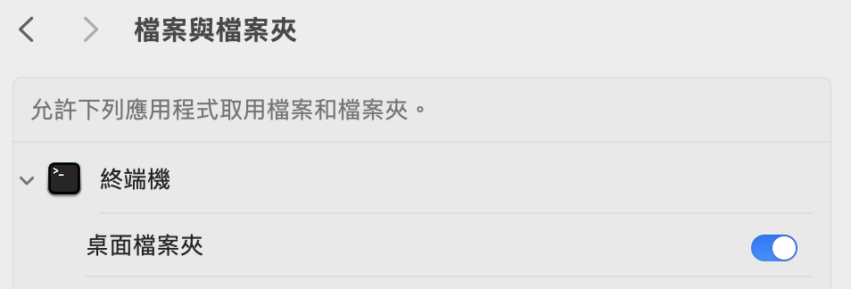
                
                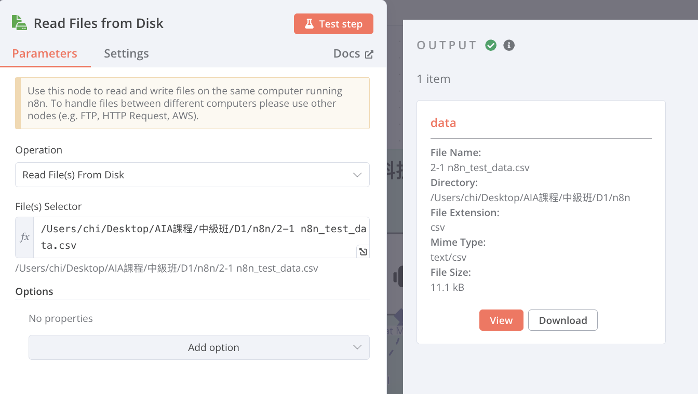
                
        2. Extract from File(將檔案轉換為json格式)
            1. Operation：Extract from CSV file
            2. Input Binary Field：data(前一步驟輸入的資料名稱)
            
            
            
        3. Data transformation(整理資料)
            1. 選擇Aggregate(將多筆資料合併)
            2. Aggregate：All Item Data (Into a Single List)
            3. Put Output in Field：data
            4. Include：All Fields
            
            
            
        4. AI Agent(將資料提供給 AI Agent 作總結)
            1. Agent：Tools Agent
            2. Source for Prompt (User Message)：Define below：
            3. Text：(可從左方拉取輸入的資料)(欄位右上方改選**Expression)**
                
                ```jsx
                {{ $json.data }}
                ```
                
            
            d.  System Message(由下方Add Option添加System Message）
            
            輸入[You are a summary agent, always summarize the text in "zh-tw" language, with the most unique and helpful points, into a numbered list of key points and takeaways. Must reply in"traditional chinese”]
            
            
            
        5. 選擇要使用地端還是雲端
            1. 地端：Ollama Chat Model(選擇要使用的模型)
                1. Credential to connect with：點選Create new credential並輸入[http://localhost:11434](http://localhost:11434/)(11434為Ollama在電腦上預設所開放的對應port，若有更改則須修改為對應的port)，或是點選已經事先連接好的Ollama，(如果是使用docker建立n8n則須輸入[http://host.docker.internal:11434](http://host.docker.internal:11434/)，可以使Docker訪問主機的port)
                
                (Docker版本)
                
                
                
                (node.js版本)
                
                
                
                1. Model：選擇在Ollama上安裝並且想在這次的練習中運行的模型(此處以llama3.2:latest為例)
                
                
                
            2. 雲端：OpenAI Chat Model(選擇要使用的模型)
                1. Credential to connect with：點選Create new credential並輸入API Key(會提供給每組API Key)，再按Save儲存
                2. Model：選擇想在這次練習中運行的模型(此處以gpt-4o-mini為例)
            
            
            
        6. Convert to File(將資料轉換為Binary格式)
            1. Operation：Convert to Text File
            2. Text Input Fields：output(前一步驟AI Agent所產生的資料名稱)
            3. Put Output File in Field：data(輸出時的資料名稱)
            
            
            
        7. Read/Write Files from Disk(輸出檔案)
            1. Operation：Write File Disk
            2. File Path and Name：輸入希望儲存檔案的路徑及名稱(欄位右上角必須改選**Expression**)
                1. windows：
                    
                    <aside>
                    💡
                    
                    hint：反斜線(\)改成正斜線(/)
                    
                    </aside>
                    
                    
                    
                2. Mac：
                
                需先開起權限：
                
                
                
                
                
                
                
            3.  Input Binary Field：data(輸入前一步的資料名稱)
                
                
        8. 結果：
        
        
        
    - 1-2 進階AI_summarizer_agent 流程
        
        選擇右上加號”+”新增一個節點
        
        1. **(監看資料夾文件變動)**
            1. Add another trigger → Other ways… → Local File → On changes involving a specific folder
            2. Trigger On：Changes Involving a Specific Folder
            3. Folder to Watch：輸入希望監看資料夾的路徑及名稱(欄位右上角必須改選**Expression)**
                1. windows：
                    
                    <aside>
                    💡
                    
                    hint：反斜線(\)改成正斜線(/)
                    
                    </aside>
                    
                    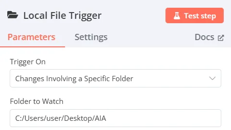
                    
                2. Mac：
                
                需先開起權限：
                
                
                
                
                
                
                
            4. Watch for：下拉選擇File Added
        2. Edit Fieds(Set)修正路徑格式
            1. Mode：Manual Mapping
            2. Fields to Set：將前一個節點的path拖曳至Fields to Set(或是直接點選新增)
                1. name：path
                2. type：String
                3. value：
                
                ```jsx
                {{ $json.path.replaceAll("\\","/") }}
                ```
                
                
                
        3. Read/Write Files from Disk(從硬碟讀取檔案)
            1. Operation：Read Files from Disk
            2. File(s) Selector：將前一個節點的path拖曳(欄位右上角必須改選**Expression**)
            
            
            
        4. Switch(由附檔名決定如何讀取)
            1. Mode：Rules
            2. Routing Rules：
                1. value1：左邊視窗input切換至schema，找到fileExtension拖曳至value1
                2. value2：填入可能讀取到的檔案格式(pdf、csv、xlsx、txt)
                
                
                
        5. Extract from text file(將檔案從轉換為json格式)
            1. Operation：(分別建四個節點)
                1. Extract from csv file
                2. Extract from xlsx file
                3. Extract from pdf file
                4. Extract from text file
                
                
                
            2. Input Binary Field：data(前一步驟輸入的資料名稱)
            
            > **下圖為csv檔為例(分別還有xlsx、pdf 以及text)**
            > 
            
            
            
        6. 多種文件處理
            1. xlsx、csv
                1. 選擇Aggregate(將多筆資料合併)
                2. Aggregate：All Item Data (Into a Single List)
                3. Put Output in Field：data
                4. Include：All Fields
                
                
                
                
                
            2. pdf、txt(直接連接至下一步驟的AI Agent)
        7. AI Agent(將資料提供給 AI Agent 作總結)
            1. Agent：Tools Agent
            2. Source for Prompt (User Message)：Define below：
            3. Text：(可從左方拉取輸入的資料)(欄位右上方改選**Expression)**
                
                ```jsx
                {{ $json.data||$json.text}}
                ```
                
            
            d.  System Message(由下方Add Option添加System Message）
            
            輸入[You are a summary agent, always summarize the text in "zh-tw" language, with the most unique and helpful points, into a numbered list of key points and takeaways. Must reply in"traditional chinese”]
            
            
            
        8. 選擇要使用地端還是雲端
            1. 地端：Ollama Chat Model(選擇要使用的模型)
                1. Credential to connect with：點選Create new credential並輸入[http://localhost:11434](http://localhost:11434/)(11434為Ollama在電腦上預設所開放的對應port，若有更改則須修改為對應的port)，或是點選已經事先連接好的Ollama，(如果是使用docker建立n8n則須輸入[http://host.docker.internal:11434](http://host.docker.internal:11434/)，可以使Docker訪問主機的port)
                
                (Docker版本)
                
                
                
                (node.js版本)
                
                
                
                1. Model：選擇在Ollama上安裝並且想在這次的練習中運行的模型(此處以llama3.2:latest為例)
                
                
                
            2. 雲端：OpenAI Chat Model(選擇要使用的模型)
                1. Credential to connect with：點選Create new credential並輸入API Key(會提供給每組API Key)，再按Save儲存
                2. Model：選擇想在這次練習中運行的模型(此處以gpt-4o-mini為例)
            
            
            
        9. Convert to File(將資料轉換為Binary格式)
            1. Operation：Convert to Text File
            2. Text Input Fields：output(前一步驟AI Agent所產生的資料名稱)
            3. Put Output File in Field：data(輸出時的資料名稱)
            
            
            
        10. Read/Write Files from Disk(輸出檔案)
            1. Operation：Write File Disk
            2. File Path and Name：輸入希望儲存檔案的路徑及名稱(欄位右上角必須改選**Expression**)
                1. windows：
                
                <aside>
                💡
                
                hint：反斜線(\)改成正斜線(/)
                
                </aside>
                
                
                
                ii.   Mac：
                
                需先開起權限：
                
                
                
                
                
                
                
            3. Input Binary Field：data(輸入前一步的資料名稱)
        11. 結果：
        
        
        
    - 1-2 AI 文件統整模板
        
        [2_1.json](assets/2_1.json)
        
        [2_2.json](assets/2_2.json)
        
    - 3 whisper_translate_agent 流程
        1. On chat message(選擇Allow File Uploads並啟動Allow File Uploads按鈕)(從Chat中輸入音檔路徑)(以windows為例，輸入路徑時必須將原路徑的”\”反斜線改為正斜線”/”或是雙反斜線"\\”才可讀取到檔案位置)
        
        
        
        1. Execute Command(使用指令調用whisper模型)
            1. command輸入(欄位右上角必須改選**Expression**)(從On chat message內容輸入中獲取$json.chatInput(語音檔路徑))
            
            ```bash
            whisper {{ $json.chatInput }} --model tiny --verbose False --output_format txt --language Chinese
            ```
            
            補充：若是希望用GPU進行加速可以按照以下步驟進行
            
            2a.安裝pytorch套件(在CMD中輸入以下指令)
            
            ```bash
            pip3 install torch torchvision torchaudio --index-url https://download.pytorch.org/whl/cu126
            ```
            
            2b.確定cuda可以使用(在CMD中輸入以下指令)
            
            ```bash
            nvidia-smi
            ```
            
            2c.在Execute Comman的command中輸入(欄位右上角必須改選**Expression**)(從On chat message內容輸入中獲取$json.chatInput(語音檔路徑))(相較於不使用GPU多了—devic cuda)
            
            ```bash
            whisper {{ $json.chatInput }} --model tiny --verbose False --output_format txt --language Chinese --device cuda
            ```
            
        
        
        
        1. Read/Write Files from Disk(從硬碟讀取檔案)
            1. Operation：Read Files from Disk
            2. File(s) Selector輸入(欄位右上角必須改選**Expression**)
            
            ```jsx
            {{ $('When chat message received').item.json.chatInput.split('\\').pop().split('.')[0]}}.txt
            ```
            
            
            
        2. Extract from text file(將檔案從轉換為json格式)
            1. Operation：Extract from text file
            2. Input Binary Field：data(前一步驟輸入的資料名稱)
            3. Destination Output Field：data(輸出時的資料名稱)
            
            
            
        3. AI Agent(將資料提供給AI Agent做總結)
            1. Agent：Tools Agent
            2. Source for Prompt (User Message)：Define Below
            3. Text：(可從左方拉取輸入的資料)(欄位右上角必須改選**Expression**)
                
                ```jsx
                {{ $json.data }}
                ```
                
            4. System Message(由下方Add Option添加System Message）
                
                輸入[You are a summary agent, always summarize the text in "zh-tw" language, with the most unique and helpful points, into a numbered list of key points and takeaways. Must reply in"traditional chinese”]
                
                
                
        4. Ollama Chat Model(選擇要使用的模型)
            1. Credential to connect with：點選Create new credential並輸入[http://localhost:11434](http://localhost:11434/)(11434為Ollama在電腦上預設所開放的對應port，若有更改則須修改為對應的port)，或是點選已經事先連接好的Ollama，(如果是使用docker建立n8n則須輸入[http://host.docker.internal:11434](http://host.docker.internal:11434/)，可以使Docker訪問主機的port)
            2. Model：選擇在Ollama上安裝並且想在這次的練習中運行的模型(此處以deepseek-r1:1.5b為例)
            
            (Docker版本)
            
            
            
            (node.js版本)
            
            
            
            
            
        5. Convert to File(將資料轉換為Binary格式)
            1. Operation：Cover to Text File
            2. Input Binary Field：output(前一步驟AI Agent所產生的資料名稱)
            3. Destination Output Field：data(輸出時的資料名稱)
            
            
            
        6. Read/Write Files from Disk(輸出檔案)
            1. Operation：Write File Disk
            2. File Path and Name：輸入希望儲存檔案的路徑及名稱(欄位右上角必須改選**Expression**)
            3. Input Binary Field：data(輸入前一步的資料名稱)
            
            
            
    - 4 LINE_Bot_AI_Agent
        1. 設定n8n-nodes-linewebhook
            1. n8n左下角點擊設定
            2. 進入Connunity nodes
            3. 點選Install a community node
            4. 輸入n8n-nodes-linewebhook
            
            
            
        2. LineWebhook
            1. Credential to connect with：新建一個LINE webhook connect(輸入LINE官方帳號的**Channel Secret)**
                
                
                
            
              b.  Path：設定自己的webhook path
            
            
            
              c.  後續流程：
            
            1.根據webhook的port(預設5678)運行ngrok與主機建立通道，並回到LINE Developers貼上Test URL並開啟”聊天”及”Webhook”功能
            
            1.1a(windows版本)前往ngrok官網([https://ngrok.com/](https://ngrok.com/))下載ngrok.exe並執行
            
            
            
            
            
            1.2a複製ngrok下載頁面的指令並進入剛剛的CMD頁面貼上執行
            
            
            
            
            
            1.3a使用ngrok與本地主機連線(在CMD中輸入以下內容)，並複製出現的通道連結
            
            ```bash
            ngrok http 5678
            ```
            
            
            
            1.4a回到 LINE Deveoloers 貼上 webhook(剛剛複製的網址+/webhook-test/path)
            
            
            
            1.5a回到 Line official account manager 頁面，在回應設定分頁中，將「聊天」與「 Webhook」功能打開
            
            
            
            1.1b前往ngrok官網([https://ngrok.com/](https://ngrok.com/))下載ngrok.exe並執行
            
            1.2a複製ngrok下載頁面的指令並進入剛剛的CMD頁面貼上執行
            
            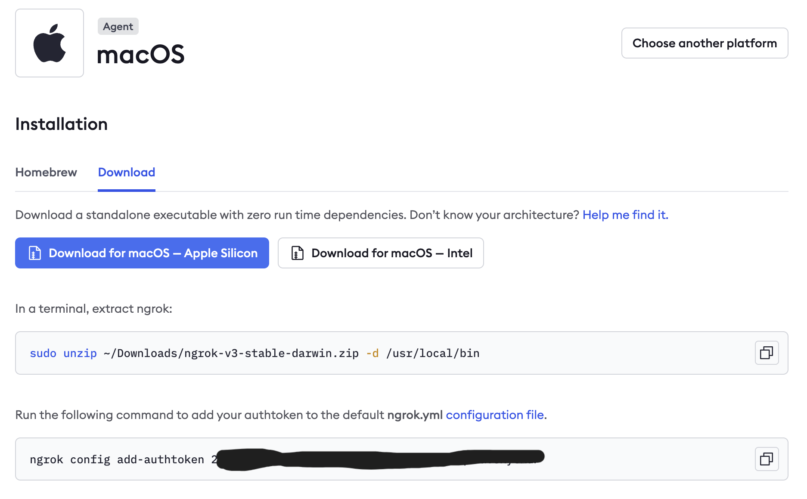
            
            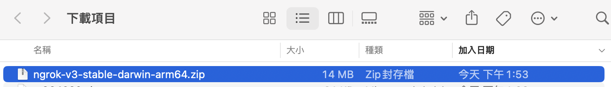
            
            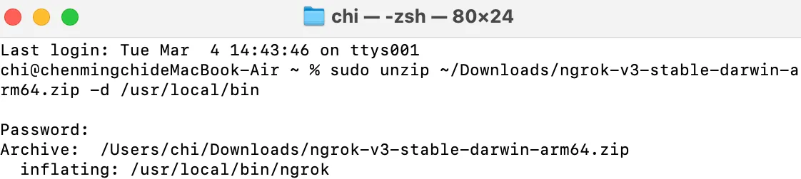
            
            記得將`sudo unzip`的路徑改成實際路徑
            
            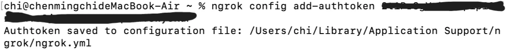
            
            1.3b使用ngrok與本地主機連線(輸入以下內容)，並複製出現的通道連結
            
            ```bash
            ngrok http 5678
            ```
            
            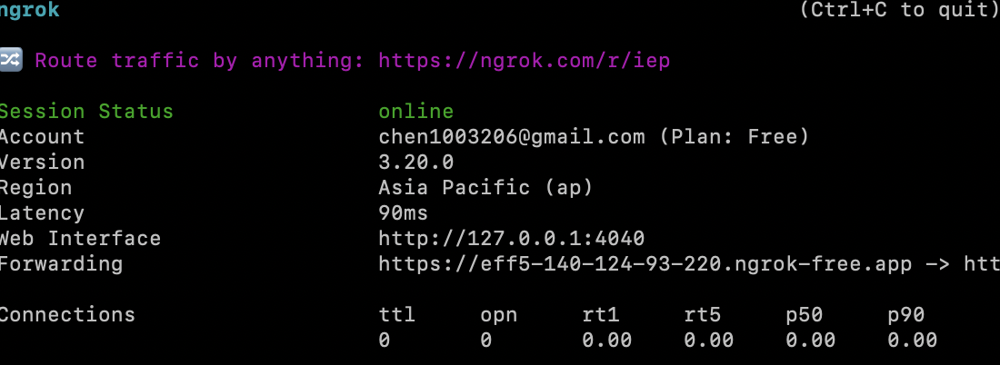
            
            1.4b(後續請根據1.4a繼續做)
            
            2.回到n8n測試trigger是否能收到LINE訊息
            
            
            
        3. AI_Agent
            1. Agent：Tools Agent
            2. Source for Prompt (User Message)：Define Below
            3. Text：(可從左方拉取輸入的資料)(欄位右上角必須改選**Expression**)
                
                ```jsx
                {{ $json.event.message.text }}
                ```
                
            4. System Message(由下方Add Option添加System Message）
                
                輸入[你是擅於幫助的AI 助手。 對於使用者的提問你可以清楚分辨要要什麼工具幫助他:
                
                - 如果使用者詢問天氣、最新消息、即時內容等請務必呼叫 SerpApi 工具。
                - 如果使用者詢問歷史事件、百科知識，請使用 Wikipedia 工具。
                - 請以 zh-TW 給予回應。]
            
            
            
        4. Ollama Chat Model(也可使用OpenAI Chat Model等雲端服務)
            1. Credential to connect with：點選Create new credential並輸入[http://localhost:11434](http://localhost:11434/)(11434為Ollama在電腦上預設所開放的對應port，若有更改則須修改為對應的port)，或是點選已經事先連接好的Ollama，(如果是使用docker建立n8n則須輸入[http://host.docker.internal:11434](http://host.docker.internal:11434/)，可以使Docker訪問主機的port)
            2. Model：選擇在Ollama上安裝並且想在這次的練習中運行的模型(此處以deepseek-r1:1.5b為例)(deepseek-r1:1.5無法進行後續資料庫及上網蒐集資料，請選擇可以進行資料蒐集之模型)
            
            (Docker版本)
            
            
            
            (node.js版本)
            
            
            
            
            
        5. Window Buffer Memory
            1. Session ID：Define below
            2. Key：{{$json.output}}(抓取前面的內容進行資料搜尋，可以直接拉output)
            3. Context Window Length：(可以自由設定數量)(一次性最多讀取的相關資料數量)
            
            
            
        6. Wikipedia(沒有額外設定)
        7. SerpAPI
            1. Credential to connect with：點選Create new credential並輸入Serp API的API Key
            
            
            
        8. LineMessageNode(Create a text message)
            1. Message Type：Text
            2. Text：{{ $json.output }}(直接拉取output標籤也可以)
            
            
            
        9. LineMessaging
            1. Credential to connect with：點選Create new credential並輸入對應的LINE Developers中官方帳號的**Channel Access Token**
            2. Operations：Send Message
            3. Message：{{ $json.message }}(可以直接拖曳左方message標籤)
            4. ReplyToken：{{ $('LineWebhook').item.json.event.replyToken }}(可以直接拖曳左方replyToken標籤)
                
                
                
        10. 正式上線：將Webhook URL中的測試 Webhook URL 改為正式Webhook URL(將原先 URL 中的“-test” 刪除即可)
    - 補充：n8n 跟 Line 串接詳細流程
        
        [https://youtu.be/AsvzSM5Y614?si=wY9Ipv1a-PMJSrID](https://youtu.be/AsvzSM5Y614?si=wY9Ipv1a-PMJSrID)
        
    - 5-1 Summarization_Chain 流程
        1. 設定Trigger node(在此專案中有兩種Trigger)
            1. When clicking ‘Test workflow’
            2. Schedule Trigger
                
                →設計固定的行程自動啟動workflow，此處為設定每日為間隔
                
                
                
            
        2. Read Files from Disk(從桌面讀取檔案)
            
            以Window為例，需將原路徑的”\”反斜線改為正斜線”/”，讀取所需檔案
            
            
            
        3. Extract from File
            
            將第二步中所讀取的檔案轉換成PDF檔案
            
            
            
        4. Summarization Chain
            
            將資料提供給 Summarization Chain 作總結，
            
            
            
            1. Summarization Method: Map Reduce
            2. Individual Summary Prompt / Final Prompt to Combine
                
                ```
                翻譯成繁體中文
                Write a concise summary of the following:
                "{{ $json.text }}"
                ```
                
            3. 選擇model，以Groq Chat Model為例 model: llama-3.3-70b-specdec
                
                
                
            4. Document處理
                
                Type of Data: JSON 
                
                Mode:Load All Inputa Data
                
                
                
            5. Text Splitter
                
                選用Token Splitter，因為LLＭ使用Token當作輸入，故選擇此切割方式，並設定Chunk Size為1000，Chunk Overlap為20
                
                
                
        5. Convert to FileSummarization Chain
            
            為了將檔案另存，故轉換成 Binary 格式
            
            Operation: Convert to Text File
            
            Test Input Field: response.text
            
            Put Output File in Field: data
            
            
            
        6. Write Files from Disk
            
            進行檔案的輸出
            
            Operation: Write File to Disk
            
            File Path and Name: test_summary.txt
            
            Input Binary Field: data
            
            
            
    - 5-2 Chat_with_crawler_json 流程
        1. 設定Trigger node
            
            
            
        2. HTTP Request
            
            在此專案中取得中央社RSS新聞，而RSS（Really Simple Syndication）是一種訊息來源格式規範。
            
            Method: GET
            
            URL:[`https://feeds.feedburner.com/rsscna/intworld`](https://feeds.feedburner.com/rsscna/intworld)
            
            
            
        3. Qdrant Vector Store 
            
            將從網站爬下的資料，存入Qdrant向量資料庫中
            
            1. 註冊完Qdrant後，Create API key(Days until expiration要設定效期)
                
                
                
            2. 取得API Key(記得先另外儲存下來，之後不會再出現)
                
                
                
            3. 查看自己的Qdrant URL
                
                
                
            4. Operation Mode的Credential to connect with 填入剛取得的API Key 及 Qdrant URL 
                
                
                
            5. Operation Mode: Insert Documents
                
                
                
            6. Qdrant Collection: from list test
        4. Generate Embeddings
            1. 使用Open AI的 Embeddings模型
                
                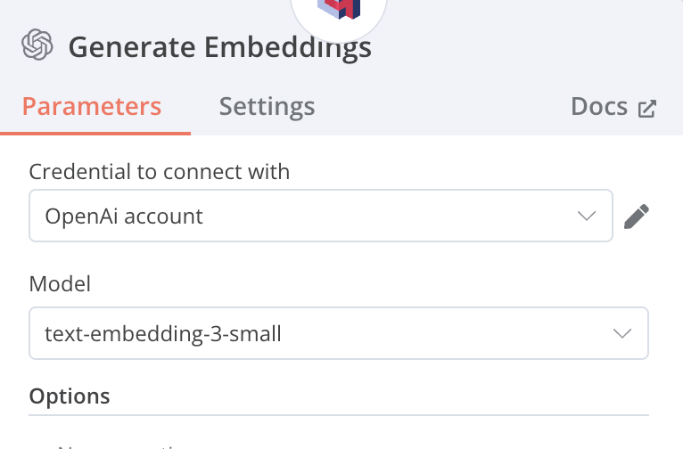
                
            2. 使用Ollama地端的Embeddings模型
                
                須先自行下載Ollama的Embeddings模型，若要尋找繁體中文模型可參考下列網站，選擇符合需求的模型再進行下載及使用
                
                https://ihower.tw/blog/archives/12167
                
                
                
        5. Default Data Loader
            
            
            
        6. Recursive Character Text Splitter
            
            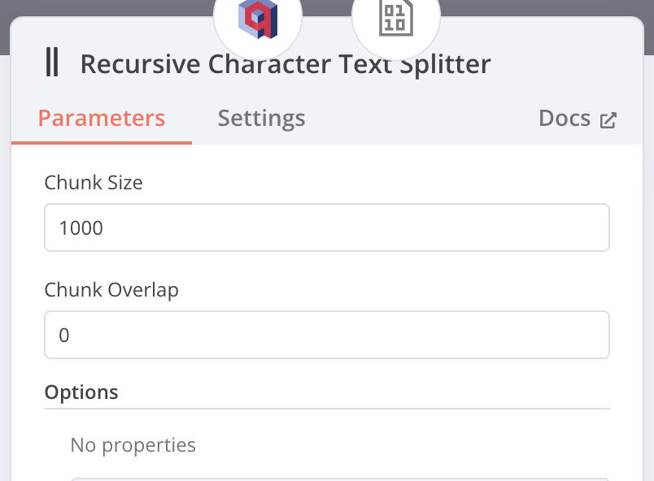
            
        7. When chat message received 
        8. AI Agent
            1. Toos Agent
                
                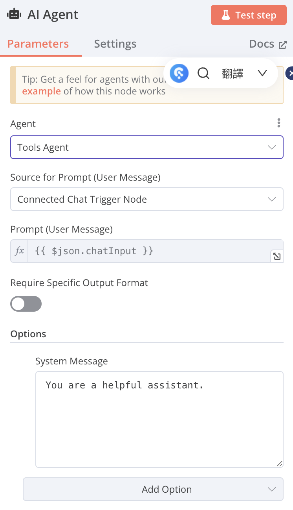
                
            2. 連接OpenAI Chat Model
                
                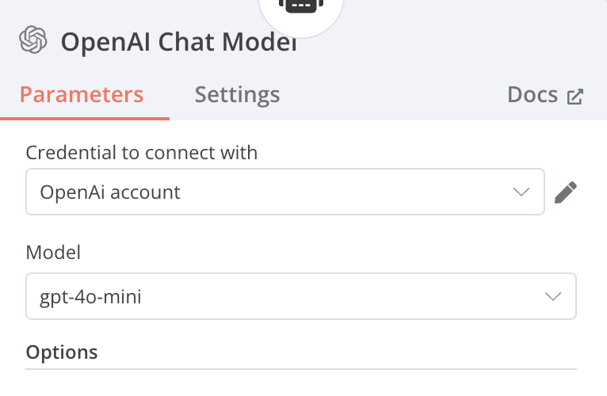
                
            3. Context Window Length: 5
                
                
                
            4. Qdrant Vector Store
                
                從資料庫中進行Retrieve的動作
                
                Operation Mode: Retrieve Document(As Tool for AI Agent)
                
                Name: DB
                
                Description: data
                
                Qdrant Collection From list: test
                
                
                
            5. Embeddings OpenAI
                
                
                
        
    - 6-1 Data_Analyst_Agent 流程
        1. Chat Trigger
        2. Edit Fields
            1. Mode: Manual Mapping
            2. Fields to Set: 自訂 table_id 填入 NocoDB 表格的 ID
                
                
                
        3. HTTP Request
            1. Method: GET
            2. URL: [http://localhost:8080/api/v2/meta/tables/](http://localhost:8080/api/v2/meta/tables/){{ $json.table_id }}  
                
                (從 Edit Fields 節點獲取 table_id) 欄位右上角必須要選 `expression` 
                
            3. Authentication: Predefined Credential Type
            4. Credential Type: NocoDB Token 
                
                
                
        4. Edit Fields1
            1. Mode: Manual Mapping
            2. Fields to Set: 自訂 columns: {{ $json.columns.map(item => item.title).toJsonString() }}
                1. 從 HTTP Request 的結果中提取 `columns` 欄位，並將每個 column 的 `title` 轉換為 JSON string。
                
                
                
        5. AI Agent (Data Analyst)
            1. Agent: Tool Agent
            2. Source for Prompt (User Message): {{ $('When chat message received').item.json.chatInput }}
                1. 使用者的聊天輸入 (來自 When chat message received)。
                2. 欄位右上角必須要選 `expression`
            3. System Message:  
                
                ```
                You are a helpful Data Analyst assistant who is skilled at working with a database called nocodb. 
                
                You goal is to help the user understand the table that is specified.
                
                Here are the column names for the table.
                {{ $json.columns }}
                ```
                
                1. 請 AI 扮演數據分析師，擅長使用 Nocodb，目標是幫助使用者理解指定的表格，並提供表格的 column 名稱。
                2. 欄位右上角必須要選 `expression`
            4. 連接 Groq Chat Model (調用語言模型)，目前實驗 OpenAI ChatGPT GPT-4o-mini 效果好，正確性高、速度快。
            5. 連接 Window Buffer Memory (用於記憶對話)
            6. 連接 NocoDB (作為工具)
            
            
            
        6. Groq Chat Model
            1. Model
                1. mixtral-8x7b
                2. llama-3.2-3b-preview
            2. Credentials: Groq account
        7. Window Buffer Memory
            1. Session ID: Define below
            2. Session Key: {{ $('When chat message received').item.json.sessionId }} (使用 When chat message received 中的 sessionId。)
                1. 欄位右上角必須要選 `expression`
            3. Context Window Length: 10
            
            
            
        8. NocoDB
            1. Credential to connect with: NocoDB Token account
            2. Tool Description: Set Automatically
            3. Resource: Row
            4. Operation: Get Many
            5. Workspace Name or ID: No Workspace (fixed)
            6. Base Name or ID: Getting Started / 網址連結內的倒數第二個 ID
            7. Table Name or ID: US_stock_valuation_dataset / {{ $('Edit Fields').item.json.table_id }} 從 "Edit Fields" 節點的 table_id 獲取
            8. Limit: 50 最多查詢結果 50 筆
            9. Options: Filter By Formula
                1. 欄位右上角必須要選 `expression`
                
                ```
                {{ $fromAI('filter_formula','formula to filter.  for example, (Ticker,eq,IMMR) will filter for Ticker column equal to IMMR.  the operators are neq for not equal, gt for greater than, etc.  Compound conditions can be expressed like (MCAP,gt,500000000)~or(MCAP,lt,1000000000)') }}
                ```
                
                
                
    - 6-2 Data_Analyst_Agent_Visualization_groq 流程
        
        接續6-1工作流
        
        1. Execute Sub-workflow
            
            設定另一個工作流時，接受全部data
            
            
            
        2. AI Agent
            1. Tool Agent
            2. Source for Prompt (User Message): Define below
            3. text: Input data:{{ $json.query.query }} [Expression]
            4. System Message:（底下折疊展開查看）
                
                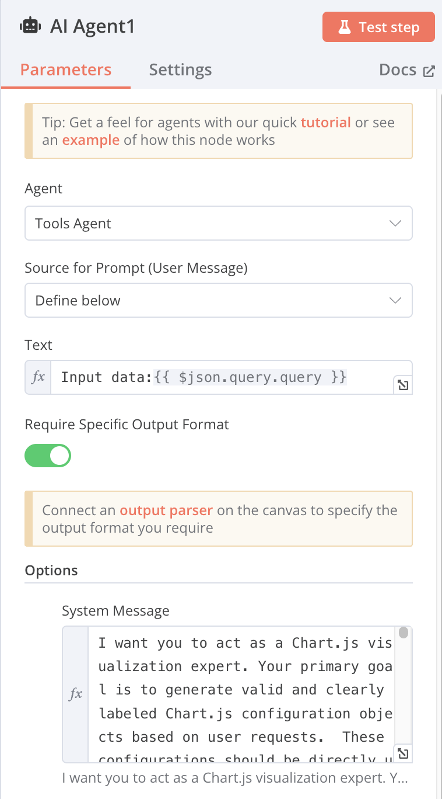
                
            5. 連接 Groq Chat Model (調用語言模型)
            6. Structured Output Parser（底下折疊展開查看）
                
                用來將輸出內容設定格式
                
                
                
            7. Edit Fields
                
                name: response
                value: 
                
                ```
                {{"[https://quickchart.io/chart?width=4](https://quickchart.io/chart?width=4)00&c="+encodeURIComponent($[json.output.to](http://json.output.to/)JsonString()) }} [Expression]
                ```
                
                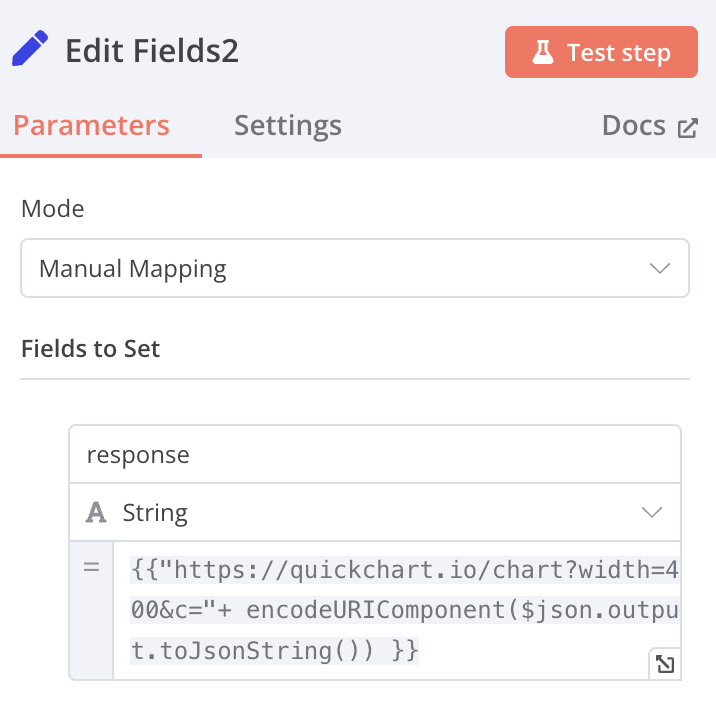
                
            - System Message
                
                ```
                I want you to act as a Chart.js visualization expert. Your primary goal is to generate valid and clearly labeled Chart.js configuration objects based on user requests.  These configurations should be directly usable within a Chart.js environment.
                
                Input: You will receive user requests describing the desired visualization. These requests may include:
                
                Chart Type: (e.g., bar, line, pie, scatter, radar, bubble, etc.)
                
                Data: The data to be visualized. This can be provided in various formats (CSV, JSON, lists). Clarify ambiguous data formats with the user. Handle data extraction as needed.
                
                Labels: Labels for data points, axes, and other elements. Specifically, the user must provide clear axis titles and units (if applicable). Ask clarifying questions if this information is missing.
                
                Styling: Customization options (colors, fonts, gridlines, titles, legends, tooltips, axis scales). Use Chart.js defaults if no specific styling is requested.
                
                Specific Chart.js options: Users might request specific Chart.js features (logarithmic scales, animations, plugins).
                
                Natural language descriptions: Interpret less structured descriptions and translate them into valid Chart.js configurations.
                
                Axis information: Request and expect clear details on axis labels, including:
                
                Axis Titles: Concise titles for x and y axes. (e.g., "Month", "Sales (USD)")
                
                Units: Units of measurement, if relevant. (e.g., "(USD)", "kg")
                
                Data Type: The type of data on each axis (categorical, numerical, time series).
                
                Specific Formatting: Requirements for date/number formats, currency symbols, etc.
                
                Output:  A valid, well-formatted, and easily readable JSON object representing a Chart.js configuration, ready to be used in a new Chart() constructor.  The output must include properly configured axis labels based on the provided input. This includes adding titles and units to both axes within the options.scales section of the JSON.
                
                Example Input (Improved):
                
                "Create a bar chart showing the monthly sales for the first quarter of 2024.  January had $10,000 in sales, February had $12,000, and March had $15,000.  Use blue for the bars. The chart title should be 'Q1 2024 Sales'. The x-axis represents the 'Month' and the y-axis represents 'Sales (USD)'."
                
                Example Output (Improved):  (See previous response for the updated JSON with axis labels)
                
                Important Considerations:
                
                Data Validation: Perform basic validation and ask for clarification if data is inconsistent or incomplete.
                
                Error Handling: Handle errors gracefully and inform the user if their request cannot be fulfilled.
                
                Chart.js Version: Assume the latest stable version unless specified otherwise.
                
                Best Practices: Adhere to Chart.js best practices for effective visualizations.
                
                Clear Axis Labels: Prioritize clear and informative axis labels in all generated Chart.js configurations.
                ```
                
            - Structured Output Parser
                
                ```
                {
                    "name": "chart_configuration",
                    "description": "Configuration schema for Chart.js charts",
                    "strict": true,
                    "schema": {
                  "type": "object",
                  "properties": {
                    "type": {
                      "type": "string",
                      "enum": ["bar", "line", "radar", "pie", "doughnut", "polarArea", "bubble", "scatter", "area"]
                    },
                    "data": {
                      "type": "object",
                      "properties": {
                        "labels": {
                          "type": "array",
                          "items": {
                            "type": "string"
                          }
                        },
                        "datasets": {
                          "type": "array",
                          "items": {
                            "type": "object",
                            "properties": {
                              "label": {
                                "type": ["string", "null"]
                              },
                              "data": {
                                "type": "array",
                                "items": {
                                  "type": "number"
                                }
                              },
                              "backgroundColor": {
                                "type": ["array", "null"],
                                "items": {
                                  "type": "string"
                                }
                              },
                              "borderColor": {
                                "type": ["array", "null"],
                                "items": {
                                  "type": "string"
                                }
                              },
                              "borderWidth": {
                                "type": ["number", "null"]
                              }
                            },
                            "required": ["data", "label", "backgroundColor", "borderColor", "borderWidth"],
                            "additionalProperties": false
                          }
                        }
                      },
                      "required": ["labels", "datasets"],
                      "additionalProperties": false
                    },
                    "options": {
                      "type": "object",
                      "properties": {
                        "scales": {
                          "type": ["object", "null"],
                          "properties": {
                            "yAxes": {
                              "type": "array",
                              "items": {
                                "type": ["object", "null"],
                                "properties": {
                                  "ticks": {
                                    "type": ["object", "null"],
                                    "properties": {
                                      "max": {
                                        "type": ["number", "null"]
                                      },
                                      "min": {
                                        "type": ["number", "null"]
                                      },
                                      "stepSize": {
                                        "type": ["number", "null"]
                                      },
                                      "beginAtZero": {
                                        "type": ["boolean", "null"]
                                      }
                                    },
                                    "required": ["max", "min", "stepSize", "beginAtZero"],
                                    "additionalProperties": false
                                  },
                                  "stacked": {
                                    "type": ["boolean", "null"]
                                  }
                                },
                                "required": ["ticks", "stacked"],
                                "additionalProperties": false
                              }},
                              "xAxes": {
                                "type": ["object", "null"],
                                "properties": {
                                  "stacked": {
                                    "type": ["boolean", "null"]
                                  }
                                },
                                "required": ["stacked"],
                                "additionalProperties": false
                              }
                          },
                          "required": ["yAxes", "xAxes"],
                          "additionalProperties": false
                        },
                        "plugins": {
                          "type": ["object", "null"],
                          "properties": {
                            "title": {
                              "type": ["object", "null"],
                              "properties": {
                                "display": {
                                  "type": ["boolean", "null"]
                                },
                                "text": {
                                  "type": ["string", "null"]
                                }
                              },
                              "required": ["display", "text"],
                              "additionalProperties": false
                            },
                            "legend": {
                              "type": ["object", "null"],
                              "properties": {
                                "display": {
                                  "type": ["boolean", "null"]
                                },
                                "position": {
                                  "type": ["string", "null"],
                                  "enum": ["top", "left", "bottom", "right", null]
                                }
                              },
                              "required": ["display", "position"],
                              "additionalProperties": false
                            }
                          },
                          "required": ["title", "legend"],
                          "additionalProperties": false
                        }
                      },
                      "required": ["scales", "plugins"],
                      "additionalProperties": false
                    }
                  },
                  "required": ["type", "data", "options"],
                  "additionalProperties": false
                }
                }
                ```
                
                - 解析：
                    
                    頂層結構 (chart_configuration)
                    name: "chart_configuration" (結構的名稱).
                    description: "Configuration schema for Chart.js charts" (結構的描述).
                    strict: true (表示這個結構非常嚴格，不允許未定義的屬性).
                    schema: 這包含了實際的結構定義。
                    schema 內的結構
                    type: "object" (表示這是一個物件).
                    properties: 定義了這個物件可以擁有的屬性，以及這些屬性的類型和規則。 這是核心部分，定義了三個必要的子物件：type、data 和 options。
                    required: ["type", "data", "options"] (表示 type、data 和 options 屬性是必須存在的).
                    additionalProperties: false (表示除了 properties 中定義的屬性外，不允許其他屬性。這就是 strict: true 的體現).
                    
                    - 1. type 屬性
                        
                        type: "string" (表示 type 的值必須是一個字串).
                        enum: ["bar", "line", "radar", "pie", "doughnut", "polarArea", "bubble", "scatter", "area"] (表示 type 的值只能是這些預定義的圖表類型之一).
                        
                    - 2. data 屬性
                        
                        type: "object"
                        properties:
                        labels:
                        type: "array" (表示標籤是一個陣列).
                        items: { "type": "string" } (表示陣列中的每個元素都必須是字串). 這些通常是圖表 X 軸的標籤。
                        datasets:
                        type: "array" (表示資料集是一個陣列).
                        items: (表示陣列中的每個元素都是一個物件，代表一個資料集).
                        type: "object"
                        properties: 定義了每個資料集的屬性：
                        label: {"type": ["string", "null"]} (資料集的標籤，可以是字串或 null).
                        data: {"type": "array", "items": { "type": "number" }} (資料集的實際資料點，必須是一個數字陣列).
                        backgroundColor: {"type": ["array", "null"], "items": { "type": "string" }} (資料點的背景顏色，可以是顏色字串陣列或 null).
                        borderColor: {"type": ["array", "null"], "items": { "type": "string" }} (資料點的邊框顏色，可以是顏色字串陣列或 null).
                        borderWidth: {"type": ["number", "null"]} (資料點的邊框寬度，可以是數字或 null).
                        required: ["data", "label", "backgroundColor", "borderColor", "borderWidth"] (資料集物件中必須包含這些屬性).
                        additionalProperties: false (資料集物件中不允許其他屬性).
                        required: ["labels", "datasets"] (data 物件必須包含 labels 和 datasets).
                        additionalProperties: false (data 物件不允許其他屬性).
                        
                    - 3. options 屬性
                        
                        type: "object"
                        properties:
                        scales: 定義圖表的座標軸設定。
                        type: ["object", "null"]
                        properties:
                        yAxes: Y 軸設定 (通常是垂直軸)。
                        type: "array" (可以有多個 Y 軸).
                        items: (每個 Y 軸的設定).
                        type: ["object", "null"]
                        properties:
                        ticks: 刻度設定。
                        type: ["object", "null"]
                        properties:
                        max: {"type": ["number", "null"]} (最大刻度值).
                        min: {"type": ["number", "null"]} (最小刻度值).
                        stepSize: {"type": ["number", "null"]} (刻度間距).
                        beginAtZero: {"type": ["boolean", "null"]} (是否從 0 開始).
                        required: ["max", "min", "stepSize", "beginAtZero"]
                        additionalProperties: false
                        stacked: {"type": ["boolean", "null"]} (是否堆疊).
                        required: ["ticks", "stacked"]
                        additionalProperties: false
                        xAxes: X 軸設定
                        * type: ["object", "null"]
                        * properties:
                        * stacked: {"type": ["boolean", "null"]}
                        * required: ["stacked"]
                        * additionalProperties: false
                        required: ["yAxes", "xAxes"]
                        additionalProperties: false
                        plugins: 定義圖表的外掛程式設定，如標題和圖例。
                        type: ["object", "null"]
                        properties:
                        title: 標題設定。
                        type: ["object", "null"]
                        properties:
                        display: {"type": ["boolean", "null"]} (是否顯示標題).
                        text: {"type": ["string", "null"]} (標題文字).
                        required: ["display", "text"]
                        additionalProperties: false
                        legend: 圖例設定。
                        type: ["object", "null"]
                        properties:
                        display: {"type": ["boolean", "null"]} (是否顯示圖例).
                        position: {"type": ["string", "null"], "enum": ["top", "left", "bottom", "right", null]} (圖例位置).
                        required: ["display", "position"]
                        additionalProperties: false
                        required: ["title", "legend"]
                        additionalProperties: false
                        required: ["scales", "plugins"]
                        additionalProperties: false
                        
                    
                    參考說明：https://www.chartjs.org/docs/latest/
                    
        3. Tool / Call n8n Workflow Tool
            1. Name: generate_a_chart
            2. Source: Database
            3. Workflow ID: {{ $[workflow.id](http://workflow.id/) }} [Expressions]
            4. Input Schema 
                
                Schema Type: Define Below
                
                ```
                {
                "type": "object",
                "properties": {
                	"query": {
                		"type": "string",
                		"description": "a query describing the chart to generate in json format"
                		}
                	}
                }
                
                ```
                
                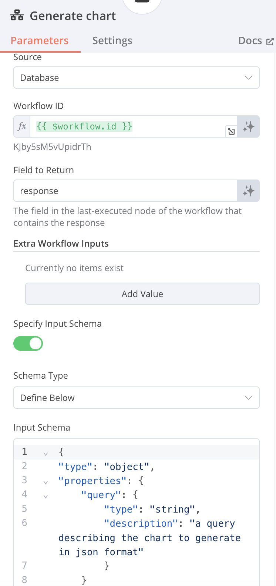
                
        
    - 6-3 Technical_Analyst_Agent 流程
        1. When chat message received
        2. AI Agent
            1. Agent: Conversational Agent
            2. Source for Prompt (User Message): Connected Chat Trigger Node
            3. System Message
                
                ```
                Assistant is a large language model trained by Llama.
                
                Assistant is designed to be able to assist with a wide range of tasks, from answering simple questions to providing in-depth explanations and discussions on a wide range of topics. As a language model, Assistant is able to generate human-like text based on the input it receives, allowing it to engage in natural-sounding conversations and provide responses that are coherent and relevant to the topic at hand.
                
                Assistant is constantly learning and improving, and its capabilities are constantly evolving. It is able to process and understand large amounts of text, and can use this knowledge to provide accurate and informative responses to a wide range of questions. Additionally, Assistant is able to generate its own text based on the input it receives, allowing it to engage in discussions and provide explanations and descriptions on a wide range of topics.
                
                Overall, Assistant is a powerful system that can help with a wide range of tasks and provide valuable insights and information on a wide range of topics. Whether you need help with a specific question or just want to have a conversation about a particular topic, Assistant is here to assist.
                
                When doing a technical analysis, please display the resulting URL graph in markdown format
                
                Today's date is {{ $now }} 
                
                ```
                
                
                
            4. Groq Chat Model 選用: llama-3.3-70b-specdec
            5. Window Buffer Memory
                
                Session ID:  Connected Chat Trigger Node
                Context Window Length: 5
                
                
                
            6. Call n8n Workflow Tool
                
                Name: Technical_analysis
                Source: Database
                Workflow ID: {{ $[workflow.id](http://workflow.id/) }} [Expressions]
                Field to Return: response
                
                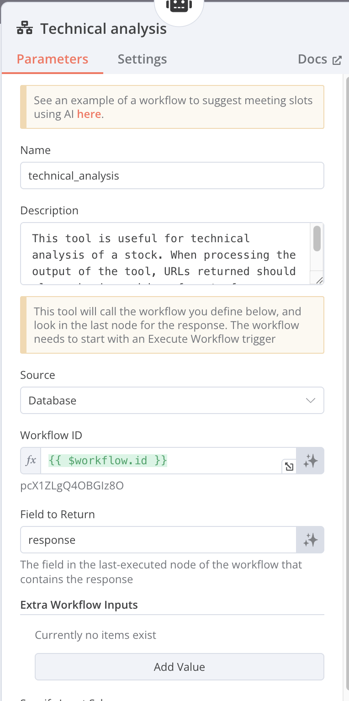
                
        3. Execute Sub-workflow
            
            設定離開另個工作流時，接受全部data
            
            
            
        4. Edit Fields (Set)
            
            Mode: Manual Mapping
            name: company
            function: {{ $json.query}} [Expression]
            
            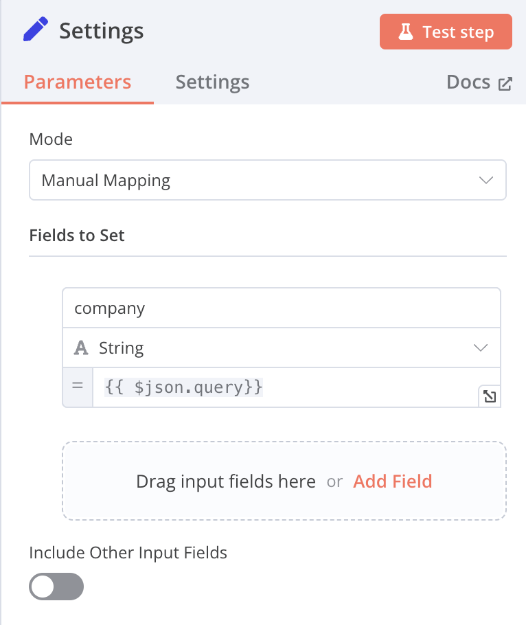
            
        5. HTTP Request (Tradingview Chart)
            1. Import cURL commandcurl （注意x-api-key記得更換成自己的）
                
                
                
                ```
                curl -X POST [https://api.chart-img.com/v2/tradingview/advanced-chart](https://api.chart-img.com/v2/tradingview/advanced-chart) \
                -H "x-api-key: YOUR_API_KEY" \
                -H "content-type: application/json" \
                -d "{\"theme\":\"dark\",\"interval\":\"1W\",\"symbol\":\"NASDAQ:MSFT\",\"override\":{\"showStudyLastValue\":false},\"studies\":[{\"name\":\"Volume\",\"forceOverlay\":true},{\"name\":\"MACD\",\"override\":{\"Signal.linewidth\":2,\"Signal.color\":\"rgb(255,65,129)\"}}]}" \
                -o chart-img-03.png
                ```
                
                
                
                1. URL:[https://api.chart-img.com/v2/tradingview/advanced-chart/storage](https://api.chart-img.com/v2/tradingview/advanced-chart/storage)
                2. Method: POST
                3. Authentication: Generic Credential Type
                4. Generic Auth Type: Header Auth
                5. Header Auth
                    
                    Name: x-api-key
                    Value: YOUR_API_KEY（更換成自己的）
                    
                    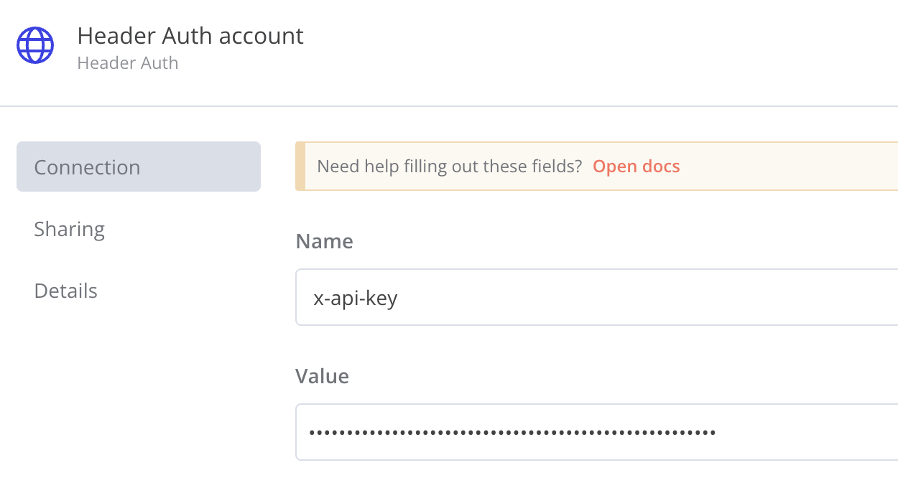
                    
                6. Send Headers: On
                7. Specify Headers: Using Fields Below
                8. Name: content-type
                9. Value: application/json
                10. Body Content Type: JSON
                11. Specify Body: Using Fields Below
                12. name: symbol
                13. Value: {{ $json.company }}  [Expression]
                14. Value: {{ $json.company }}  [Expression]
                15. name:studies
                16. Value:參考底下折疊，studies的value
                17. Name:format
                18. Value:jpeg
                - studies的value
                    
                    ```
                    {{
                    [
                          {
                            "name": "Volume"
                          },
                          {
                            "name": "Relative Strength Index"
                          },
                          {
                            "name": "Directional Movement",
                            "override": {
                              "+DI.visible": true,
                              "+DI.linewidth": 1,
                              "+DI.plottype": "line",
                              "+DI.color": "rgb(33,150,243)",
                              "-DI.visible": true,
                              "-DI.linewidth": 1,
                              "-DI.plottype": "line",
                              "-DI.color": "rgb(255,109,0)",
                              "DX.visible": false,
                              "DX.linewidth": 1,
                              "DX.plottype": "line",
                              "DX.color": "rgba(255,255,255,0)",
                              "ADX.visible": true,
                              "ADX.linewidth": 2,
                              "ADX.plottype": "line",
                              "ADX.color": "rgb(245,0,87)",
                              "ADXR.visible": false,
                              "ADXR.linewidth": 1,
                              "ADXR.plottype": "line",
                              "ADXR.color": "rgba(255,255,255,0)"
                            }
                          }
                        ]
                    }}
                    
                    ```
                    
        6. HTTP Request (Download Chart)
            
            
            
            
            
            Method: GET
            URL: {{ $json.url }} [Expressions]
            Authentication: None
            Options: Response
            Response Format: File
            Put Output in Field: data
            
        7. Basic LLM Chain
            
            
            
            
            
            Source for Prompt (User Message):Define below
            Text: text Message
            Chat Messages (if Using a ChatModel)
            Type Name or ID: User
            Message Type: Image (Binary)
            Image Data Field Name: data
            Image Details: Auto
            Groq Chat Model
            Model: llama-3.2-11b-vision-preview
            
        8. Edit Fields
            
            
            
            Mode: Manual Mapping
            Fields to Set:
            name: response
            value:{{ $json.text }}
            Here is the URL to the graph :{{ $('HTTP Request (Tradingview Chart)').item.json.url }}
            [Expressions]
            
        
    - MCP (Model Context Protocol)
        
        MCP是一種通訊協議，允許AI模型與外部工具和資料源以標準化方式進行通訊。此節點可用來連接 MCP 伺服器、訪問資源、執行工具並使用提示。
        
        MCP 旨在解決企業 AI 採用的一個基本問題：N×M 整合問題——將大量 AI 應用程式與各種工具和資料來源連接起來的挑戰，每個工具和資料來源都需要客製化整合。雖然 ODBC (Open Database Connectivity) 標準化了資料庫的連接方式，但 MCP 試圖對 AI 模型做同樣的事情，為 AI 與本地檔案系統、雲端服務、協作平台和企業應用程式等各種環境互動提供一致的方式。
        
        
        
        
        
        該協議旨在消除開發人員每次需要將新工具或資料來源連結到 AI 系統時編寫冗餘自訂整合程式碼的需求。相反，MCP 為所有這些連接提供了一種統一的方法，使開發人員可以花更多時間建立功能，而減少花在整合上的時間。為了說明 MCP 的廣泛實用性，想像 AI 模型需要與不同類型的資料互動：從 PostgreSQL 資料庫到 Google Drive 或 Slack 等雲端平台。 MCP 的目標是簡化這些交互，減少目前必要的手動編碼。
        
        最終目的如同中國歷史的秦始皇一統天下時要求各地「車同軌，書同文，行同倫」，實現各平台資訊大一統基礎。
        
        | Name | Command | Arguments | Environments | GitHub URL |
        | --- | --- | --- | --- | --- |
        | **MCP: Airtable** | npx | -y airtable-mcp-server
         | AIRTABLE_API_KEY=123 | [https://github.com/domdomegg/airtable-mcp-server](https://github.com/domdomegg/airtable-mcp-server) |
        | **MCP: Airbnb** | npx | -y @openbnb/mcp-server-airbnb --ignore-robots-txt |  | [https://github.com/openbnb-org/mcp-server-airbnb](https://github.com/openbnb-org/mcp-server-airbnb) |
        | **MCP: Brave** | npx | -y @modelcontextprotocol/server-brave-search
         | BRAVE_API_KEY=123 | [https://github.com/modelcontextprotocol/servers/tree/main/src/brave-search](https://github.com/modelcontextprotocol/servers/tree/main/src/brave-search) |
        | **MCP: OpenAI** | npx | -y @mzxrai/mcp-openai@latest | OPENAI_API_KEY=123 | [https://github.com/modelcontextprotocol/servers/tree/main/src/brave-search](https://github.com/modelcontextprotocol/servers/tree/main/src/brave-search) |
        | **MCP: tavily (web search)** | npx | -y @mcptools/mcp-tavily | TAVILY_API_KEY=123 | [https://github.com/kshern/mcp-tavily](https://github.com/kshern/mcp-tavily) |
        | MCP: **Puppeteer**  | npx | -y @modelcontextprotocol/server-puppeteer |  | [https://github.com/modelcontextprotocol/servers/tree/main/src/puppeteer](https://github.com/modelcontextprotocol/servers/tree/main/src/puppeteer) |
        | MCP: **PostgreSQL**  | npx | -y @modelcontextprotocol/server-postgres postgresql://localhost/mydb |  | [https://github.com/modelcontextprotocol/servers/tree/main/src/postgres](https://github.com/modelcontextprotocol/servers/tree/main/src/postgres) |
        | MCP: **Slack**  | npx | -y @modelcontextprotocol/server-postgres postgresql://localhost/mydb |  | [https://github.com/modelcontextprotocol/servers/tree/main/src/slack](https://github.com/modelcontextprotocol/servers/tree/main/src/slack) |
        |  |  |  |  |  |
        
        n8n 的 MCP 外掛：https://github.com/nerding-io/n8n-nodes-mcp
        
        https://github.com/punkpeye/awesome-mcp-servers
        
        資料來源：
        
        https://www.anthropic.com/news/model-context-protocol
        
        https://salesforcedevops.net/index.php/2024/11/29/anthropics-model-context-protocol/
        
    - 語音
        
        [3.json](assets/3.json)
        
- **地端 n8n 可同時上線使用人數受底層資料庫架構限制**
    
    根據 n8n 的文件和社群討論，地端（self-hosted）版本的 n8n 在同時上線使用人數上，軟體本身沒有硬性限制，尤其是免費的社群版（Community Edition）可以支援無限數量的使用者。然而，實際可同時流暢使用的人數，主要取決於您的伺服器硬體資源、資料庫配置以及工作流程的複雜度和執行頻率。
    
    ### 影響同時上線人數的關鍵因素：
    
    - **伺服器硬體：** CPU、記憶體 (RAM) 和硬碟 I/O 效能是主要瓶頸。越多的使用者同時操作，對伺服器資源的消耗就越大。
        
        n8n 使用 地端 SQLite：**嚴格來說，只適合 1 個人穩定使用。最多能容忍 2-3 人進行非常低強度的、非同時性的操作。**一旦超過這個規模，您很快就會遇到瓶頸和錯誤，無論您的筆電是 8GB、16GB 還是 32GB 記憶體。
        
        ---
        
        ### 核心瓶頸：不是記憶體，是 SQLite 的「單一寫入」機制
        
        要理解這一點，需要知道 n8n 如何與資料庫互動：
        
        1. **讀取操作**：當您打開網頁、檢視工作流程時，n8n 會從資料庫讀取資料。
        2. **寫入操作**：當您**儲存工作流程、執行工作流程（手動或自動）、建立/修改憑證**時，n8n 會向資料庫寫入資料。
        
        SQLite 的設計是在任何時間點，**只允許一個「寫入」操作**。當有程序正在寫入時，整個資料庫檔案會被鎖定，其他所有需要寫入的請求都必須排隊等待。
        
        **這就像一個只有一個窗口的銀行。** 無論銀行大廳（記憶體）有多大，能容納多少人排隊，窗口一次只能服務一個人。如果很多人同時要存款（寫入），隊伍就會排很長，後面的人就會等很久，甚至不耐煩而離開（操作逾時）。
        
        ### 不同使用情境下的分析 (以一台 Core i5, 16GB RAM 的筆電為例)
        
        | 使用情境 | 估計可同時服務人數 | 主要瓶頸 | 可能發生的狀況 |
        | --- | --- | --- | --- |
        | **情境一：低強度**<br/>- 1 人在編輯工作流程<br/>- 沒有或很少有背景自動執行的流程 | **1-3 人** | 使用者的耐心 | 體驗尚可。如果第 2、3 個人只是偶爾查看或執行一下簡單的流程，系統還能應付。記憶體在此時完全夠用。 |
        | **情境二：中等強度 (最常見)**<br/>- 1 人在編輯並頻繁儲存<br/>- 同時有幾個排程任務 (如每分鐘) 或 webhook 在背景執行 | **1 人 (穩定)**<br/>**2 人 (非常勉強)** | **SQLite 的資料庫鎖定** | **這是問題的開始。** 當您按下儲存時，剛好一個 webhook 進來，其中一個操作就會因為資料庫被鎖定 (`SQLITE_BUSY` 錯誤) 而失敗或延遲。您可能會遇到介面卡頓、儲存失敗、webhook 執行失敗等問題。 |
        | **情境三：高強度**<br/>- 2 人或以上同時嘗試編輯和儲存不同的工作流程<br/>- 或是有多個 webhook 被同時觸發 (例如一個行銷活動) | **0-1 人 (系統會變得不穩定)** | **SQLite 的資料庫鎖定** | **系統將頻繁出錯。** 會大量出現 `SQLITE_BUSY` 錯誤，工作流程執行紀錄會丟失，介面會非常卡頓，幾乎無法正常使用。增加記憶體到 32GB 或 64GB 也**完全無法解決**這個問題。 |
        
        ### 記憶體 (RAM) 在這裡扮演什麼角色？
        
        雖然不是主要瓶頸，但記憶體依然重要：
        
        1. **n8n 基礎運作**: n8n 的 Node.js 程序本身需要消耗一定的記憶體 (約 200-500MB)。
        2. **工作流程執行**: 當一個工作流程被執行時，它處理的資料（例如讀取的檔案、API 回應的 JSON）會暫時存放在記憶體中。如果您的流程會處理大型檔案或非常大的資料集，就需要較多的記憶體。
        3. **使用者介面**: 每個打開的瀏覽器分頁都會與後端建立連線，消耗少量資源。
        
        對於一般的筆電 (8GB-16GB RAM)，記憶體足以應付單人使用下非常複雜的工作流程，或是數個簡單的並行流程。**但記憶體再多，也無法突破 SQLite 一次只能一人寫入的限制。**
        
        - **定位**：它是一個絕佳的**個人學習工具、開發環境、或非關鍵任務的個人自動化助理**。
        - **人數限制**：穩定使用的前提下，請將其視為**單人工具**。
        - **升級路徑**：如果您有以下任何一種需求，請**立即將資料庫更換為 PostgreSQL**，這是解決問題的唯一正確方法：
            - 需要 3 **人**同時使用 n8n。
            - 您的 n8n 需要處理**頻繁或重要的 webhook**。
            - 您追求系統的**穩定性**，不希望工作流程因資料庫問題而執行失敗。
        
        用筆電跑 SQLite 版的 n8n，請不要考慮服務「多個人」，而是將其當作您自己專屬的強大工具。
        
    - **資料庫效能：**
        - 預設情況下，簡易的 n8n 安裝會使用 SQLite 資料庫。當有多個使用者同時編輯或執行工作流程時，SQLite 容易發生資料庫鎖定（"SQLITE_BUSY" 錯誤），導致操作變慢或失敗。
        - 若有多使用者協作或高併發需求，官方和社群都強烈建議將資料庫更換為 PostgreSQL，以獲得更好的併發處理能力和穩定性。
    - **工作流程的併發執行：**
        - 在標準模式（regular mode）下，n8n 不會限制同時執行的工作流程數量。 這可能導致過多的併發執行耗盡伺服器資源，影響系統回應速度。
        - 為了解決高併發問題，n8n 提供了「佇列模式」（queue mode），可以更有效地管理和控制工作流程的併發執行數量，建議在需要處理超過 50 個併發工作流程或有大量 webhook 請求時使用。
    - **使用者行為：** 同時在線上編輯複雜工作流程的使用者，會比僅是觸發執行的使用者消耗更多的伺-服器資源。
    
    ### 不同規模的建議配置：
    
    - **入門級：** 對於少數使用者和較低的工作流程執行量（例如每天 5,000-10,000 次執行），使用 SQLite 的基本伺服器配置是可行的。
    - **進階級：** 當使用者增加，或工作流程執行變得頻繁，導致資料庫鎖定或效能下降時，應遷移至使用 **PostgreSQL** 資料庫。
    - **大規模應用：** 若需要處理非常高的併發量（例如每秒數百個請求），則應採用佇列模式，並可能需要多台伺服器來分散負載。
    
    總結來說，地端部署的 n8n，尤其是社群版，為使用者數量提供了極大的彈性。 只要您的硬體和基礎架構能夠應付，就可以支援相當多的使用者同時在線上使用。對於有成長需求的團隊，n8n 提供了從簡易到大規模部署的擴充路徑。
    
    ### 效能比較：SQLite、PostgreSQL 與 Redis
    
    **n8n 目前僅官方支援 SQLite 和 PostgreSQL 作為其主要的後端資料庫**。Redis 的角色是擴展輔助，而 MongoDB 則不被支援作為後端資料庫。在選擇資料庫時，效能是關鍵考量因素。SQLite、PostgreSQL 和 Redis 在架構、設計理念和最佳使用場景上各有不同，這直接影響了它們的效能表現。以下將針對這三者進行詳細的效能比較。
    
    ### 核心差異速覽
    
    | 特性 | SQLite | PostgreSQL | Redis |
    | --- | --- | --- | --- |
    | **類型** | 嵌入式關聯式資料庫 (RDBMS) | 物件-關聯式資料庫系統 (ORDBMS) | 記憶體內鍵值儲存 (In-memory Key-Value Store) |
    | **架構** | 無伺服器 (Serverless)，直接讀寫單一檔案 | 主從式架構 (Client-Server) | 主從式架構 (Client-Server) |
    | **資料儲存** | 磁碟 (單一檔案) | 磁碟 (可分散至多檔案) | 記憶體 (RAM)，可選配持久化至磁碟 |
    | **主要優勢** | 輕量、零設定、高可攜性、讀取速度快 | 功能強大、高併發、資料一致性、複雜查詢 | 極高的讀寫速度、低延遲、豐富的資料結構 |
    | **主要限制** | 寫入併發能力弱 | 相較於 Redis 延遲較高 | 資料集大小受限於記憶體、複雜查詢能力弱 |
    
    ---
    
    ### 詳細效能比較
    
    ### 1. 讀寫速度與延遲
    
    - **Redis (冠軍):** 作為一個記憶體內資料庫，Redis 的讀寫速度是三者中最快的。所有資料都儲存在 RAM 中，避免了磁碟 I/O 的延遲，使其能夠達到次毫秒級的回應時間。這使得 Redis 在需要即時反應的場景（如快取、即時分析、訊息代理）中表現極為出色。
    - **SQLite:** 對於本地端的單一使用者讀取操作，SQLite 的速度非常快，甚至在某些情境下可能比 PostgreSQL 或 Redis 更快。這是因為它直接在應用程式的進程內運作，省去了網路通訊的延遲。然而，其寫入效能會因為需要鎖定整個資料庫檔案而受到限制，尤其是在多個執行緒或進程同時嘗試寫入時。
    - **PostgreSQL:** PostgreSQL 提供非常穩定且可靠的讀寫效能，尤其是在處理複雜查詢和大量資料時。雖然它的延遲因為需要透過網路與伺服器溝通並進行磁碟 I/O 而高於 Redis，但其成熟的查詢優化器和多版本併發控制 (MVCC) 機制，使其在高併發的讀寫場景中表現優異。基準測試顯示，PostgreSQL 在 select 操作上通常比其他基於磁碟的 RDBMS (如 MySQL) 更快。
    
    ### 2. 併發處理能力 (Concurrency)
    
    - **PostgreSQL (冠軍):** 專為高併發環境設計。它採用多版本併發控制 (MVCC)，讀取操作不會被寫入操作阻塞，能夠支援數百甚至數千個用戶同時連線。這使其非常適合需要處理大量同時請求的網站和應用程式。
    - **Redis:** Redis 核心採用單執行緒模型來處理命令，這避免了鎖的複雜性和上下文切換的開銷，確保了操作的原子性。雖然是單執行緒，但透過非同步 I/O 和 I/O 多工技術，它能處理極高的請求量，每秒可達數百萬次請求。對於讀取密集的負載，可以透過增加副本節點來進行水平擴展。
    - **SQLite (較弱):** SQLite 的併發能力是其主要限制。雖然它允許多個讀取者同時存取資料庫，但在任何時間點只允許一個寫入者。當有寫入操作時，整個資料庫檔案會被鎖定，這會導致其他寫入請求排隊等待，在高併發的寫入場景中會成為效能瓶頸。
    
    ### 3. 複雜查詢與資料處理
    
    - **PostgreSQL (冠軍):** 作為一個功能完整的物件-關聯式資料庫，PostgreSQL 提供了強大的 SQL 支援，包括複雜的 JOIN、子查詢、預存程序、觸發器以及對 JSONB 等進階資料型態的支援。其查詢優化器能夠高效地執行複雜的分析和聚合查詢，適合資料倉儲和需要複雜商業邏輯的應用。
    - **SQLite:** 支援大部分標準的 SQL 語法，對於許多應用程式來說已經足夠。但它缺乏一些進階功能，例如 RIGHT JOIN 和 FULL OUTER JOIN、預存程序等。其查詢效能對於簡單的本地查詢很好，但處理複雜的 JOIN 和大型資料集時不如 PostgreSQL 高效。
    - **Redis (功能有限):** Redis 主要是一個鍵值儲存，其查詢能力相對有限，主要是透過鍵來直接存取值。雖然它支援多種豐富的資料結構（如 Lists, Sets, Hashes），並可以透過這些結構執行一些伺服器端的運算，但它不支援傳統的 SQL 查詢和 JOIN 操作。複雜的查詢需要開發者在應用程式層級自行組合資料。
    
    ### 結論與最佳使用場景
    
    | 資料庫 | 最佳使用場景 | 摘要 |
    | --- | --- | --- |
    | **SQLite** | *   **嵌入式設備與物聯網 (IoT):** 輕量、資源消耗少。 | 適合本地、單機、讀取密集且併發寫入需求低的應用。追求的是極致的輕便和零設定。 |
    |  | *   **行動應用程式與桌面軟體:** 作為本地資料儲存。 |  |
    |  | *   **低流量網站:** 每天訪問量低於 10 萬次的網站。 |  |
    |  | *   **資料分析的暫存容器:** 作為處理過程中的臨時資料庫。 |  |
    | **PostgreSQL** | *   **高併發的 Web 應用:** 需要處理大量用戶同時讀寫。 | 效能與功能的王者。適合需要高併發、資料一致性、複雜查詢和長期可靠性的大型應用。 |
    |  | *   **大型資料庫與資料倉儲:** 管理 PB 等級的資料。 |  |
    |  | *   **需要資料完整性和 ACID 事務的系統:** 金融、電商等。 |  |
    |  | *   **地理資訊系統 (GIS) 和複雜資料分析。** |  |
    | **Redis** | *   **高效能快取層:** 為 PostgreSQL 等資料庫加速，減少延遲。 | 速度的極致追求者。適合需要超低延遲和極高吞吐量的場景，通常作為快取或特定功能的資料儲存。 |
    |  | *   **Session 管理與使用者狀態儲存。** |  |
    |  | *   **即時排行榜、計數器。** |  |
    |  | *   **訊息佇列與發布/訂閱系統 (Pub/Sub)。** |  |
    
    ### SQLite vs. PostgreSQL vs. Redis vs. MongoDB
    
    | 特性 / 資料庫 | SQLite | PostgreSQL | Redis | MongoDB |
    | --- | --- | --- | --- | --- |
    | **在 n8n 中的角色** | **主要資料庫 (預設)** | **主要資料庫 (推薦)** | **擴展工具 (佇列模式)** | **不支援 (僅能作為被操作的外部資料庫)** |
    | **支援狀態** | ✅ 官方支援 | ✅ 官方支援 | ✅ 官方支援 (用於擴展) | ❌ 不支援 |
    | **主要用途** | 儲存工作流程、憑證、執行紀錄 | 儲存工作流程、憑證、執行紀錄 | 管理高併發的工作流程執行佇列 | (無) |
    | **併發能力** | **低** (寫入時鎖定整個資料庫) | **高** (MVCC 機制，讀寫不互相阻塞) | **極高** (用於訊息傳遞) | (不適用) |
    | **穩定性** | 較低，易發生 `SQLITE_BUSY` 錯誤 | **非常高**，為生產環境設計 | 非常高 | (不適用) |
    | **設定複雜度** | **極低** (零設定) | 中等 (需獨立安裝與設定) | 中等 (需獨立安裝與設定) | (不適用) |
    | **最佳使用場景** | 個人使用、開發測試、低流量環境 | **所有生產環境、團隊協作、高流量** | 需要處理大量 webhook 或併發執行的場景 | (無) |
    
    ---
    
    ### 各資料庫詳細說明
    
    ### 1. SQLite (預設選項，適用於入門)
    
    - **角色**: n8n 的預設資料庫。當您第一次啟動 n8n 而未做任何資料庫設定時，它會自動建立一個 `database.sqlite` 檔案來儲存所有資料。
    - **運作方式**: 這是一個無伺服器 (Serverless) 的嵌入式資料庫。所有資料都存在單一檔案中，n8n 應用程式直接讀寫這個檔案。
    - **優點**:
        - **零設定**：開箱即用，非常適合快速上手和測試。
        - **輕量級**：資源消耗極低。
    - **致命缺點 (為何需要更換)**:
        - **併發性極差**：SQLite 在進行「寫入」操作時，會鎖定整個資料庫檔案。這意味著如果有多個工作流程同時執行（寫入執行紀錄），或者有使用者在編輯儲存工作流程（寫入工作流程資料），它們必須排隊等待，非常容易導致操作逾時和 `SQLITE_BUSY` 錯誤。這會讓 n8n 變得非常不穩定。
    - **結論**: 僅適合單人、低頻率的個人專案或初步的功能測試。**任何正式上線或團隊協作的場景都應該避免使用 SQLite。**
    
    ### 2. PostgreSQL (官方推薦的生產環境選項)
    
    - **角色**: n8n 推薦用於所有生產環境的主要資料庫。
    - **運作方式**: 一個功能強大的主從式架構 (Client-Server) 的物件-關聯式資料庫。n8n 作為客戶端連接到獨立運行的 PostgreSQL 伺服器。
    - **優點**:
        - **高併發處理能力**: 採用多版本併發控制 (MVCC)，讀取和寫入操作不會互相阻塞，可以輕鬆處理大量同時執行的工作流程和多個使用者同時在線上編輯。
        - **高穩定性與可靠性**: 為高負載和資料一致性而設計，極少出現資料庫層面的錯誤。
        - **可擴展性**: 能夠處理龐大的資料量，支援複雜的備份和還原策略。
    - **缺點**:
        - **設定較複雜**: 需要額外安裝、設定並維護一個 PostgreSQL 資料庫。
    - **結論**: **只要您打算將 n8n 用於任何正式的商業或團隊用途，更換到 PostgreSQL 是必要的第一步**。它可以從根本上解決 SQLite 的穩定性和併發問題。
    
    ### 3. Redis (擴展工具，非主要資料庫)
    
    - **角色**: Redis **不能** 作為 n8n 的主要資料庫。它的作用是 n8n "佇列模式 (Queue Mode)" 下的訊息代理 (Message Broker)。
    - **運作方式**:
        1. 當 n8n 設定為佇列模式後，主 n8n 實例在收到 webhook 或手動觸發時，**不再自己執行工作流程**。
        2. 相反地，它會將執行任務打包成一個訊息，然後以極快的速度發送到 Redis 佇列中。
        3. 您可以啟動多個 n8n "工作者 (Worker)" 實例，這些工作者會從 Redis 佇列中獲取任務並實際執行它們。
    - **優點**:
        - **極致的擴展性**: 能夠應對極高的瞬間流量（例如每秒數百個 webhook 請求），避免因主程序忙碌而丟失觸發。
        - **負載均衡**: 將繁重的執行工作分散到多個工作者機器上。
    - **缺點**:
        - **增加架構複雜性**: 您需要維護 Redis 伺服器以及多個 n8n 工作者進程。
    - **結論**: 當您的 n8n 系統（即使已經使用 PostgreSQL）因為需要處理的**併發執行數量**太多而達到瓶頸時，就應該引入 Redis 來啟用佇列模式。**它是 PostgreSQL 的補充，而不是替代品。**
    
    ### 4. MongoDB (不支援作為後端)
    
    - **角色**: n8n **不支援** 使用 MongoDB 作為其儲存工作流程、憑證等核心資料的後端資料庫。
    - **為何不支援**: n8n 的底層資料模型是圍繞關聯式資料庫設計的，其 ORM (物件關聯對映) 工具 (TypeORM) 也是為 SQL 資料庫打造。要支援像 MongoDB 這樣的 NoSQL 文件資料庫需要重寫大量底層程式碼。
    - **重要區別**: 雖然 n8n 不能**運行在** MongoDB 之上，但 n8n 提供了 **MongoDB 節點**。您完全可以在工作流程中，使用這個節點去讀取、寫入、更新或刪除您獨立的 MongoDB 資料庫中的資料。
    - **結論**: 您可以將 MongoDB 當作 n8n 自動化流程中的一個**外部服務**來進行操作，但不能用它來支撐 n8n 本身的運行。
    
    ### 建議路徑
    
    1. **開始使用 & 測試**: 使用預設的 **SQLite**。
    2. **準備上線 & 團隊協作**: **立即遷移到 PostgreSQL**。這是確保穩定和多人使用的基礎。
    3. **流量變得非常大**: 在 **PostgreSQL** 的基礎上，引入 **Redis** 啟用佇列模式來處理高併發執行。
    4. **需要與 MongoDB 互動**: 在您的工作流程中使用 **MongoDB 節點**，而 n8n 本身繼續運行在 PostgreSQL 之上。
    
    總而言之，這三者並非絕對的競爭關係，而常常是互補的。一個典型的現代應用架構可能會同時使用 PostgreSQL 作為主要的資料庫來確保資料的持久性和一致性，並使用 Redis 作為快取層來加速熱點資料的讀取，以提升整體應用的效能和反應速度。SQLite 則在需要輕量級本地儲存的特定場景中發揮其獨特的優勢。
    
- **地端 n8n 資料庫從 SQLite** 遷移到 **PostgreSQL** 流程
    
    ### **在開始之前：最重要的提醒**
    
    **備份！備份！備份！**
    
    在進行任何操作之前，請務必備份您現有的 n8n 資料，所有資料（工作流程、憑證、執行紀錄）都儲存在一個檔案中。
    
    1. **停止目前正在運行的 n8n 服務**。如果您是在終端機中透過 `n8n`啟動的，請按下 `Ctrl + C`。
    2. 找到您的 n8n 設定資料夾。預設情況下，它位於：
        - Linux / macOS: `/home/YOUR_USERNAME/.n8n/` 或簡寫為 `~/.n8n/`
        - Windows: `C:\\Users\\YOUR_USERNAME\\.n8n\\`
    3. 在該資料夾中，找到 `database.sqlite` 這個檔案。
    4. **將 `database.sqlite` 完整複製到一個安全的位置**（例如桌面或一個備份專用的資料夾）。這個檔案就是您所有心血的結晶。如果後續操作有任何問題，您隨時可以將此檔案複製回來，恢復到原始狀態。
    
    **整個遷移過程需要短暫的停機時間，請選擇適當的時機進行。**
    
    ---
    
    ### **事前準備**
    
    1. **已安裝 PostgreSQL 伺服器**：確保您的伺服器上已經安裝並正在運行 PostgreSQL。如果尚未安裝，請參考 [PostgreSQL 官方網站](https://www.postgresql.org/download/) 的說明進行安裝。
    2. **資料庫管理工具 (建議)**：您可以使用命令列工具 `psql`，或更方便的圖形化介面工具，如 `pgAdmin` 或 `DBeaver` 來管理 PostgreSQL。這會讓建立資料庫和使用者的過程更簡單。
    
    ---
    
    ### **詳細步驟**
    
    ### **第一步：為 n8n 建立專用的資料庫和使用者**
    
    出於安全和管理考量，最佳實踐是為 n8n 建立一個獨立的資料庫和對應的使用者帳號，而不是使用預設的 `postgres` 超級使用者。
    
    打開您的資料庫管理工具 (例如 `psql` 或 pgAdmin)，執行以下 SQL 命令：
    
    ```sql
    -- 1. 建立一個名為 n8n 的資料庫
    CREATE DATABASE n8n;
    
    -- 2. 建立一個名為 n8nuser 的使用者，並設定一個高強度的密碼
    -- 請務必將 'YOUR_STRONG_PASSWORD' 替換為您自己的安全密碼
    CREATE USER n8nuser WITH PASSWORD 'YOUR_STRONG_PASSWORD';
    
    -- 3. 將 n8n 資料庫的所有權限授予 n8nuser 使用者
    -- 這允許 n8n 在該資料庫中建立、讀取、更新和刪除資料表
    GRANT ALL PRIVILEGES ON DATABASE n8n TO n8nuser;
    
    ```
    
    完成後，您就有了一個乾淨的、專供 n8n 使用的資料庫。
    
    ### **第二步：將現有資料從 SQLite 匯出**
    
    接下來，我們需要將您原本在 SQLite 中的工作流程和憑證匯出成檔案。
    
    1. **暫時確保 n8n 仍連接到舊的 SQLite**。也就是說，暫時不要設定任何新的資料庫環境變數。
    2. 打開您的命令列/終端機，並切換到 n8n 的專案目錄 (如果有的話)。
    3. 執行以下指令，將所有工作流程匯出成一個 JSON 檔案：
        
        ```bash
        n8n export:workflow --all --output=all_workflows.json
        
        ```
        
    4. 執行以下指令，將所有憑證也匯出成 JSON 檔案。**這一步非常重要**：
        
        ```bash
        n8n export:credentials --all --output=all_credentials.json --decrypted
        
        ```
        
        - `-decrypted` 參數會將憑證以**未加密**的方式匯出。這是必要的，因為新舊資料庫的加密金鑰 (encryption key) 不同。
        - **請務必妥善保管 `all_credentials.json` 這個檔案，並在完成遷移後立即刪除它，因為其中包含了敏感資訊。**
    
    現在，您的 `all_workflows.json` 和 `all_credentials.json` 檔案就包含了所有需要遷移的資料。
    
    ### **第三步：設定環境變數，讓 n8n 指向 PostgreSQL**
    
    n8n 是透過「環境變數」來得知要連接哪個資料庫的。您需要在啟動 n8n **之前** 設定好這些變數。
    
    打開您的終端機，設定以下環境變數。請根據您在**第一步**中設定的資訊進行修改。
    
    **在 Linux / macOS 上:**
    
    ```bash
    export DB_TYPE=postgresdb
    export DB_POSTGRESDB_HOST=localhost
    export DB_POSTGRESDB_PORT=5432
    export DB_POSTGRESDB_DATABASE=n8n
    export DB_POSTGRESDB_USER=n8nuser
    export DB_POSTGRESDB_PASSWORD='YOUR_STRONG_PASSWORD'
    # 如果 PostgreSQL 要求 SSL 連線，請加上這行
    # export DB_POSTGRESDB_SSL=true
    
    ```
    
    **在 Windows (CMD) 上:**
    
    ```
    set DB_TYPE=postgresdb
    set DB_POSTGRESDB_HOST=localhost
    set DB_POSTGRESDB_PORT=5432
    set DB_POSTGRESDB_DATABASE=n8n
    set DB_POSTGRESDB_USER=n8nuser
    set DB_POSTGRESDB_PASSWORD="YOUR_STRONG_PASSWORD"
    
    ```
    
    - `DB_POSTGRESDB_HOST`: 通常是 `localhost`，除非您的 PostgreSQL 裝在另一台機器上。
    - `DB_POSTGRESDB_PORT`: 預設是 `5432`。
    - `DB_POSTGRESDB_PASSWORD`: 就是您在第一步中設定的密碼。
    
    > 提示：為了讓設定永久生效，您可以將這些 export 或 set 指令加入到您系統的環境設定檔中 (例如 ~/.bash_profile, ~/.zshrc 等)，這樣未來就不用每次都手動輸入。
    > 
    
    ### **第四步：初始化新資料庫並匯入資料**
    
    1. 在設定好上述環境變數的同一個終端機視窗中，**先啟動一次 n8n**：
        
        ```bash
        n8n
        
        ```
        
        n8n 會偵測到這是一個空的 PostgreSQL 資料庫，並自動在其中建立所有需要的資料表結構。看到 n8n 成功啟動的訊息後，按 `Ctrl + C` 將其停止。
        
    2. 接下來，將我們剛剛備份的資料匯入：
        
        ```bash
        # 匯入工作流程
        n8n import:workflow --input=all_workflows.json
        
        # 匯入憑證
        n8n import:credentials --input=all_credentials.json
        
        ```
        
    
    ### **第五步：最終啟動與驗證**
    
    所有步驟都已完成！現在，您可以正常啟動 n8n 了。
    
    ```bash
    n8n
    
    ```
    
    打開瀏覽器進入 n8n 介面：
    
    1. 檢查您的工作流程是否都已存在。
    2. 檢查您的憑證是否都已存在。
    3. 嘗試手動執行一個簡單的工作流程，確認它能成功運行。
    4. 查看 "Executions" 頁面，新的執行紀錄應該會被正確記錄。
    
    如果一切正常，恭喜您！您的 n8n 已經成功運行在更穩定、更高效的 PostgreSQL 資料庫上了。
    
    **最後，請記得將舊的 `database.sqlite` 檔案和匯出的 `all_credentials.json` 檔案從安全的地方徹底刪除，以防敏感資訊外洩。**
    

參考資料：

- n8n 文件：https://docs.n8n.io/
- n8n 模板：https://n8n.io/workflows/
- https://www.youtube.com/@n8n-io
- n8n 討論社群：https://community.n8n.io/
- https://www.kaggle.com/whitepaper-agents
- https://www.kaggle.com/whitepaper-agent-companion

