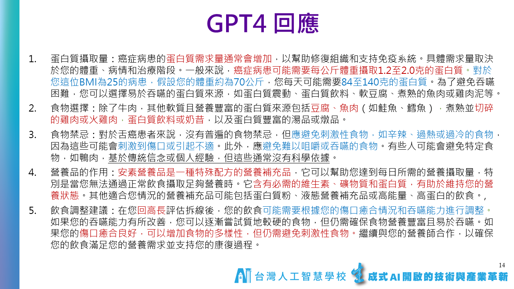

# Part III：大型語言模型實作高階班（LangChain, RAG, Fine-tuning）

## 📑 目錄

- [一、課程地圖](#一課程地圖)
- [二、學員作品示例](#二學員作品示例)
- [三、課程資料](#三課程資料)
- [補充資源](#補充)
- [四、其他補充](#四-其他補充)

---

## Part III：大型語言模型實作高階班 (LangChain, RAG, **Fine-tuning**)

### **一、課程地圖**


### **二、學員作品示例**

- 癌症營養師衛教系統
    
    
    
    
    
    
    
    
    
    [725464117.714952.mp4](assets/725464117.714952.mp4)
    
- 飲食聊天機器人
    
    
    
    [媒體1.mp4](assets/%E5%AA%92%E9%AB%941.mp4)
    
    https://github.com/clover8939/AI-final
    

### **三、課程資料**

- **Day1 & Day 2 LangChain & RAG**
    
    LangChain Notes
    
    [Prompt Template & Prompt](subpages/Prompt%20Template%20%26%20Prompt.md)
    
    [Messages](subpages/Messages.md)
    
    [Chat Prompt Template & Chat Prompt-1](subpages/Chat%20Prompt%20Template%20%26%20Chat%20Prompt-1.md)
    
    [Chat Prompt Template & Chat Prompt-2](subpages/Chat%20Prompt%20Template%20%26%20Chat%20Prompt-2.md)
    
    [Partial Variables in Prompt Template-1](subpages/Partial%20Variables%20in%20Prompt%20Template-1.md)
    
    [Partial Variables in Prompt Template-2](subpages/Partial%20Variables%20in%20Prompt%20Template-2.md)
    
    [LLM vs. Chat Model](subpages/LLM%20vs%20Chat%20Model.md)
    
    [Output Parser](subpages/Output%20Parser.md)
    
    [String Output Parser](subpages/String%20Output%20Parser.md)
    
- **Day3 Fine-tuning**
    
    **請大家在上課前先撥空註冊以下帳號與授權:**
    
    1.**Huggingface帳號**: 建議用google e-mail註冊 ([https://huggingface.co/](https://huggingface.co/))。
    
    2.**Meta Llama 模型下載授權**: 請使用跟huggingface同一個e-mail註冊 ([https://llama.meta.com/llama-downloads](https://llama.meta.com/llama-downloads)) *能勾的版本都勾選(Llama 2, 3, 3.1, 3.2版),一次申請全部。
    
    3.**Google Gemma申請:** ([https://www.kaggle.com/models/google/gemma/](https://www.kaggle.com/models/google/gemma/))
    
    **[參考書] 公開的版本**
    
    (復旦大學) 大规模语言模型：从理论到实践 ([https://intro-llm.github.io/](https://intro-llm.github.io/))。
    
    (LLM pdf下載) [https://github.com/intro-llm/intro-llm.github.io](https://github.com/intro-llm/intro-llm.github.io)
    
    - 各種 LLMs 微調方法及範例程式 [https://docs.unsloth.ai/basics/tutorials-how-to-fine-tune-and-run-llms](https://docs.unsloth.ai/basics/tutorials-how-to-fine-tune-and-run-llms)
    - 大型語言模型微調UI介面：LLaMA-Factory
        - Miniconda 安裝
            
            下載網址：https://docs.anaconda.com/miniconda/#miniconda-latest-installer-links
            
            - Windows
                
                安裝流程：Next → I Agree → 個人用點 Next → 預設路徑點 Next →全部勾選後點 Next →等待安裝完成後點 Next→ 點Finish
                
                
                
                
                
                
                
                
                
                
                
                
                
            - Linux
                
                下載 [Miniconda3-latest-Linux-x86_64.sh](https://repo.anaconda.com/miniconda/Miniconda3-latest-Linux-x86_64.sh)
                
                ```bash
                wget https://repo.anaconda.com/miniconda/Miniconda3-latest-Linux-x86_64.sh
                sha256sum Miniconda3-latest-Linux-x86_64.sh
                bash Miniconda3-latest-Linux-x86_64.sh
                ```
                
        - 安裝LLaMA-Factory
            
             https://github.com/hiyouga/LLaMA-Factory
            
            ```bash
            # 建立 conda 指定 Python 版本
            conda create -n LLaMA-Factory python=3.12
            conda activate LLaMA-Factory
            ```
            
            ```bash
            git clone --depth 1 https://github.com/hiyouga/LLaMA-Factory.git
            cd LLaMA-Factory
            pip install -e ".[torch,metrics]"
            pip install https://github.com/jllllll/bitsandbytes-windows-webui/releases/download/wheels/bitsandbytes-0.41.2.post2-py3-none-win_amd64.whl
            ```
            
            ```bash
            # OSError: [WinError 126] 找不到指定的模組。 Error loading "~\LLaMA-Factory\Lib\site-packages\torch\lib\fbgemm.dll" or one of its dependencies.
            # 改安裝torch 2.3.0 版
            pip install torch==2.3.0 torchvision==0.18.0 torchaudio==2.3.0
            ```
            
            如果有 GPU 需要加速請安裝 Cuda 12.1以上及相關套件
            
            ```bash
            # cuda 12.1
            # cuda 下載網址: https://developer.nvidia.com/cuda-12-1-0-download-archive
            pip install torch==2.3.0 torchvision==0.18.0 torchaudio==2.3.0 --index-url https://download.pytorch.org/whl/cu121
            
            # cuda 12.4
            # cuda 下載網址: https://developer.nvidia.com/cuda-12-4-0-download-archive
            pip install torch==2.3.0 torchvision==0.18.0 torchaudio==2.3.0 --index-url https://download.pytorch.org/whl/cu124
            ```
            
            介面繁體中文化，將下面檔案覆蓋後即可繁體中文化
            
            路徑： ~\LLaMA-Factory\src\llamafactory\webui
            
            [locales.py](assets/locales.py)
            
            開啟微調介面
            
            ```bash
            llamafactory-cli webui
            ```
            
    - LLM 推論 vRAM 評估器 [https://apxml.com/tools/vram-calculator](https://apxml.com/tools/vram-calculator)
- **Day4 平台應用**
    - Kuwa 平台
        - [Kuwa GenAI OS - 介紹 | Kuwa AI](https://kuwaai.tw/zh-Hant/os/intro)
        - Windows：
            1. https://github.com/kuwaai/genai-os/releases/download/v0.3.2/Kuwa-GenAI-OS-v0.3.2.exe
            2. https://github.com/kuwaai/genai-os/blob/main/windows/README.md
        - Linux：https://github.com/kuwaai/genai-os/blob/main/README_TW.md
        - 安裝流程：https://hackmd.io/@cclljj/r1mIc3tNR
        - 相關操作：https://kuwaai.tw/zh-Hant/blog


# 補充：

[2025年IBM舉辦的企業級RAG挑戰第一名演算法](subpages/2025%E5%B9%B4IBM%E8%88%89%E8%BE%A6%E7%9A%84%E4%BC%81%E6%A5%AD%E7%B4%9ARAG%E6%8C%91%E6%88%B0%E7%AC%AC%E4%B8%80%E5%90%8D%E6%BC%94%E7%AE%97%E6%B3%95.md)

探索 DeepSeek Model-Related Papers

作者有系統整理 DeepSeek 相關論文，涵蓋 DeepSeek LLM、DeepSeek-V2（專家混合模型）、DeepSeek-VL（視覺-語言理解）與 DeepSeek-Math（數學推理） 等關鍵技術。這些研究展現 DeepSeek 在 AI 領域的創新發展，並為業界與學術界提供深入分析。

‣ 

About: 陳伶志博士, 台灣人工智慧學校執行長。他擁有豐富的學術與實務經驗，任職中央研究院資訊科學研究所研究員、資訊服務處處長，並積極參與政府與學術機構的 AI 相關諮詢工作

[停止使用RAG，改用CAG吧！🚫 中研院資訊所 黃瀚萱 助研究員跟政大資科合作的論文！🌟](subpages/%E5%81%9C%E6%AD%A2%E4%BD%BF%E7%94%A8RAG%EF%BC%8C%E6%94%B9%E7%94%A8CAG%E5%90%A7%EF%BC%81%F0%9F%9A%AB%20%E4%B8%AD%E7%A0%94%E9%99%A2%E8%B3%87%E8%A8%8A%E6%89%80%20%E9%BB%83%E7%80%9A%E8%90%B1%20%E5%8A%A9%E7%A0%94%E7%A9%B6%E5%93%A1%E8%B7%9F%E6%94%BF%E5%A4%A7%E8%B3%87%E7%A7%91%E5%90%88%E4%BD%9C%E7%9A%84%E8%AB%96%E6%96%87%EF%BC%81%F0%9F%8C%9F.md)

https://docs.google.com/document/d/1AwylUdyciJhvYn-64ltpe79UL7_G-BmNwqs4NNt4oQ0/edit?_bhlid=a9384dea1b6efd24178e4dbfdba0008c121b8835&tab=t.0#heading=h.y0vtu1yxeknu

- 中研院會議紀錄系統 & FAQ 系統
    
    ‣ 
    
    AS-AIGC / TranscriptHub： [https://github.com/AS-AIGC/TranscriptHub](https://github.com/AS-AIGC/TranscriptHub)
    AS-FAQ-Web-ChatBot： [https://github.com/AS-AIGC/AS-FAQ-Bot/tree/main/AS-FAQ-Web-ChatBot](https://github.com/AS-AIGC/AS-FAQ-Bot/tree/main/AS-FAQ-Web-ChatBot)
    AS-FAQ-RAG：[https://github.com/AS-AIGC/AS-FAQ-Bot/tree/main/AS-FAQ-RAG](https://github.com/AS-AIGC/AS-FAQ-Bot/tree/main/AS-FAQ-RAG)
    聯發科開源台灣語料微調語言模型 Llama-Breeze2-8B-Instruct：
    [https://ollama.com/willqiu/Llama-Breeze2-8B-Instruct](https://ollama.com/willqiu/Llama-Breeze2-8B-Instruct)
    聯發科中英夾雜語音轉文字模型 Breeze-ASR-25：
    [https://huggingface.co/MediaTek-Research/Breeze-ASR-25](https://huggingface.co/MediaTek-Research/Breeze-ASR-25)
    
    中研院會議記錄系統安裝流程 劉智漢博士錄的教學影片，請參考YT連結：[https://youtu.be/3s5xYsaqebU](https://youtu.be/3s5xYsaqebU)
    
- Google Cloud 釋出的生成式 AI 應用
    
    2025 年 AI 商業趨勢
    [https://services.google.com/fh/files/misc/google_cloud_ai_trends_zh-tw.pdf](https://services.google.com/fh/files/misc/google_cloud_ai_trends_zh-tw.pdf)
    
    2025 年 AI 趨勢 – 零售業與民生消費用品業 [https://services.google.com/fh/files/misc/2025_ai_trends_retail_zh-tw.pdf](https://services.google.com/fh/files/misc/2025_ai_trends_retail_zh-tw.pdf)
    
    2025 年 AI 趨勢 – 製造業與汽車業
    [https://services.google.com/fh/files/misc/2025_ai_trends_manufacturing_zh-tw.pdf](https://services.google.com/fh/files/misc/2025_ai_trends_manufacturing_zh-tw.pdf)
    
    2025 年 AI 趨勢 – 電信業
    [https://services.google.com/fh/files/misc/2025_ai_trends_telco_zh-tw.pdf](https://services.google.com/fh/files/misc/2025_ai_trends_telco_zh-tw.pdf)
    
    2025 年 AI 趨勢 – 媒體與娛樂業
    [https://services.google.com/fh/files/misc/2025_ai_trends_media_entertainment_zh-tw.pdf](https://services.google.com/fh/files/misc/2025_ai_trends_media_entertainment_zh-tw.pdf)
    
    2025 年 AI 趨勢 – 公部門
    [https://services.google.com/fh/files/misc/2025_ai_trends_public_sector_zh-tw.pdf](https://services.google.com/fh/files/misc/2025_ai_trends_public_sector_zh-tw.pdf)
    
    2025 年 AI 趨勢 – 客戶體驗
    [https://services.google.com/fh/files/misc/2025_ai_trends_cx_zh-tw.pdf](https://services.google.com/fh/files/misc/2025_ai_trends_cx_zh-tw.pdf)
    
    2025 年 AI 趨勢 – 金融服務業
    [https://services.google.com/fh/files/misc/2025_ai_trends_finance_zh-tw.pdf](https://services.google.com/fh/files/misc/2025_ai_trends_finance_zh-tw.pdf)
    
    2025 年 AI 趨勢 – 醫療照護與生命科學業
    [https://services.google.com/fh/files/misc/2025_ai_trends_healthcare_life_sciences_zh-tw.pdf](https://services.google.com/fh/files/misc/2025_ai_trends_healthcare_life_sciences_zh-tw.pdf)
    
- 從 DeepSeek-V3 到 Kimi K2 的 LLM 架構  [https://magazine.sebastianraschka.com/p/the-big-llm-architecture-comparison](https://magazine.sebastianraschka.com/p/the-big-llm-architecture-comparison)
- OpenAI 推出六年來首款開源權重模型 gpt-oss
    
    
    
    **最新消息：** OpenAI 發表了自 2019 年的 GPT-2 以來，首款可公開取得權重的模型。gpt-oss 系列包含兩款專為代理應用設計的混合專家模型 (MoE)：gpt-oss-120b 和 gpt-oss-20b，兩者皆可免費使用與修改。
    
    - **輸入／輸出：** 模型可處理最多 128,000 個 token 的文字輸入，並生成最多 33,000 個 token 的文字輸出。
    - **模型架構：**
        - **gpt-oss-120b：** 採用混合專家（MoE）的 Transformer 架構，總參數為 1170 億，每個 token 啟用 51 億個參數。
        - **gpt-oss-20b：** 同樣為混合專家（MoE）的 Transformer 架構，總參數為 210 億，每個 token 啟用 36 億個參數。
    - **效能表現：** 整體表現優於 o3-mini，但落後於 o3 及 o4-mini。
    - **取得方式：** 提供免費的網頁版試用，其模型權重採用 Apache 2.0 授權，可供商業及非商業用途。
    - **模型特色：**
        - 可調整的「思維鏈」（Chain-of-Thought）推理等級（高、中、低）。
        - 可完整存取模型的推理過程。
        - 支援工具使用。
    - **未公開資訊：** 訓練資料和方法的細節。
    
    **運作方式：**
    開發團隊運用了數兆個包含一般知識、程式設計、數學及科學等領域的 token 來預訓練 gpt-oss 模型，並在微調階段專注於強化其推理與工具使用的能力。
    
    為了提升運作效率，團隊將混合專家模型層（MoE layers）中的權重量化，讓每個參數僅使用 4.25 位元。由於模型中超過九成的參數都位於 MoE 層，此舉讓 gpt-oss-120b 能在配備 80 GB 記憶體的 GPU 上運行，而 gpt-oss-20b 則僅需 16 GB 的記憶體即可運行。
    
    開發團隊透過監督式微調及強化學習來訓練模型生成「思維鏈」，此方法與微調 OpenAI o3 的技術相似。 在微調過程中，他們藉由在提示中加入「Reasoning:low」等詞彙，讓模型學會支援三種不同的推理等級。
    
    此外，模型也被微調到能夠搜尋網路、執行 Python 程式碼及使用多種工具。 團隊也訓練模型拒絕處理仇恨言論、犯罪指引、危險物質配方等不當請求。在內部針對風險行為的測試中，經過生物學與網路安全微調的 gpt-oss-120b，在這兩個領域的能力仍未達到「高能力」的門檻。
    
    **測試結果：**
    在 OpenAI 的測試中，當設定為高等級推理時，gpt-oss 模型的表現普遍介於 o3-mini、o3 與 o4-mini 之間。 除非另有註明，以下 OpenAI 的測試結果皆來自其官方報告，而 DeepSeek R1 的結果則源於其最新模型更新的報告。
    
    - 在 2024 年的美國數學邀請賽（AIME）中，利用工具解決數學競賽問題時，gpt-oss-120b（準確率 96.6%）和 gpt-oss-20b（準確率 96%）的表現超越了 o3（95.2%），但仍落後於 o4-mini（98.7%）。
    - 在不使用工具的情況下回答 GPQA Diamond 科學問題時，gpt-oss-120b（準確率 80.1%）的表現優於 o3-mini（77%），但遜於 o3（83.3%）及 o4-mini（81.4%）。較小的 gpt-oss-20b（71.5%）在 OpenAI 展示的模型中則敬陪末座。根據 Artificial Analysis 的分析，這也讓 gpt-oss 的表現落後於 Grok 4（87.7%）、Gemini 2.5 Pro（84.4%）及 DeepSeek R1 的最新更新版本（81.3%）。
    - 在測試代理工具使用的 Tau-Bench 零售項目中，gpt-oss-120b（準確率 67.8%）的成績高於 o3（65.6%），但低於 o4-mini（70.4%）。這些模型皆優於 DeepSeek R1（63.9%）。相較之下，gpt-oss-20b 的準確率（54.8%）則明顯偏低。
- vRAM 評估器 [https://apxml.com/tools/vram-calculator](https://apxml.com/tools/vram-calculator)
- Google Senior Engineer released a free 400+ page guide on agentic design patterns
    
    [https://docs.google.com/document/d/1rsaK53T3Lg5KoGwvf8ukOUvbELRtH-V0LnOIFDxBryE/edit?_bhlid=aa02134330f1e14ba7ca362e32799952c9227573&tab=t.0](https://docs.google.com/document/d/1rsaK53T3Lg5KoGwvf8ukOUvbELRtH-V0LnOIFDxBryE/edit?_bhlid=aa02134330f1e14ba7ca362e32799952c9227573&tab=t.0)
    
    https://github.com/Mathews-Tom/Agentic-Design-Patterns?tab=readme-ov-file
    
- 聯發科 Breeze 全家桶
    
    Llama-Breeze2-8B-Instruct(LLM): https://huggingface.co/MediaTek-Research/Llama-Breeze2-8B-Instruct
    
    Breeze-ASR-25(STT): https://huggingface.co/MediaTek-Research/Breeze-ASR-25
    
    [**BreezyVoice](https://github.com/mtkresearch/BreezyVoice)(TTS):** https://github.com/mtkresearch/BreezyVoice
    

## 四、 其他補充

- 如何取得 OpenAI API key?
    1. 進入下面網址 [https://openai.com/blog/openai-api](https://openai.com/blog/openai-api)
    2. 點右上角 Log in 登入
    3. 選擇右邊的API
    4. 點左側欄位的齒輪 Settings -> Billings -> Payment methods -> 輸入信用卡(每月底結帳) -> 上排 Preferences -> 輸入收帳單的e-mail及地址
    5. 點左側欄位的齒輪 Settings -> Limits -> 設定每月預算多少美金
    6. 點左側欄位的鎖頭 API keys -> Create new secret key -> 自行取一個名字 -> Create secret key
    6.1 如果要特別設定那些功能開啟可在 Permissions -> Restricted -> 設定那些功能要寫或讀
    7. 複製 API key 後按 Done
    8. API key不再使用可點垃圾桶刪除
    
    YT範例影片
    [https://youtu.be/sFWw_WPGxek?si=YhROOXdNwmL8sKj_](https://youtu.be/sFWw_WPGxek?si=YhROOXdNwmL8sKj_)
    
- **OpenAI、Google、Anthropic** 已經發佈了多種 AI 指南，包含：**Prompt**、**AI Agents** 等相關內容
    - **Prompt**
        - **Google：[Prompting Guide 101](https://link.mail.beehiiv.com/ss/c/u001.IDG2u2DUOmtrJoHC2Gukka_l8BMHA6Xzi5otCRZCQ9lrLZU8s7wXHo9Qoo2w8-arKSl17Sm5tVTy-_gNE4mvB61GmMJmQCJ2_Ba158cDyHGmQLJzZos7dSd_mGVCyOb9eSJQikHznzAZFKMApLL7FPJjZAy7ubcKKE2P9ed2-WN2jL86PFbNjhyjJbX-ozrWeIKXANWlQxOfmSaDAJ5QcyoSYktfUqxurx_4PsjjqHZVrpMFMToyaSG5GvyEgCNpkNOynnwdfODlaJoMbT7pt7Xa2zpxrJ-E9tdWuWQy3-m6lDHIt7pOC7GZG_kRFtN_/4hb/IsHRq2EVTPaHyIdE4AC-zw/h24/h001.7f25kFkoYicMHZ7Iv_0VHyBi0BxiZvgPRmzOHDIelgI)、[Prompt Engineering by Lee Boonstra](https://link.mail.beehiiv.com/ss/c/u001.TxpNRhainZVsWLAFDuxmZzj7Hkecc5TcVv9elZJt2WO4eA2_VPK-FC6egAO_0kDB71LVBuwSB3rtWD8AiBwx8dqzBnSAA_waE25hnHe1axsOi_tJmvEI8sZKbdKV2BOC0JRXbalnq0mFEf6Jufsl5SSO6BrTemC0_jniGTCja_OC7_mckHS9-Yyf9JT7kLK1aBc4rUA3KTt8sSwBfOnJHQcqk0gyTPsPveKeQzjp4wZDZNp3HJ2a_Y5d9o7dyyCy/4hb/IsHRq2EVTPaHyIdE4AC-zw/h25/h001.NVaYF7u-DweXQ1KHABhblqx7Z-YSf0VmDrQfIFa3xAw)**
        - **Anthropic：[Prompt Engineering Overview](https://link.mail.beehiiv.com/ss/c/u001.QsJesj9sPo26N9_H3yCVgq3sJA7Bfr6tlIeSm81w_XW9sTiivYh4s4Su4ZvZmZP97QtqyEGcOP3mw64C_93INVBh4LCrq8D6FBhB3OEs2McaZhOlnaNSm23ahHTdyA8P9T0aHWnxOt402gtg2jAZfaSmPM_4BgzH4R5HtrGvjYOKWMbipmNGC3a4fUJaS_f8QU1zwy8__FP5wDYbiOyeSIA-18qwWF--5KnWbp1yRgab4SfZhp1y7v1aMwsQheBrXb_-3rPPsgdENuJHMK6q_sCAA5m7psg1h5gp59a69EA/4hb/IsHRq2EVTPaHyIdE4AC-zw/h26/h001.tY970-Qq1fXpRrcqBPFN6UtHwxB4a-gkmqJ8IXjLwp8)**
    - **AI Agents**
        - **OpenAI：[A practical guide to building agents](https://link.mail.beehiiv.com/ss/c/u001.KcDh8oVy1tyn6XRGWP4MfWH_jNMvqwh6FBXuGHp1T-bavpzENQqQ8MYV4RIg9hubrxjgrnhsmTaA5SezCGKfTTZn1BFHgN99rx2D7Zjvu60D3ieYh_jGicjgswQvkuzaVN92rnNmhYxWxlytG78CN6ks5m_PbK-7OVDLye4pBlahUoDiqy_5LN78GwnhqsiX2HZkDZtqdsCcb0saJZt5reTSzj8S0GJvC6PmA7g8pqtf1kQgN-mc6gdFp9xzMWISeTovbtCfsNAZlC6iajGqPPsGrrJeiiIEm8mH1xVebRJn8j58Bx49IRLPdz6KUkoS/4hb/IsHRq2EVTPaHyIdE4AC-zw/h27/h001.KbFPyatj_pKGioz05Jhgnp4H448Tr2ZxVZr-ro7q2EQ)**
        - **Anthropic：[Building Effective Agents](https://link.mail.beehiiv.com/ss/c/u001.TxpNRhainZVsWLAFDuxmZ6vc2skQk2gAs5m8haIXS3cvLBMXTHEs7zjQJYrWF1AUsLcx83I70nDnxV0CBBG7LbSArUskfwOLi9ZdVT4QlJT-GejhE6KvtKLy9blbyKTxWrMqrqs79Gzf3yS80TjM2XB2hQh5gwnhMdBJN2fAtraQiTE7qcr1phgpaCBB07FR2-3zSQoH6vvaqCyqZ8ILGch7hdQV2mbIPxBZ75tMcPYgas6uRlczSie8voOPdhryu8qFUOrAmlVHjBFl6_l0rg/4hb/IsHRq2EVTPaHyIdE4AC-zw/h28/h001.K6oHN1zQSHNxeo3CF0ZmQUaI6781t-8aUfWHWlJ548c)**
        - **Google：[Agents Companion](https://link.mail.beehiiv.com/ss/c/u001.TxpNRhainZVsWLAFDuxmZzj7Hkecc5TcVv9elZJt2WNjWSGxNBq4-5lTqNb4V1aOIR0CoLc7b_a1-r7J3wmtjS2-5srWmSjdsmyruD9PQgxH78aitiN4Sp_EjYYnCZ0AAZi6KPa7nVfQVOM5MPMrx5alybNq4ejKWWCICRkgDOuctl2TIlaTRmjsQsIboB2RFuIdOpSZFAChhB_hFMwYtkBFbl53AU7nO_YRroxxqR9jAOoySOjxCs-G9HTsvqxl/4hb/IsHRq2EVTPaHyIdE4AC-zw/h29/h001._daKnlb7gSYTIl2vgVKp8K2_GRJVP6zlGOmFARhRjwU)**
    - **AI 應用案例**
        - **OpenAI：[AI in the Enterprise](https://link.mail.beehiiv.com/ss/c/u001.KcDh8oVy1tyn6XRGWP4MfWH_jNMvqwh6FBXuGHp1T-bavpzENQqQ8MYV4RIg9hubzw6iDqEHdKE_g3PeRPPvh7_qnkfBJF5f9XsqcyJkyu5LUiiYexoWkMruorirN7MvgonC7a1_AtLaitfeTlgkPZ8bwMelAVz1aHbxiqT2zQcJrZeKJbkj0SMnSwZivnPU-rZxIVz7ZBlkfDH8cu_gRs-3EXPDjjl3tcZJgbMoG34tNj23b_pse82A0h1HDLRCyr_LDhfLVI7lyUS_waMfthWgUuuz0O6LuZLj6oA6pG8/4hb/IsHRq2EVTPaHyIdE4AC-zw/h30/h001.h0ShXnkBSLbFNyOB3wh79h7wbMkN8JuUMiZtlc5hZ50)、[Identifying and scaling AI use cases](https://link.mail.beehiiv.com/ss/c/u001.KcDh8oVy1tyn6XRGWP4MfWH_jNMvqwh6FBXuGHp1T-bavpzENQqQ8MYV4RIg9hubRa45YP-wsCPqGnA3pmBS7gY_-WEMLPw3lqcUjMw62ylOeFp_a-ZA00bbS-S66K_x5rli1mps72fdC7ZMYKPp0WnyBHmBMeRmjtX7X2iPMfmGIqim4RcthkaT8CDD8KGxeNqzGeLRO7lxtEHfpG0iEgDiDQR0-5dV7LxIr8_-91Bl9LvSV-IbypizI4Vj306O4ApNKrchG8YkBx3aFzqfrfHpf11f1mN7YfomLpLwnuOacK8yYr9YgHJIdHN2S1lC/4hb/IsHRq2EVTPaHyIdE4AC-zw/h31/h001.KxMu0JFzWbuxPboMXrw3Gkn69gBSQc7PQWPt1-CtQtE)**
        - **Google：[601 real-world Google Cloud AI use cases](https://link.mail.beehiiv.com/ss/c/u001.KcDh8oVy1tyn6XRGWP4MffYAp50Wd_C5bwo3TPhxK2mUjR8Wtmznw6jlSGVQoM7p03CrePyLuvaLbTeHeqIletVy-9534ISzkir-B0ZMpuRNrlHd-wf7fCpjpJumM4fKziJGrABW85Sp6K-p8KLeXNKUyI8y5hHKnsl1PMZg_NfGUSYO_u1higAxcVC2oBC8G3d8hTAV9J9ootgzipvac6HoYad8WiGALbS_8kQk19r5EpyO5_Hhrnz1Xs1kcWOa5lKgrar0slhSBc_Py7ZmDBdT5hDyfeeErjxi3hFSw3qXrf5AKO4E2IuDqD0HNBdQ/4hb/IsHRq2EVTPaHyIdE4AC-zw/h32/h001.SmUQslCMhc2MqkWJjHyW8dR_rcJH4soUG34LUz9saDo)**

為推動知識共享與資源應用，本文件內容採**開源方式公開**，提供大眾自由參考、複製與修改使用。

若您有需要，可依實際情況進行調整與引用。

**請於使用或轉載時註明來源：**

> 財團法人台灣人工智慧學校基金會
> 

感謝大家的支持與推廣，讓知識得以持續傳遞與發揚。

聯絡信箱：[hi@aiacademy.tw](mailto:hi@aiacademy.tw)

