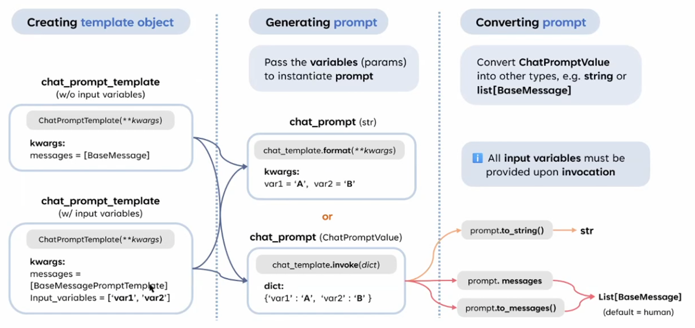

# Chat Prompt Template & Chat Prompt-2



這張圖的左邊部分與之前的圖相比，增加了 **Chat Prompt Template 的創建方式的細化**，特別是是否需要指定輸入變數 (input variables)。以下是對左側部分的詳細解釋，以及圖中想表達的差異：

---

## **1. ChatPromptTemplate 的兩種創建方式**

這張圖的左側部分將 **ChatPromptTemplate** 的創建方式進一步區分為 **不帶輸入變數** 和 **帶輸入變數** 兩種情況：

### **1.1 ChatPromptTemplate (w/o input variables)**

- **情況**：
    - **不需要指定輸入變數**，直接傳入消息列表 (`BaseMessage`) 即可。
    - 適用於靜態的、多輪對話上下文，內容不需要動態填充。
- **參數**：
    - `messages`：消息列表，內容為 `BaseMessage` 類型（例如 `HumanMessage`, `AIMessage`, 或 `SystemMessage`）。
- **範例**：
    
    ```python
    from langchain.prompts import ChatPromptTemplate
    from langchain.schema import HumanMessage, SystemMessage
    
    chat_prompt_template = ChatPromptTemplate(
        messages=[
            SystemMessage(content="You are a helpful assistant."),
            HumanMessage(content="Tell me a joke."),
            HumanMessage(content="What is the capital of France?")
        ]
    )
    ```
    
- **特點**：
    - 不需要動態變數插值，適合固定的對話腳本。
    - 模板直接是靜態消息，不依賴於外部參數。

---

### **1.2 ChatPromptTemplate (w/ input variables)**

- **情況**：
    - **需要指定輸入變數**，並在生成 Prompt 時插入動態內容。
    - 適用於需要填充變數（例如 `{var1}`）的情境。
- **參數**：
    - `messages`：消息列表，內容為 `BaseMessagePromptTemplate`（例如 `HumanMessagePromptTemplate`, `SystemMessagePromptTemplate`）。
    - `input_variables`：變數名稱列表，例如 `['var1', 'var2']`。
- **範例**：
    
    ```python
    from langchain.prompts import ChatPromptTemplate
    from langchain.prompts.base import HumanMessagePromptTemplate, SystemMessagePromptTemplate
    
    chat_prompt_template = ChatPromptTemplate(
        messages=[
            SystemMessagePromptTemplate.from_template("You are a helpful assistant."),
            HumanMessagePromptTemplate.from_template("Tell me a joke about {topic}."),
            HumanMessagePromptTemplate.from_template("What is the capital of {country}?")
        ],
        input_variables=["topic", "country"]
    )
    ```
    
- **特點**：
    - 模板中包含變數占位符（例如 `{topic}`），並且需要在生成 Prompt 時提供這些變數的值。
    - 適合動態生成對話內容的場景。

---

## **2. 生成 Prompt 的一致性**

不論模板是否包含輸入變數，在生成 Prompt 的時候，兩者的調用方式是一致的，分為：

- **.format()**：
    - 適合直接生成字符串的情境。
- **.invoke()**：
    - 適合需要更結構化輸出的場景（返回 `ChatPromptValue`）。

---

## **3. 將 Prompt 轉換為其他格式**

右側部分說明了如何將生成的 Prompt 轉換為其他格式，這部分與之前的圖一致，包括：

- **.to_string()**：轉換為純字符串。
- **.messages**：獲取 `list[BaseMessage]`。
- **.to_messages()**：類似 `.messages`，但更靈活。

---

## **4. 主要差異點**

這張圖的核心是在左側部分：

- 增加了對 **ChatPromptTemplate** 的兩種創建方式（是否指定輸入變數）的細分。
- **不帶輸入變數的模板** 適用於靜態對話腳本。
- **帶輸入變數的模板** 適用於動態插值的場景。

---

## **5. 使用場景比較**

| **創建方式** | **適用場景** |
| --- | --- |
| **不帶輸入變數** | 固定對話腳本，例如 FAQ 回答、靜態系統設置。 |
| **帶輸入變數** | 動態內容生成，例如基於用戶輸入或上下文填充的個性化回覆。 |