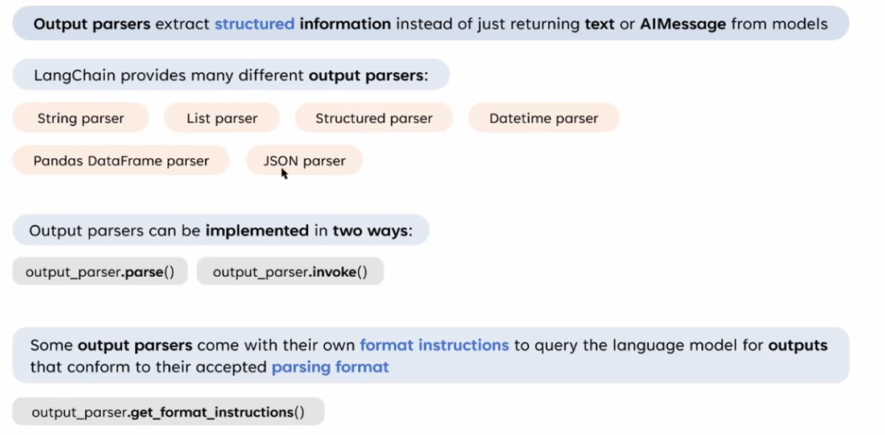

# Output Parser



展示 **Output Parsers** 在 LangChain 中的概念與應用，主要用於從模型返回的輸出中提取結構化資訊，而不是僅僅返回純文字或 AIMessage。以下是對這張圖的詳細解釋：

---

## **1. Output Parsers 的概念**

- **作用**：將模型的輸出解析為結構化數據，而不是僅僅返回純文字或 AIMessage。
- **優勢**：
    - 提高數據處理的精確性和一致性。
    - 更容易與外部系統進行集成，例如將結果轉換為 JSON、DataFrame 或其他結構化格式。

---

## **2. LangChain 提供的多種 Output Parsers**

LangChain 中支持多種輸出解析器，滿足不同的應用需求：

1. **String Parser**
    - 將輸出解析為純字符串。
    - 適用於簡單的文字輸出場景。
2. **List Parser**
    - 將輸出解析為列表結構。
    - 適合處理多項輸出的情境，例如多條回答。
3. **Structured Parser**
    - 將輸出解析為更複雜的結構化數據，例如字典。
    - 適用於需要高精度的多字段提取場景。
4. **Datetime Parser**
    - 將輸出解析為日期和時間格式。
    - 適合處理與時間相關的模型輸出。
5. **Pandas DataFrame Parser**
    - 將輸出直接解析為 Pandas DataFrame。
    - 適合用於處理表格型數據的場景。
6. **JSON Parser**
    - 將輸出解析為 JSON 格式。
    - 適合於需要結構化數據進行後續處理的場景。

---

## **3. Output Parsers 的實現方式**

Output Parsers 有兩種主要的實現方法：

1. **`.parse()` 方法**
    - 用於手動解析模型輸出。
    - **範例**：
        
        ```python
        parsed_output = output_parser.parse(raw_output)
        ```
        
2. **`.invoke()` 方法**
    - 自動調用解析器並與模型交互。
    - **範例**：
        
        ```python
        parsed_output = output_parser.invoke(model_output)
        ```
        

---

## **4. Format Instructions**

- **用途**：
    - 一些 Output Parsers 自帶格式說明，幫助生成符合特定解析格式的輸出。
    - 這些格式說明可以作為提示，告訴模型如何構造輸出以便解析器正確解析。
- **方法**：
    - 使用 `.get_format_instructions()` 獲取格式化提示。
    - **範例**：
        
        ```python
        format_instructions = output_parser.get_format_instructions()
        print(format_instructions)
        ```
        

---

## **5. Output Parsers 的應用場景**

### **5.1 結構化問答**

- 使用 JSON Parser 將模型的輸出結構化為 JSON 格式，方便後續處理。
    
    ```python
    {
        "question": "What is the capital of France?",
        "answer": "Paris"
    }
    ```
    

### **5.2 表格型輸出**

- 使用 Pandas DataFrame Parser 將模型的輸出直接解析為 DataFrame，用於分析或可視化。

### **5.3 日期處理**

- 使用 Datetime Parser 提取模型輸出中的日期或時間信息，適用於日程安排或時間篩選場景。

---

## **6. 總結**

1. **Output Parsers 是 LangChain 中的重要組件**，可以幫助將模型輸出轉換為結構化數據。
2. 支持多種解析器，包括字符串、列表、結構化數據、JSON、DataFrame 等。
3. 提供 `.parse()` 和 `.invoke()` 方法，方便靈活地解析輸出。
4. 配合 `get_format_instructions()`，可以引導模型生成更符合需求的輸出格式。