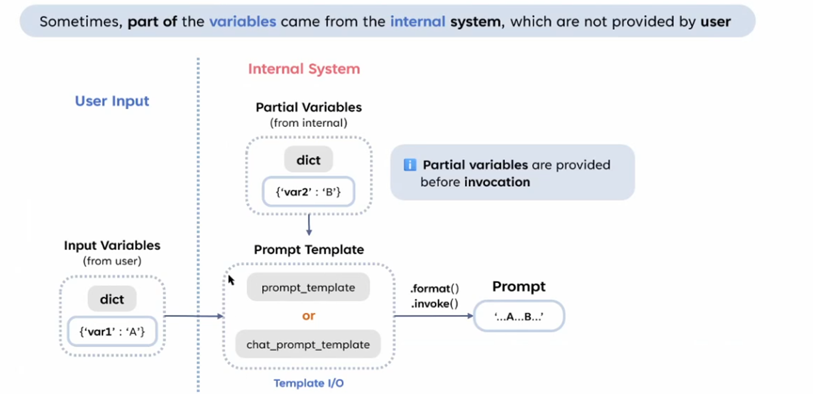

# Partial Variables in Prompt Template-1



展示 **部分變數 (Partial Variables)** 的概念，說明在生成 Prompt 時，部分變數是由 **用戶輸入** 提供，而其他部分可能來自於內部系統（Internal System）。這是一種動態填充 Prompt 的方法，常用於更靈活的應用場景。

## **1. 主題**

- **背景**：在使用 LangChain 的 Prompt Template 時，生成 Prompt 通常需要多個輸入變數，而這些變數的值可能來自不同來源。
- **核心概念**：
    - **部分變數 (Partial Variables)** 是在正式生成 Prompt 前，預先填充的變數值。
    - **用戶輸入的變數 (Input Variables)** 與內部系統提供的變數相結合，共同完成模板的填充。

---

## **2. 流程解析**

### **2.1 用戶輸入 (User Input)**

- **來源**：用戶直接提供的一部分輸入變數值。
- **格式**：通常以字典的形式表示，例如：
    
    ```python
    
    user_input = {"var1": "A"}
    ```
    
- **角色**：
    - 用戶輸入的變數通常是對話或指令的內容，例如問題的主題。

---

### **2.2 內部系統 (Internal System)**

- **來源**：內部系統或應用程序生成的預設值，或者是上下文中已有的數據。
- **格式**：與用戶輸入類似，也以字典表示，例如：
    
    ```python
    internal_data = {"var2": "B"}
    ```
    
- **角色**：
    - 內部系統提供的變數通常是固定或預定義的內容，例如系統指令、配置參數或工具執行結果。
- **提示**：
    - **Partial Variables** 在 `.invoke()` 或 `.format()` 方法執行之前就被提供。
    - 這確保了在用戶輸入的變數未完全提供時，模板仍能正確處理。

---

### **2.3 Prompt Template**

- **模板類型**：
    - 可以是 `PromptTemplate`（普通模板）或 `ChatPromptTemplate`（適用於多輪對話）。
- **模板輸入**：
    - 結合用戶輸入的變數和內部系統的部分變數。
- **範例**：
假設模板如下：
    
    ```python
    from langchain.prompts import PromptTemplate
    
    prompt_template = PromptTemplate(
        template="{var1} and {var2}",
        input_variables=["var1", "var2"]
    )
    ```
    
    - **用戶輸入**：`{"var1": "A"}`
    - **內部系統提供**：`{"var2": "B"}`

---

### **2.4 Prompt 的生成**

- **調用方法**：
    - **`.format()`**：返回純字符串。
    - **`.invoke()`**：返回更結構化的 `PromptValue`，例如 `StringPromptValue` 或 `ChatPromptValue`。
- **輸出結果**：
    - 結合用戶輸入和內部變數，生成完整的 Prompt。
    - 範例輸出：
        
        ```
        "A and B"
        ```
        

---

## **3. 使用場景**

### **3.1 動態對話生成**

- 部分變數（如上下文或先前消息）由系統提供，用戶僅需填入與當前問題相關的數據。
- 範例：
    - 系統提供：「你是一個友好的助理。」
    - 用戶提供：「今天的天氣怎麼樣？」

### **3.2 工具調用**

- 內部系統從工具（如 API）獲取數據，將其作為部分變數填充模板。
- 範例：
    - 工具返回數據：`{"temperature": "25°C"}`
    - 用戶輸入：`{"location": "Taipei"}`

### **3.3 預設值填充**

- 預先定義固定內容作為部分變數，例如標準操作指令。

---

## **4. 關鍵點總結**

1. **部分變數** 是內部系統提供的，並在 Prompt 正式生成前完成填充。
2. 用戶輸入與內部變數共同組成完整的 Prompt。
3. **.format() 與 .invoke()** 方法可以靈活處理部分變數，確保模板的動態適應性。
4. 提供部分變數能有效降低用戶輸入的負擔，提升應用的靈活性。