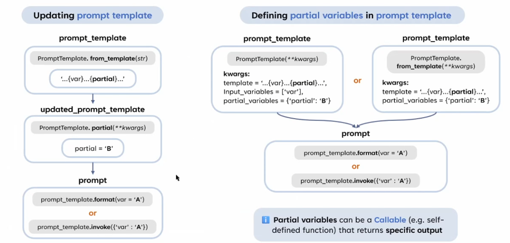

# Partial Variables in Prompt Template-2



這張圖詳細介紹了 **部分變數 (Partial Variables)** 在 LangChain 中的兩種使用方式，包括如何更新 Prompt Template 和如何在模板中定義部分變數。以下是對圖中每個部分的解釋：

## **1. Updating Prompt Template**

### **流程**

1. **建立初始模板 (Prompt Template)**
    - 使用 `PromptTemplate.from_template()` 方法創建一個模板，模板中包含普通變數 `{var}` 和部分變數 `{partial}`。
    - 範例：
        
        ```python
        from langchain.prompts import PromptTemplate
        
        prompt_template = PromptTemplate.from_template(
            template="{var}...{partial}..."
        )
        ```
        
2. **更新模板 (Updated Prompt Template)**
    - 使用 `.partial()` 方法為部分變數填入值，更新模板。
    - **方法**：
        
        ```python
        updated_prompt_template = prompt_template.partial(partial="B")
        ```
        
    - 更新後的模板中，`partial` 已經被固定為 `B`，只剩 `var` 需要由用戶提供。
3. **生成 Prompt**
    - 通過 `.format()` 或 `.invoke()` 方法生成最終的 Prompt。
    - 範例：
        
        ```python
        
        # 使用 .format() 填入剩餘變數
        prompt = updated_prompt_template.format(var="A")
        print(prompt)  # 結果："A...B..."
        ```
        

### **關鍵點**

- **部分變數 (`partial`) 的靈活性**：
    - 在設計模板時，可以先定義需要的所有變數，然後動態地為部分變數預填值，而不是一次性填充所有變數。
- **應用場景**：
    - 適用於動態更新模板的情況，例如先用系統預設值填充部分變數，再等待用戶輸入剩餘變數。

---

## **2. Defining Partial Variables in Prompt Template**

### **流程**

1. **創建模板時直接定義部分變數**
    - 在創建模板時，可以通過 `partial_variables` 參數為部分變數設置值，而不需要後續使用 `.partial()` 方法。
    - **兩種方法**：
        - 使用 `PromptTemplate`：
            
            ```python
            prompt_template = PromptTemplate(
                template="{var}...{partial}...",
                input_variables=["var"],
                partial_variables={"partial": "B"}
            )
            ```
            
        - 使用 `PromptTemplate.from_template()`：
            
            ```python
            prompt_template = PromptTemplate.from_template(
                template="{var}...{partial}...",
                partial_variables={"partial": "B"}
            )
            ```
            
2. **生成 Prompt**
    - 與第一部分相同，可以使用 `.format()` 或 `.invoke()` 填入剩餘變數。
    - 範例：
        
        ```python
        prompt = prompt_template.format(var="A")
        print(prompt)  # 結果："A...B..."
        ```
        

### **關鍵點**

- **設置部分變數的靈活性**：
    - 在創建模板時直接設置部分變數可以簡化流程，適合部分變數的值已經固定的情況。
- **應用場景**：
    - 適用於靜態場景，部分變數由系統或預設值直接提供。

---

## **3. Callable Partial Variables**

- **部分變數可以是 Callable（可調用的函數或方法）**：
    - 在某些情況下，部分變數的值需要動態計算，例如基於上下文生成。
    - **範例**：
        
        ```python
        def dynamic_partial():
            return "B"
        
        prompt_template = PromptTemplate(
            template="{var}...{partial}...",
            input_variables=["var"],
            partial_variables={"partial": dynamic_partial}
        )
        
        prompt = prompt_template.format(var="A")
        print(prompt)  # 結果："A...B..."
        ```
        

### **應用場景**

- 當部分變數的值取決於某些動態條件（例如 API 調用結果、上下文）時，可以使用 Callable。

---

## **整體比較與應用場景**

| **方法** | **適用場景** |
| --- | --- |
| **Updating Prompt Template** | 當部分變數的值在模板創建後才確定，並需要多次更新時使用。 |
| **Defining Partial Variables** | 部分變數的值固定且可在模板創建時設置，簡化使用流程。 |
| **Callable Partial Variables** | 部分變數需要根據動態條件生成，例如與外部系統交互。 |

---

## **總結**

1. **部分變數** 提供了極大的靈活性，使模板能夠動態適應不同的場景。
2. **更新模板與直接定義** 是兩種不同的實現方式，選擇哪種方式取決於應用場景的需求。
3. **Callable 部分變數** 對於動態計算值的場景非常實用。