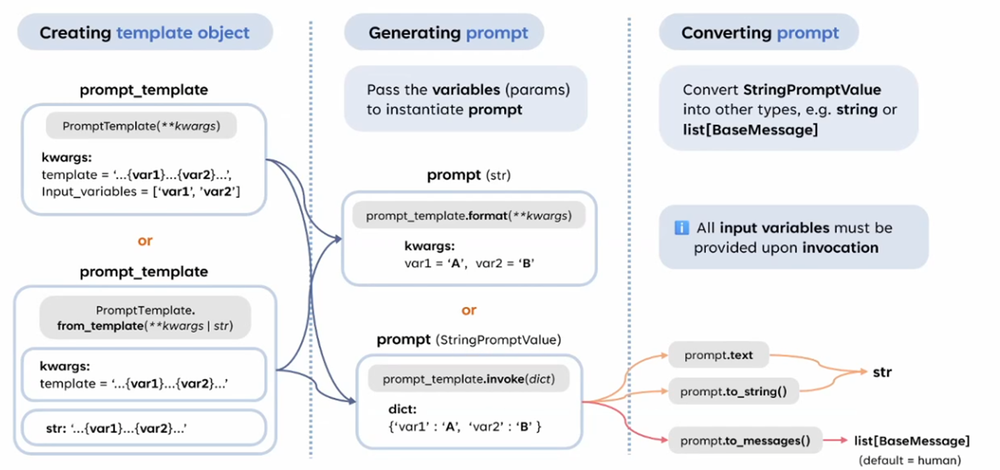

# Prompt Template & Prompt



### **1. Creating Template Object**

- **PromptTemplate**
    - 使用 `PromptTemplate` 類來建立一個模板。
    - **參數**：
        - `template`：定義模板的格式，例如 `"{var1}...{var2}"`。
        - `input_variables`：一個列表，指定模板中使用的變數名稱，例如 `['var1', 'var2']`。
    - **示例**：
        
        ```python
        prompt_template = PromptTemplate(
            template="{var1} is a {var2}",
            input_variables=["var1", "var2"]
        )
        ```
        
- **PromptTemplate.from_template**
    - 這是一個輔助方法，可以從單一的字符串直接建立模板，而不需要顯式定義 `input_variables`。
    - **參數**：
        - `str`：包含變數占位符的模板字符串，例如 `"{var1}...{var2}"`。
    - **示例**：
        
        ```python
        prompt_template = PromptTemplate.from_template("{var1} is a {var2}")
        ```
        

---

### **2. Generating Prompt**

- 將參數（變數）傳入模板來生成實例化的 Prompt。
- **兩種方法**：
    - 使用 **format 方法**：
        - 調用 `.format(**kwargs)`，用變數值填充模板。
        - **示例**：
            
            ```python
            prompt = prompt_template.format(var1="A", var2="B")
            # 結果： "A is a 
            ```
            
    - 使用 **invoke 方法**（StringPromptValue）：
        - `.invoke(dict)` 接受一個字典，返回一個 StringPromptValue。
        - **示例**：
            
            ```python
            prompt = prompt_template.invoke({"var1": "A", "var2": "B"})
            ```
            

---

### **3. Converting Prompt**

- Prompt 可以轉換為不同的格式，這在 LangChain 中非常重要。
- **轉換格式的方法**：
    1. **prompt.text**：
        - 獲取字符串格式的 Prompt。
        - **結果**：`str`。
    2. **prompt.to_string()**：
        - 另一種方式將 Prompt 轉換為字符串。
    3. **prompt.to_messages()**：
        - 將 Prompt 轉換為一個消息列表（`list[BaseMessage]`），默認為 `HumanMessage`。
        - **用途**：
            - 用於多輪對話場景，例如與 Chat Model 結合。

---

### **4. 提示**

- **所有的輸入變數都必須在調用時提供**。
    - 無論是 `.format` 還是 `.invoke`，都需要明確提供模板中所需要的所有變數值。

---

### **總結**

- **建立模板**：
    - 使用 `PromptTemplate` 或 `PromptTemplate.from_template`。
- **生成 Prompt**：
    - 用 `.format` 或 `.invoke` 填充模板變數。
- **轉換 Prompt**：
    - 使用 `.text`, `.to_string()` 或 `.to_messages()` 將 Prompt 轉換為不同格式以適應不同場景（例如 LLM 輸入或多輪對話）。