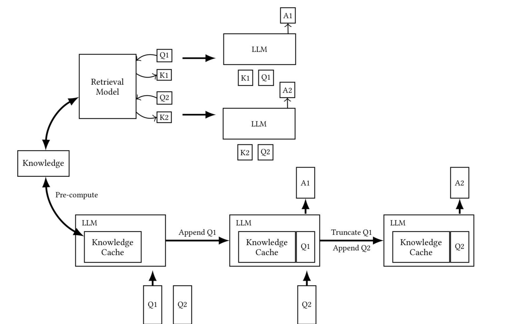

# 停止使用RAG，改用CAG吧！🚫 中研院資訊所 黃瀚萱 助研究員跟政大資科合作的論文！🌟

傳統RAG存在著一些問題：檢索延遲、文件選擇錯誤，以及系統複雜。研究團隊因而提出Cache增強生成(CAG)方法。⚠️

🔍 該方法出奇的簡單：

1. 知識預加載：系統預先將所有相關文件轉換爲KV緩存。
2. 推理階段：當使用者提出問題時，系統直接使用預加載的緩存生成答案。
3. 緩存重置：透過截斷，系統可以快速重置緩存。

📊 研究團隊在SQuAD和HotPotQA進行了詳細的實驗：

- 性能提升：在大多數測試場景中，CAG方法的BERT-Score評分都優於傳統的RAG系統。
- 時間效率：由於無需即時檢索，回答生成時間大幅縮短，尤其在長文本時，優勢更明顯。
- 架構簡化：移除了檢索器和生成器的整合需求，降低了系統維護的複雜度。

隨著大語言模型的上下文處理能力不斷提升，CAG方法不僅適用於知識庫規模可控的和需要即時回應的問答系統。🚀

不過，對於開放問答或知識庫經常更新的場景，傳統RAG方法可能仍是更好的選擇。⚖️

論文來源：
[https://arxiv.org/abs/2412.15605](https://arxiv.org/abs/2412.15605)